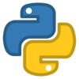

# Getting Started with Profinity Scripting

Welcome to the Profinity Scripting guide. This document serves as your comprehensive introduction to the scripting capabilities within Profinity, designed to empower you with the tools and knowledge needed to create robust and efficient scripts. Whether you are automating tasks, processing data, or integrating systems, this guide will help you navigate the essential features and best practices of Profinity scripting.

## Overview

Profinity offers a versatile scripting environment that supports three powerful languages: C#, Python (via IronPython), and JavaScript (via Jint). Each language is integrated with the .NET framework, providing a rich set of libraries and tools to enhance your scripting experience. This guide will walk you through the core functionalities and provide insights into choosing the right language for your needs.

## Scripting vs APIs

Profinity offers two completely different ways, Scripting and APIs that you can extend it's capabilities to meet the requirements of your applications.  Why would you choose one over the other?

| Scripting                                                                | APIs                                                                           |
| ------------------------------------------------------------------------ | ------------------------------------------------------------------------------ |
| Supports Python, Javascript and C#                                       | Support any Programming Language that can call REST APIs and JSON              |
| Are built in to Profinity and require no external frameworks or hosting  | Run outside of Profinity in your own environment, APP or cloud                 |
| Can be developed quickly and easily, to solve simple problems            | Can be as rich and complex as you want your app to be and still use Profinity  |
| Can run headless (no user interaction, scheduled or triggered by CAN)    | Requires you to write the logic for how your app uses the API                  |
| Script runs inside Profinity                                             | If scripted, your scripts run outside Profinity and can be distributed         |

Ultimately the decision on how to extend Profinity is up to you, but with two choices you have the flexibility to find the model that suits your needs best.

## Supported Scripting Languages

Profinity supports three programming languages.

| C# Scripting                        | Python                                   | JavaScript                                       |
|-------------------------------------|------------------------------------------|--------------------------------------------------|
| |  |  |

Ultimately the choice of your preferred scripting language is up to you, Profinity supports three to help developers who are coming from different programming backgrounds, but the features and functions available are common across all three languages.

| Language | Strengths | Considerations |
|----------|-----------|----------------|
| C# | - Strong typing - Full .NET framework access - Enterprise features - Performance optimization | - More verbose syntax - Requires .NET knowledge - Longer development time |
| JavaScript | - Simple syntax - Quick development - Familiar to web developers - Lightweight | - Less type safety - Limited to basic features - Less suitable for complex operations |
| Python | - Clean syntax - Rich ecosystem - Great for data processing - Easy to learn | - Slower execution - Less suitable for real-time operations - Memory management considerations |

If you need even more power than Profinity Scripting provides then you can also call Profinity APIs to get the full access to all key Profinity functionality from your own tools.

### C# Scripting

C# is a statically typed, object-oriented language known for its performance and scalability. In Profinity, C# scripts leverage the full power of the .NET framework, making it ideal for complex operations and enterprise-level applications.  It is also the best language to use if you are looking to deeply integrate with Profinity itself as Profinity is written in C#.

C# scripts in Profinity are implemented as classes that inherit from base classes or implement specific interfaces. They provide strong typing and full access to the .NET framework.

**C# is Best for:**

- Complex operations requiring type safety
- Integration with .NET libraries
- Large-scale automation projects
- Performance-critical applications
- Enterprise-level solutions

[C# Language Reference](https://docs.microsoft.com/en-us/dotnet/csharp/language-reference/)
[.NET API Documentation](https://docs.microsoft.com/en-us/dotnet/api/)

### Python (via IronPython)

Python scripts in Profinity use a procedural style with functions that are called by the system. They provide a clean, readable syntax and are excellent for data processing and automation tasks.

Profinity uses a C# library called IronPython to allow you to write Python code within the C# framework that Profinity is built on.  IronPython brings the simplicity and readability of Python to the .NET ecosystem. It is particularly well-suited for data analysis, scripting, and rapid prototyping, offering seamless integration with .NET libraries.  

If you want to use Python as your preferred programming language or want to integrate Profinity with other libraries written in Python, this is a good choice.

**Python Is Best for:**

- Data processing and analysis
- Complex data manipulation
- Scientific computing
- Integration with Python libraries
- Readable, maintainable code

[IronPython Documentation](https://ironpython.net/documentation/)
[Python Language Reference](https://docs.python.org/3/reference/)

### JavaScript (Jint)

JavaScript scripts in Profinity use a more functional approach, with global functions that are called by the system. They provide a simpler syntax and are well-suited for quick scripting tasks.

Profinity supports JavaScript scripting, through the Jint interpreter, provides a dynamic scripting option within Profinity. It is perfect for web developers and those looking for a lightweight, flexible scripting solution and want to be able to create scripts in Profinity.

**Best for:**

- Rapid prototyping
- Quick automation tasks
- Simple scripts
- Web developers familiar with JavaScript
- Lightweight operations

[Jint Documentation](https://github.com/sebastienros/jint)
[JavaScript Reference](https://developer.mozilla.org/en-US/docs/Web/JavaScript/Reference)

