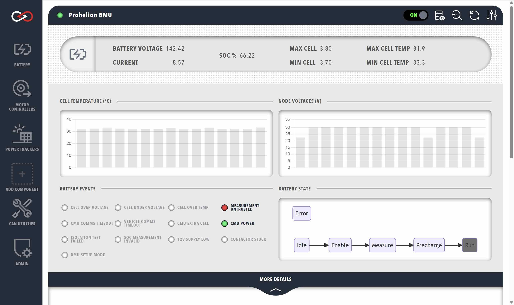
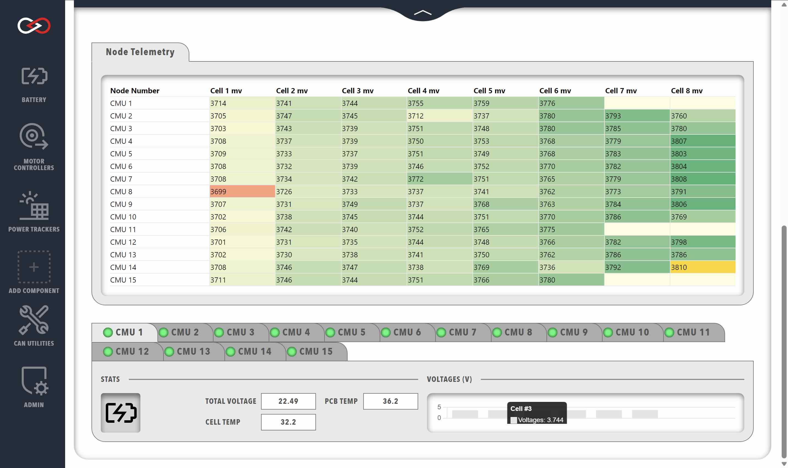
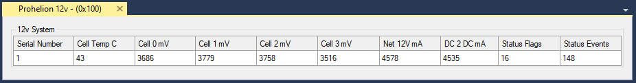

# Prohelion Batteries

Prohelion design and sells Battery Management Systems (BMS) designed for both automotive and fixed location environments.

The Prohelion Battery Management technology is built around three main components.  The Battery Management Unit (BMU) which consists of a master board and a number of Cell Management Units (CMU)'s.  In addition to the BMU and CMUs a typical Prohelion battery may also contain a 12v Control System which monitors the onboard 12v capabilities.  For more information on these products, please see the main [Prohelion Website](https://www.prohelion.com/product-category/bms/).

Profinity supports the management and monitoring of the BMUs, CMUs, and 12v systems via your Profile.

!!! info "Only the BMU needs to be added to your Profile"
    Prohelion CMUs utilise a second CAN network organised by the BMU, and thus do not need to be added as components to your Profile. By adding the BMU to your Profile, you are able to control and see data from the entire BMS. For more information, see [Prohelion BMS documentation](../Battery_Management_Systems/index.md).

A typical battery will generally only have one BMU, but larger packs or split packs like the ones used in racing can involve two or more BMUs.  If your pack is configured as such, then you simply add multiple BMUs to your Profile with different base CAN addresses.

## BMU Management

The BMU dashboard contains several sections each with different information about your system. The top section shows data from the BMU, whilst clicking on the `MORE DETAILS` banner will expand the dashboard to display telemetry data from the CMUs.

<figure markdown>

<figcaption>Prohelion BMU</figcaption>
</figure>

### BMU DATA

The top row of BMU data presents a summary of the following information (left to right):

| Cell              | Meaning                                                          |
|-------------------|------------------------------------------------------------------|
| `BATTERY VOLTAGE` |  |
| `CURRENT`         |  |
| `SOC %`           |  |
| `MAX CELL`        |  |
| `MIN CELL`        |  |
| `MAX CELL TEMP`   |  |
| `MIN CELL TEMP`   |  |

<!--
| `Min mV`    | Minimum voltage cell in the pack, and its voltage. The example shows Node (CMU) 8, Cell 0 is minimum, at 3699mV                                                                        |
| `Max mV`    | Maximum voltage cell in the pack, and its voltage. The example shows Node (CMU) 14, Cell 7 is maximum, at 3799mV                                                                        |
| `Min C`     | Minimum temperature cell in the pack, and it's temperature       |  
| `Max C`     | Maximum temperature cell in the pack, and it's temperature       |
| `Pack mV`   | Total pack voltage                                               |
| `Pack mA`   | Total pack current                                               |
| `Balance +` | Balance threshold voltage                                        |
| `Balance -` | Balance threshold minimum voltage (balance voltage – hysteresis) | 
| `CMU Count` | CMU count in system                                              | -->

The next row shows Precharge status information on the left:

| Cell             | Meaning                                                        |
|------------------|----------------------------------------------------------------|
| `Prechrg Status` | Current state (Idle, Precharge, Run, etc)                      |
|                  | Contactor 12V supply voltage presence (mV on v4 or older BMUs) |

The buttons in the BMU section shows the various status flags, some flags are normal and show green when engaged, if buttons are showing orange or red then consult the BMU manual for more information.

Note that when not engaged or receiving messages from the control module the BMU will drop back to its safe precharge state which is the error state.  

Consult the [BMU documentation](../Battery_Management_Systems/index.md) for more information but note that the error state can be part of normal operation.

- CMU Power supply OK
- Any cell OverVoltage
- Any cell UnderVoltage
- Any cell OverTemperature
- Any cell untrusted
- CMU and vehicle timeout errors 

The right-hand side shows:

- Fan speed for both fans
- SoC and Balance SoC in Ah
- SoC and Balance SoC in %

### CMU DATA

Each CMU correlates to a node in the network. The `Node Telemetry` table displays the currently connected CMUs and the voltages for each collection of cells being monitored by the specific CMU. 

<!-- The information shown is:

| Cell            | Meaning                             |
|-----------------|-------------------------------------|
| `Node Number`   | CMU Serial Number                   |
| `PCB C`         | CMU circuit board (PCB) temperature |
| `Cell C`        | CMU external (cell) temperature     |
| `PCB C`         | CMU circuit board (PCB) temperature |
| `Cell 1 - 8 mV` | 1 – 8 cell voltage measurements     | -->

<figure markdown>

<figcaption>Prohelion CMU</figcaption>
</figure>

Various additional information about the system is highlighted by the colour of the voltage readings:

- Cells currently balancing have a blue background
- The minimum and maximum cells <!--have bold text and -->are colour coded (green shows highest voltage, orange lowest)
- Cell in yellow have trust errors
- Cells not present (where the CMU has been programmed to monitor less than 8 cells) have no text, and a pale-yellow background

Below the `Node Telemetry` table is a selection of tabs for the various CMUs. Selecting a tab displays the following data from the chosen CMU:

- The total voltage observed by the CMU (sum of all cell voltages)
- The temperature observed by the CMU's onboard temperature sensor
- The temperature observed by the CMU cell thermistor
- A graph of cell voltages observed by the CMU. Hovering your mouse over a particular cell will show that cell's voltage

## Prohelion 12 Volt Control System

Prohelion also offers a 12 volt control module that can be used to provide power to onboard 12 volt systems and is typically used in a racing environment.  This module has a separate control panel that can be added to the profile and provides additional data on the performance of the 12 volt system.

<figure markdown>

<figcaption>Prohelion 12 Volt</figcaption>
</figure>

## Updating the BMU Configuration

To update the configuration of your Battery Management Unit, right mouse click on the BMU in the Profinity menu and select Configure Prohelion BMU.  This will load the BMU configuration from the firmware and allow you to change it as desired.

!!! danger "Be Careful!"
    Changing the configuration of your BMU can lead to dangerous situations if you set the wrong values for your pack.  Be careful and only make these changes if you know what you are doing and understand the purpose of these values.

<video autoplay loop controls width="100%">
  <source src="video/ConfigBMU.mov" type="video/mp4">
  Your browser does not support the video tag.
</video>

## Flashing the BMU Firmware

To flash the BMU firmware, right mouse click on the Update Firmware menu item on the BMU.  A CAN to Ethernet bridge or a [Virtual CAN Adapter](Virtual_CAN_Adapter.md) is required for this operation.