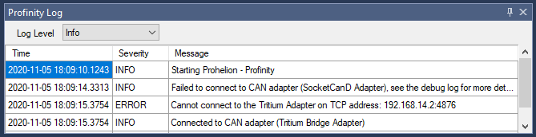
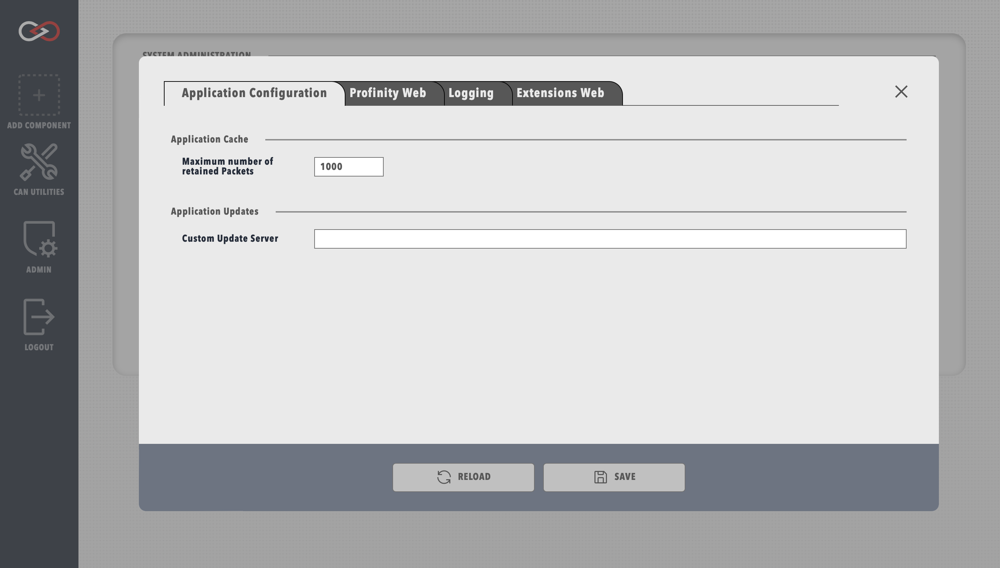
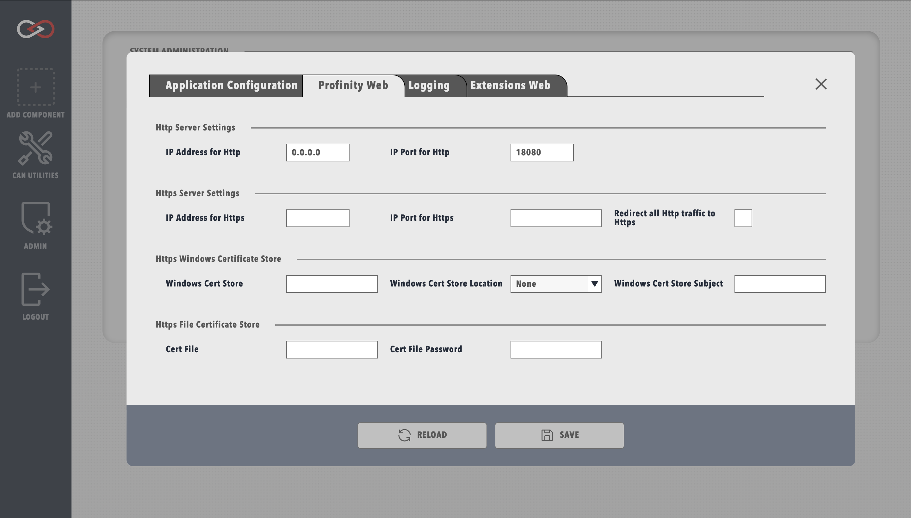
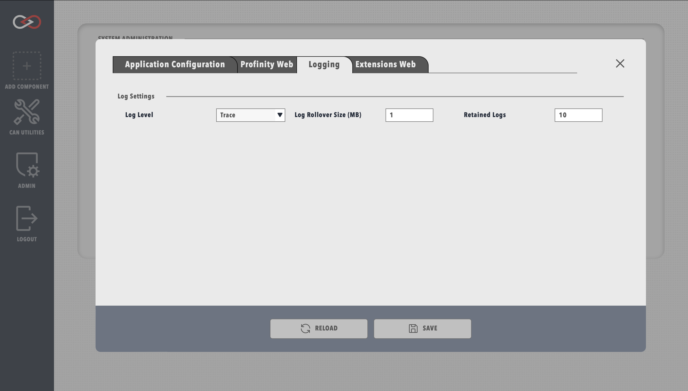
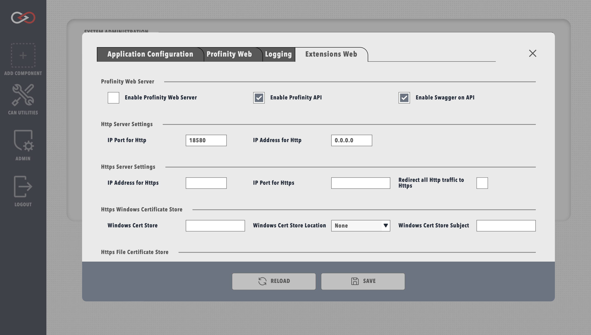

# System Administration

## Profinity Logs

Profinity has a built in logging mechanism that captures information about the operation of the system.  Typically this log appears at the bottom of the Profinity screen.  If you close the log and wish to view it again, then the log button on the menu bar will make it reappear.

<figure markdown>

<figcaption>Prohelion Log</figcaption>
</figure>

The level of debugging shown in the log file can be varied by changing the log level.  If you are trying to diagnose a problem then setting the log level to a lower level (like debug), may assist.

!!! info "Log levels are persisted"
    Once a log level is set, it will remain persisted across restarts of Profinity

## System Configuration

The System Configuration menu is located in the Admin tab and contains 

### Application Configuration

<figure markdown>

<figcaption>New user menu</figcaption>
</figure>

### Profinity Web Configuration

<figure markdown>

<figcaption>New user menu</figcaption>
</figure>

### Logging

<figure markdown>

<figcaption>New user menu</figcaption>
</figure>

### Web Extensions

<figure markdown>

<figcaption>New user menu</figcaption>
</figure>