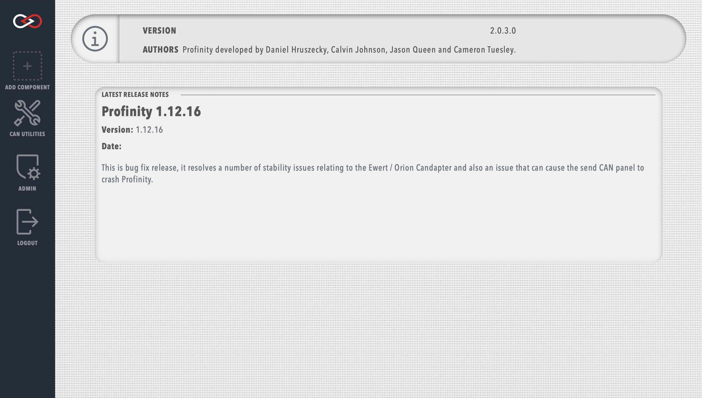
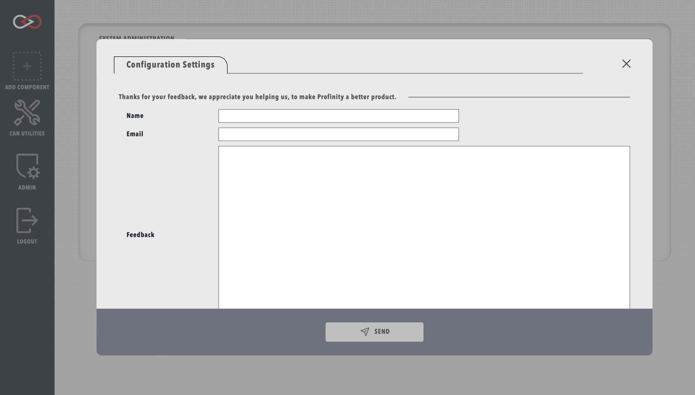

# System Administration

## System Information

To see which version of Profinity you are running, select the `SYSTEM INFORMATION` option in the `ADMIN` tab.

<figure markdown>

<figcaption>System information page</figcaption>
</figure>

This page also contains notes about the latest Profinity releases and the software credits.

## System Configuration

The `System Configuration` menu is located in the `ADMIN` tab and contains 

!!! warning "Changes to the system config"
    Modifying any parameters in the `System Configuration` menu will trigger a reboot of Profinity. If using the web client, wait around 15 seconds after saving the changes before reloading the page.

### Application Configuration

<figure markdown>

<figcaption>New user menu</figcaption>
</figure>

### Profinity Web Configuration

<figure markdown>

<figcaption>New user menu</figcaption>
</figure>

### Profinity Logs Configuration

The Logging menu contains the options for modifying the log level, logs rollover size, and number of retained logs.

| Option              | Description                                                                                |
| ------------------- | ------------------------------------------------------------------------------------------ |
| `Log Level`         | The scope of messages shown in the [system logs](Getting_Started/Profinity_Log.md)         |
| `Log Rollover Size` | The maximum file size for each log file created, in MB                                     |
| `Retained Logs`     | The number of log files that can be created before overwriting the oldest file             | 

<figure markdown>

<figcaption>Profinity logs configuration menu</figcaption>
</figure>

Logging levels are a standard industry term and define the types of messages that are displayed to the user in the system logs. Each progressive logging level also encompasses all entries of the previous levels. A brief description of the various log levels is given below.

| Logging Level   | Description                                                                                          |
| ----------------| ---------------------------------------------------------------------------------------------------- |
| `Fatal`         | Used when the application encounters an error that prevents the critical functionality from working  |
| `Error`         | Used when the application encounters an error that prevents particular functionality from working, but other parts of the application may remain functional |
| `Warn`          | Indicates something unexpected has happened, but the application continues to function               |
| `Info`          | Standard log level containing informative messages indicating the actions of the application. E.g., when changing states, connecting to the web API, etc.         |
| `Debug`         | Intermediate level of visibility that is helpful for debugging. Details some of the underlying application processes     |
| `Trace`         | Grants full visibility of underlying application execution. Only necessary when performing debugging |

!!! info "Log levels are persistent"
    Once a log level is set, it will remain persistent across restarts of Profinity

### Web Extensions

<figure markdown>

<figcaption>New user menu</figcaption>
</figure>

## Feedback Form

Profinity has a built-in feedback form, accessible through the `ADMIN` tab. To provide feedback about the Profinity software, fill in the form with your name, email address, and the feedback.

<figure markdown>

<figcaption>Profinity feedback form</figcaption>
</figure>