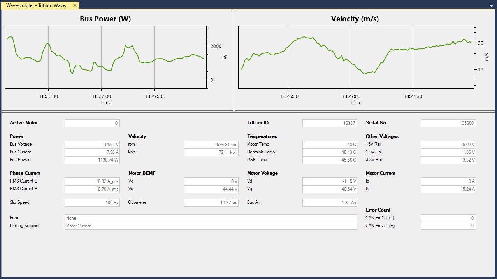
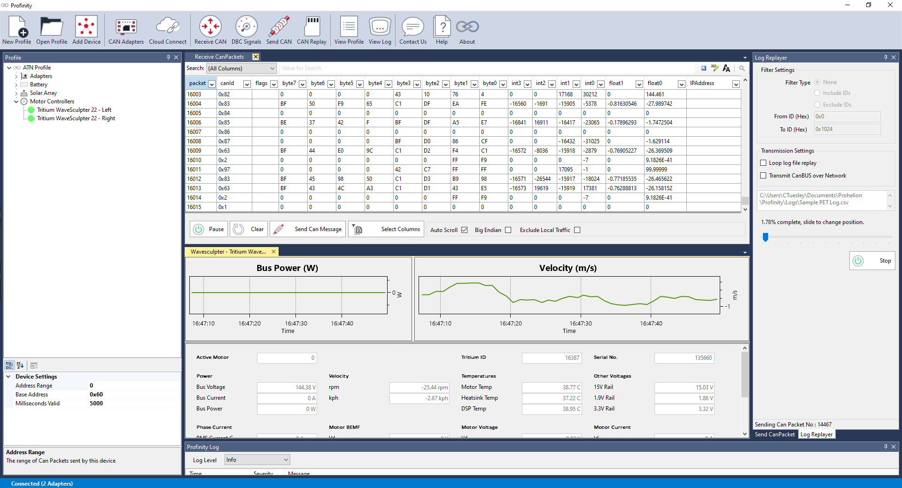
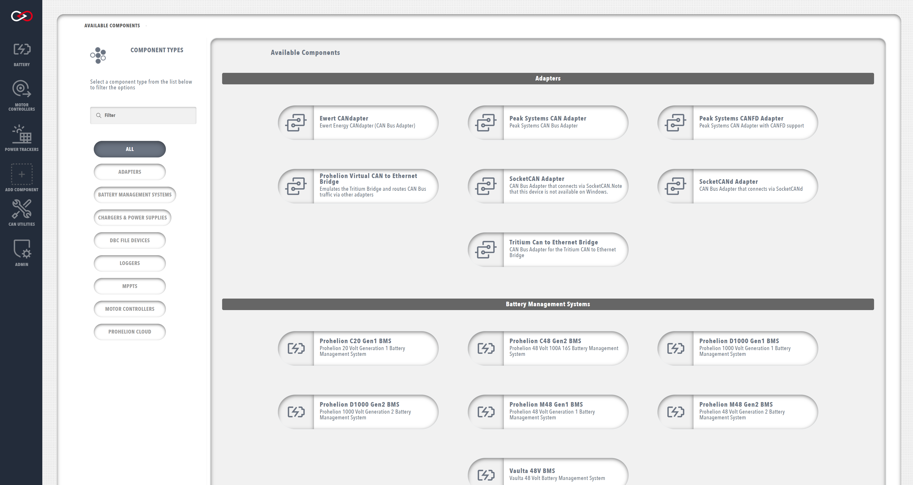
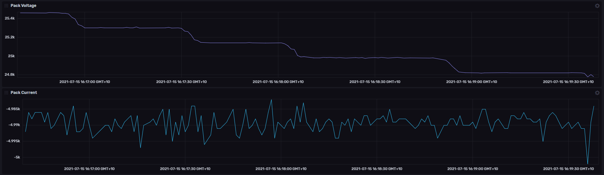

# Prohelion Profinity

Profinity is our comprehensive CAN bus management platform, designed to connect your CAN-based solutions to modern cloud, API, and big data technologies. Choose your version below to get started.

## Available Versions

-   :material-tools:{ .lg .middle } __Profinity V2__

    ---

    The latest version of Profinity, featuring:
    
    - Modern container and API-centric architecture
    - Enhanced cloud connectivity
    - Improved user interface
    - Advanced device management

    <figure markdown>
    
    <figcaption>Modern web-based interface of Profinity V2</figcaption>
    </figure>

    [:octicons-arrow-right-24: Profinity V2 Documentation](Profinity_Version2/index.md)

    !!! tip "Profinity V2 IS NOW IN EARLY ADOPTER RELEASE"
        Profinity V2 is available now in Early Adopter Release.  To support this release we are making the product available to our Early Adopter Community.  If you have any issues or feedback please report them via our support portal or via the Feedback form in the Profinity Admin menu.

-   :material-tools:{ .lg .middle } __Profinity V1 (Retired Soon)__

    ---

    The original version of Profinity, supporting:
    
    - Basic CAN bus management
    - Device configuration
    - Data logging
    - Simple cloud integration

    <figure markdown>
    
    <figcaption>Classic interface of Profinity V1</figcaption>
    </figure>

    [:octicons-arrow-right-24: Profinity V1 Documentation](Profinity_Version1/index.md)

## Key Features of Profinity

### Device Management
- Connect and configure CAN bus devices
- Support for multiple device types
- Real-time monitoring and control

<figure markdown>

<figcaption>Adding and configuring devices in Profinity</figcaption>
</figure>

### Data Integration
- Cloud connectivity options
- API access for custom integrations
- Advanced data logging capabilities

<figure markdown>

<figcaption>Advanced data logging and analysis features</figcaption>
</figure>

### Security (V2 Only)
- Role-based access control
- Secure credential management
- Audit logging

<figure markdown>

<figcaption>Secure user management and access control</figcaption>
</figure>

## Support

Need help? We're here to assist:

- Visit our [Support Portal](https://prohelion.atlassian.net/servicedesk/customer/portals)
- [Contact Us](https://www.prohelion.com/contact-us/) directly
- Check our [FAQs](../FAQs/index.md)
