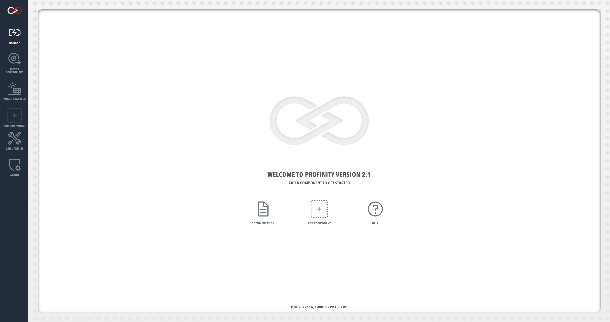
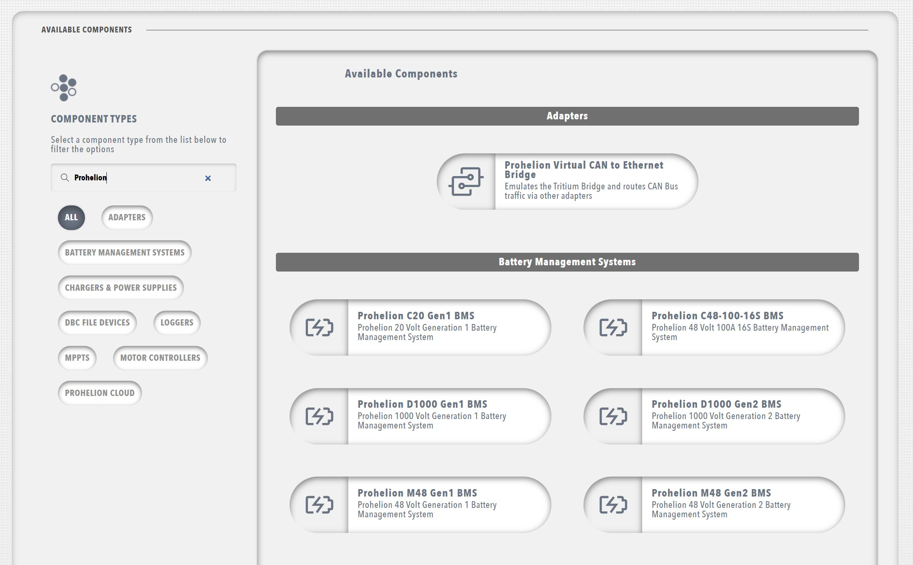

# Prohelion Profinity

Profinity is our comprehensive CAN bus management platform, designed to connect your CAN-based solutions to modern cloud, API, and big data technologies. Choose your version below to get started.

## Available Versions

-   :material-tools:{ .lg .middle } __Profinity V2__

    ---

    The latest version of Profinity, featuring:
    
    - Modern container and API-centric architecture
    - Enhanced cloud connectivity
    - Improved user interface
    - Advanced device management

    <figure markdown>
    
    <figcaption>Modern web-based interface of Profinity V2</figcaption>
    </figure>

    [:octicons-arrow-right-24: Getting Started](Profinity_Version2/index.md)

-   :material-tools:{ .lg .middle } __Profinity V1__

    ---

    The original version of Profinity, supporting:
    
    - Basic CAN bus management
    - Device configuration
    - Data logging
    - Simple cloud integration

    <figure markdown>
    
    <figcaption>Classic interface of Profinity V1</figcaption>
    </figure>

    [:octicons-arrow-right-24: Documentation](Profinity_Version1/index.md)

## Key Features

### Device Management
- Connect and configure CAN bus devices
- Support for multiple device types
- Real-time monitoring and control

<figure markdown>

<figcaption>Adding and configuring devices in Profinity</figcaption>
</figure>

### Data Integration
- Cloud connectivity options
- API access for custom integrations
- Advanced data logging capabilities

<figure markdown>

<figcaption>Advanced data logging and analysis features</figcaption>
</figure>

### Security
- Role-based access control
- Secure credential management
- Audit logging

<figure markdown>

<figcaption>Secure user management and access control</figcaption>
</figure>

## Getting Started

!!! tip "Recommended Version"
    We recommend using Profinity V2 for new installations, as it offers enhanced features and better integration capabilities.

1. Choose your version from the cards above
2. Follow the installation guide
3. Create your first user account
4. Configure your devices

## Support

Need help? We're here to assist:

- Visit our [Support Portal](https://prohelion.atlassian.net/servicedesk/customer/portals)
- [Contact Us](https://www.prohelion.com/contact-us/) directly
- Check our [FAQs](../FAQs/index.md)
