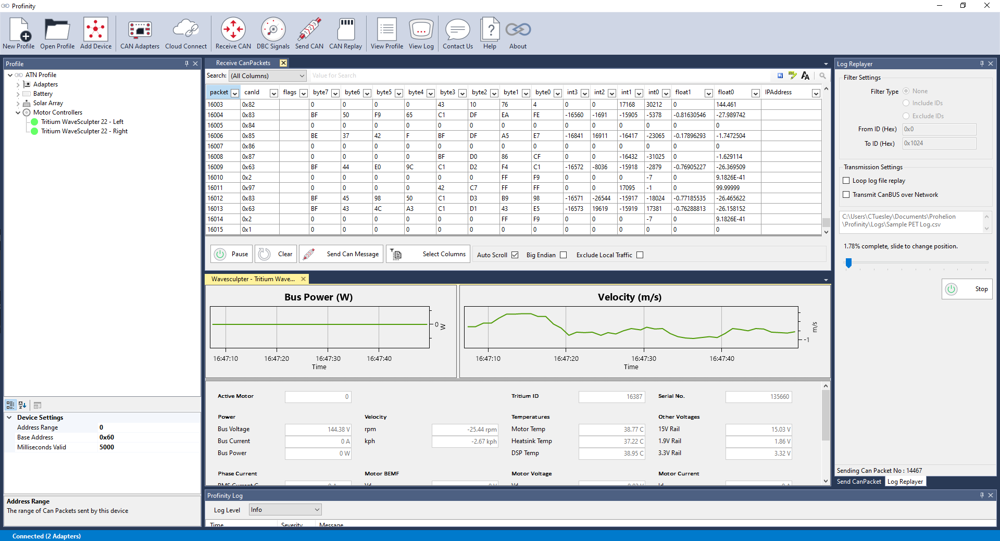

# Prohelion Profinity

Profinity is a modern CAN Bus management platform designed to enable the connection of CAN Bus based solution to modern Cloud, APIs and Big Data technologies.

[Download Profinity :material-download:](https://github.com/Prohelion/Profinity/releases/latest/download/Profinity.install.msi){ .md-button }

Originally developed by Prohelion to manage our own products it has evolved over time to be multi-platform solution, capable of running on Windows, Linux, MacOS and Docker, with a core engine, easily extendable via Restful APIs.

Profinity is built around the concept of [profiles](Profiles.md), which is a set of configured devices in your system.  By switching between profiles you can support multiple configurations across different sites of different combinations of technologies.  The configuration of the system is largely driven by the Profinity GUI, but once configured, the solution can run as a service, providing continuous data streams off servers or embedded devices, or run from the cloud.

<figure markdown>

<figcaption>Profinity</figcaption>
</figure>

Profinity can connect to [CAN Bridges](CAN_Bus_Adapters.md), which translate CAN Bus traffic from your network to the Profinity solution, you can send and receive and view CAN Bus messages either raw or using DBC, log messages and replay them.  You can also use Profinity to share CAN Bus data from your system to your team, either in near real time via a [Prohelion Cloud Connect](Prohelion_Cloud_Connect.md) data stream, or via the logs to cloud data logging platforms. 

It provides specialised tools for managing [Prohelion Batteries](Prohelion_Batteries.md) and chargers, MPPT systems from [Elmar Solar](Elmar_Solar_MPPT.md) and [WaveSculptors](WaveSculptor.md) as well as any device that can be defined by a CAN DBC file.  

### Profinity Server (Rest APIs, Web and Docker)

As of Profinity 1.11, Prohelion has migrated to a modern container and API centric architecture.  You will find information on our [Restful APIs and Swagger Support](Profinity_Rest_APIs.md) in the documentation as well as our out of the box Cloud connectivity for [InfluxDB and Prometheus](InfluxDB_Prometheus_Integration.md) to support cloud based Big Data capture and analytics of CAN Bus based solutions.  

In addition we now support for Profinity running as a Server on [Windows, Docker, Linux and MacOS](Profinity_Server.md).

If you require support or assistance, please [Contact Us](https://www.prohelion.com/contact-us/) via the Prohelion Website or you can log bugs, requests for help or requests for improvement on our [Support Portal](https://prohelion.atlassian.net/servicedesk/customer/portals).