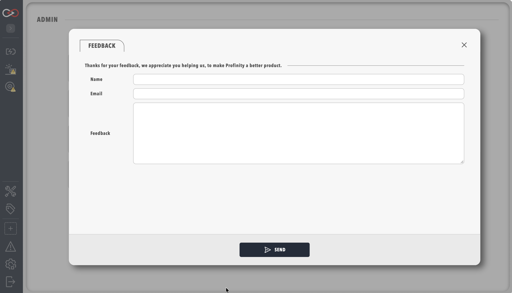

# Profinity Feedback

Profinity includes a built-in feedback system that allows you to share suggestions, report issues, or provide general feedback about your experience with the product, which Prohelion uses to improve Profinity and to better support its users.

## Accessing the Feedback Form

The feedback form is accessible through the **ADMIN** page in the Profinity interface. To access the form, open Profinity, select **ADMIN** in the side menu, and select the **Feedback** pill to open the feedback interface.

<figure markdown>

<figcaption>Profinity feedback form interface</figcaption>
</figure>

## Providing Effective Feedback

To allow Prohelion to process your feedback effectively, each submission needs your name and contact information along with a clear description of your feedback or issue. If you are reporting a problem, include any relevant error messages or screenshots that help explain the situation.

Each submission should include:

- Your full name
- Your contact email address
- A detailed description of your feedback or issue

The following additional information helps Prohelion understand your feedback:

- Steps to reproduce any issues you are experiencing
- Your operating system and Profinity version
- Any relevant error messages

## After You Submit

Once you submit your feedback, the Prohelion team reviews the submission and may contact you for additional information if needed.

## Alternative Support Options

For immediate assistance or urgent issues, visit the [Prohelion Support Portal](https://prohelion.atlassian.net/servicedesk/customer/portals) for support resources, or [contact Prohelion](https://www.prohelion.com/contact-us/) directly through the Prohelion website.
