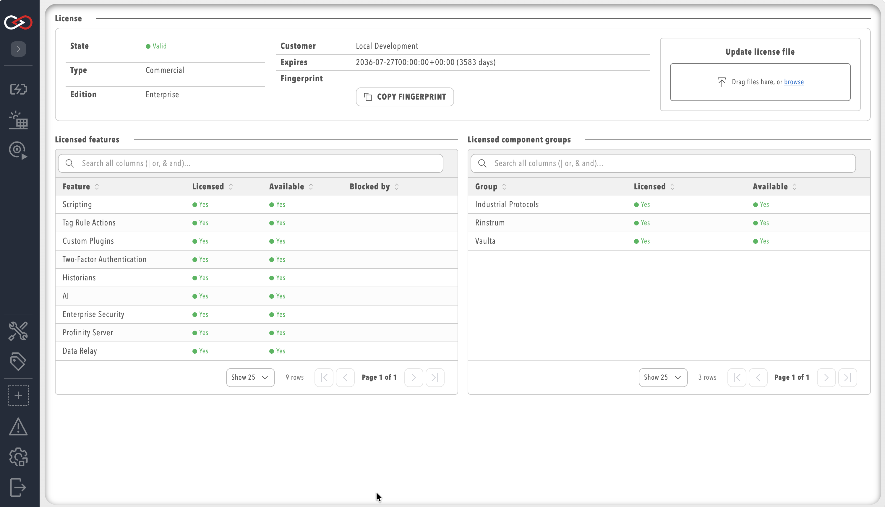

# Licensing

Profinity uses an offline, signed licence file to control which commercial features and components are available on an instance. There is no activation service and no online licence check: Profinity is designed to run on remote or air-gapped edge machines, so licensing works entirely from a file placed on the instance and a signature that Profinity validates locally.

A licence sets the commercial **ceiling** for the instance. The final set of available features and components is the combination of the licence, the OEM customisation file (`Custom.yaml`), and the site configuration (`config.yaml`); a feature is only available when all three allow it. Config-level toggles can narrow what the licence permits, but never grant more than the licence allows.

## Check licence status

Select **ADMIN** in the side menu, then **License**. A user needs the **SecurityAdmin** permission to view or change this page.

The page shows:

- **State** — `Valid`, `Trial`, `Expiring`, `Expired`, `Invalid`, `WrongInstance`, `UnsupportedVersion`, or `Missing`. A licence file whose expiry is 30 days or less away is reported as `Expiring` instead of `Valid` or `Trial`.
- **Type** — `Commercial`, `Trial`, or `LocalTrial` (the automatic in-product trial).
- **Edition** — the commercial edition name, for display only. Profinity does not gate features by edition name; it always checks explicit feature and component entitlements.
- **Customer** — the customer name or ID recorded on the licence.
- **Expires** — the expiry date and, where applicable, the number of days remaining.
- **Fingerprint** — the unique identifier for this installation, with a button to copy it.
- **Licensed features** — a table of every product feature, whether it is licensed, whether it is currently available (licensed **and** not blocked by configuration), and, if unavailable, what is blocking it.
- **Licensed component groups** — the same status for licensed component groups, such as protocol or hardware-integration bundles.

<figure markdown>

<figcaption>ADMIN &rarr; License — status, entitlements, and fingerprint</figcaption>
</figure>

Component groups are licensed separately from product features. For example, the BACnet, EtherNet/IP, Modbus, OPC UA and S7 [industrial protocol plugins](../Components/Industrial_Protocols/index.md) all require the **Industrial Protocols** component group, whereas [Tag Relays](../Components/Tag_Relays/index.md) require the **Data Relay** feature. Without the matching entitlement the components show as unavailable, even when the plugin is installed.

!!! info "Available versus licensed"
    A feature can be licensed but still unavailable, for example when it has been turned off in site configuration. The **Licensed** column always reflects the licence file; the **Available** column reflects the actual runtime state and names the layer responsible when it is blocked.

## Upload a new licence

To apply a commercial or evaluation licence:

1. Select **ADMIN** in the side menu, then **License**.
2. Copy the **fingerprint** shown on the page and send it to Prohelion through the normal sales or support channel.
3. Prohelion signs a `license.yaml` file for that fingerprint and returns it.
4. Transfer the file to the machine running Profinity (for example by USB drive or secure file copy) if the instance has no network access.
5. On the License page, use **Update license file** and select the `license.yaml` file.

Profinity validates the file's signature and expiry, and checks that its fingerprint matches the instance, before applying it. If validation fails, Profinity rejects the upload and the existing licence, if any, remains in effect. A `license.yaml` file can also be installed without using the UI, by copying it directly into the instance's licence folder; this is the usual path for headless or scripted deployments.

!!! warning "The fingerprint is instance-specific"
    A licence is signed for one machine's fingerprint. A licence issued for one instance does not apply to another, and Profinity reports the state as `WrongInstance` if an administrator uploads a licence issued for a different machine.

## The 14-day local trial

A Profinity instance that has never had a licence applied issues itself a one-time, 14-day, server-tier trial automatically on first startup, provided the installer build has trial issuance enabled; some OEM-customised builds may not offer this local trial. This local trial:

- Requires no network access and no request to Prohelion.
- Runs for a maximum of 14 days from first startup, enforced by the engine's own trial clock.
- Grants server-tier entitlements (the same feature set as a standard `Commercial` server licence), not enterprise-only features.
- Is issued once per installation. Reinstalling or resetting the instance does not restart the trial, because the trial is recorded against the instance fingerprint.
- Reports the state `Expiring` for its whole duration rather than `Trial`, because Profinity marks any local trial with 30 days or less remaining as `Expiring` and the local trial never lasts longer than 14 days. The `Trial` state appears only for a signed trial licence file with more than 30 days remaining.
- Is not available on Desktop hosts, which have a separate free-use policy (see below).

!!! warning "When the local trial expires"
    When the 14-day trial ends, Profinity drops the instance to the same unlicensed entitlement set a Desktop installation uses, and shows an expiry notice on the Home screen linking to the **License** pill on the **ADMIN** page. Profinity does not stop, lock users out, or switch to a read-only mode: the engine keeps running, and features and components outside the unlicensed set become unavailable until a suitable commercial or extended evaluation licence is uploaded.

## Desktop free-use policy

A Desktop installation is not required to have a licence for non-commercial use, and does not issue or consume the automatic local trial described above. It keeps the unlicensed entitlement set indefinitely and shows a notice on the Home screen explaining the non-commercial-use restriction and directing commercial users to contact Prohelion. If a trial or commercial `license.yaml` is installed on a Desktop host manually, Profinity validates and applies it in the same way as on a server host.

## The machine fingerprint

The fingerprint is a value computed from the installation itself, unique to that machine and Profinity install. It has two purposes:

- It ties a signed `license.yaml` to one specific installation, so a licence file cannot be copied to another machine and reused.
- It is the only piece of information an administrator needs to send to Prohelion to request a licence or evaluation, which keeps the process usable for edge machines with no internet access.

## REST API

| Method | Route | Purpose |
|--------|-------|---------|
| GET | `/api/v2/License` | Returns licence status and the entitled features and components lists. Requires `SecurityAdmin`. |
| GET | `/api/v2/License/Fingerprint` | Returns the instance fingerprint used to request a licence. Requires `SecurityAdmin`. |
| PUT | `/api/v2/License` | Uploads and applies a `license.yaml` document, validating signature, expiry, and fingerprint before saving it. Requires `SecurityAdmin`. |
| GET | `/api/v2/Availability/Features` | Returns the current availability of every product feature, with the blocking layer named where a feature is unavailable. Requires an authenticated user. |

## Related documentation

- [System information](System_Info.md) — instance version and licence summary shown alongside other system details.
- [Roles and permissions](Users_and_Access/Roles_and_Permissions.md) — assigning the SecurityAdmin permission needed to manage licences.
- [System configuration](System_Configuration/index.md) — the site-level configuration layer that can narrow, but never exceed, what the licence permits.
