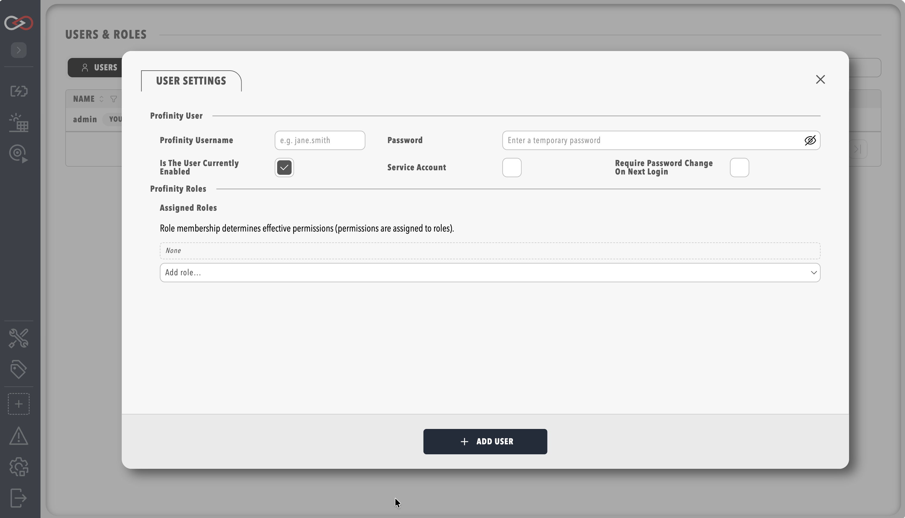

# Managing Users

!!! info "Desktop Mode"
    When using Profinity in Windows Desktop Mode no user is required as a special admin user is used for this environment that has full permissions. Only when accessing Profinity via the Web or API interface are user profiles required.

## Overview

Profinity 2.3 manages access through **users**, **assigned roles**, and **permissions**. Before using Profinity in web or API mode, create user accounts with the minimum roles required for each person's job.

For the full permission catalog and default role templates, see [RBAC and permissions](./Security/RBAC_Permissions.md).

## Creating a new user

1. Open the **pill menu** (top-right) → **Users & Groups** (`/admin?view=users`).
    - Requires **SecurityAdmin** permission.
2. Click **+ Add user**.
3. Enter username and initial password (for local sign-in).
4. Assign one or more **roles** under **Assigned roles**.
5. Save.

<figure markdown>

<figcaption>New user creation form</figcaption>
</figure>

For **SSO** sites, create the user and add **External identity links** — see [SSO and sign-in method](./Security/SSO_and_Sign_In.md).

For **automation**, enable **Service account** and copy the API token — see [Service accounts](./Security/Service_Accounts.md).

Administrator actions for an existing user — **Reset MFA**, **Reset Password**, and **Generate Token** / **View Token** — live in the **User Actions** tab of that user's settings dialog (click the user's row in Users & Groups to open it). See [MFA account management](./Security/MFA_Account_Management.md) and [Service accounts](./Security/Service_Accounts.md) for the full steps.

## Security roles (2.3)

!!! info "Roles, not legacy groups"
    Security.yaml in Profinity **2.3** uses **roles** only (`Version: "2.3"`). Each role bundles granular **permissions** (for example `TagView`, `CANSend`, `SecurityAdmin`). Users hold **Assigned roles**.

### Default templates

| Template | Typical use |
|----------|-------------|
| **Read-only** | Monitoring dashboards and tags without changes |
| **Operator** | Day-to-day CAN and component actions |
| **Engineer** | Profile, component, dashboard, and tag rule editing |
| **Security admin** | User and role administration |
| **System admin** | System Configuration (Config.yaml) |
| **Administrators** | Full permission bundle |

Custom roles are supported — open the **Roles** tab in Users & Groups.

### High-risk permissions

!!! warning "CAN Send is high-risk"
    **`CANSend`** allows injecting CAN frames. Assign only to trusted operators.

!!! warning "Session changes"
    Editing a user's **Assigned roles** or a role's permissions **revokes active sessions** for affected users.

## Password and MFA

- **Password policy** — [Password policy](./Security/Password_Policy.md)
- **Two-factor authentication** — [Two-factor authentication](./Security/Two_Factor_Authentication.md)
- **Admin reset MFA / password** — [MFA account management](./Security/MFA_Account_Management.md)

## Next steps

After creating a user:

1. Share login credentials securely (local sign-in only).
2. Enable **Require password change** for first login when appropriate.
3. Verify the user sees only the expected side menu entries for their roles.

!!! warning "Security notice"
    Always follow your organisation's security policies when creating and sharing credentials. Change default `admin` / `password` immediately on new installs.

## Related documentation

- [RBAC and permissions](./Security/RBAC_Permissions.md)
- [Security guide](../Installation/Security.md)
- [Kiosk Mode](./Kiosk_Mode.md)
