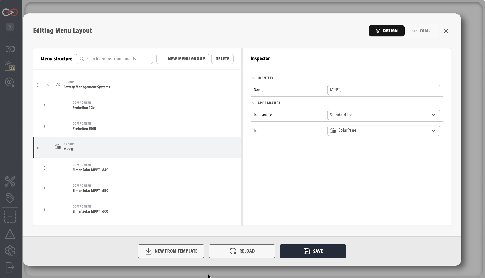
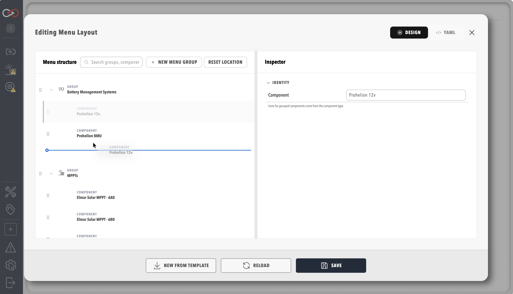

# Profile and component menu layout

Profinity 2.3 lets engineers customise the **top section** of the side menu — which components appear and in what order. The bottom system section (CAN utilities, Tags, Admin) remains **system-defined**.

## Profile menu layout

Editing the profile menu layout requires **`ProfileModify`**.

1. Open **Admin** → **Profiles**.
2. Edit a profile.
3. Open the **Menu Layout** tab.
4. Drag to reorder menu groups and assign components.

<figure markdown>

<figcaption>Profile menu layout editor</figcaption>
</figure>

The **custom menu** is always enabled for profiles that use the layout editor — there is no separate "enable custom menu" toggle in 2.3.

## Per-component placement

Each component can override placement using the same drag/reorder editor as the profile **Menu Layout** tab (both tabs use the same layout editor):

1. Open the component **Settings**.
2. Open the **Menu** tab.
3. Drag to reorder menu groups and assign the component's placement within the menu tree.

<figure markdown>

<figcaption>Component menu placement editor</figcaption>
</figure>

## Limitations

- Only the **top** menu section is customisable.
- Bottom entries (CAN, Tag utilities, Admin hub) follow permission gates and fixed ordering.

## Related documentation

- [Profiles](./Profiles.md)
- [Roles and permissions](./Roles_and_Permissions.md)
