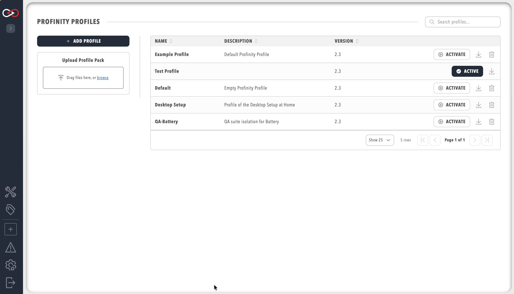

# Profiles

A Profile is the core mechanism by which Profinity maintains the configuration of your system. Any component that you add to your system becomes associated with the active Profile, and the configuration for each device is retained after Profinity is shut down. Profinity keeps track of your Profiles and loads the most recently used one each time you start the tool.

The **Profile** pill is located on the **ADMIN** page, which is opened by selecting **ADMIN** in the side menu.

<figure markdown>

<figcaption>Profinity Profiles menu</figcaption>
</figure>

## Changing the Active Profile

To change which profile is currently active in Profinity:

1. Select **ADMIN** in the side menu
2. Select the **Profile** pill
3. In the profile list, locate the profile you want to activate
4. Click **ACTIVATE** on the profile row to make it the active profile
5. The selected profile becomes active immediately

!!! info "Active Profile Indicator"
    The active profile is indicated by the **ACTIVE** marker on its row. Only one profile can be active at a time. When you switch profiles, Profinity loads the configuration associated with the newly selected profile.

## Editing Profile Settings

You can edit a profile's name and description to better organise your profiles.

### Editing Profile Name and Description

1. Select **ADMIN** in the side menu
2. Select the **Profile** pill
3. In the profile list, **click on the name** of the profile you want to edit
4. A dialog opens allowing you to modify:
   - **Profile Name**: Must be unique across all profiles
   - **Description**: Optional text to describe the profile's purpose or application
5. Make your changes
6. Click **Save** to apply the changes

!!! warning "Renaming the Active Profile"
    You cannot rename the active profile directly. To rename the active profile:
    
    1. First, change to a different profile (using **ACTIVATE**)
    2. Then click on the name of the profile you want to rename
    3. Edit the name and save
    4. Change back to the renamed profile if needed
    
    A temporary profile created for this purpose can be deleted after the profile you want has been renamed.

## Creating a New Profile

To create a new Profile:

1. Select **ADMIN** in the side menu
2. Select the **Profile** pill
3. Click the **+ ADD PROFILE** button
4. Enter a unique profile name and optional description
5. Build your system configuration from scratch

Alternatively, if you have a Profile Pack prepared from another instance of Profinity:

1. Click the **UPLOAD PROFILE PACK** button
2. Select the Profile Pack ZIP file from your computer
3. The profile is imported with all associated configurations

## Setting Kiosk Mode in a Profile

Kiosk Mode enables automatic user authentication for a profile, bypassing the login page. This is useful for kiosk displays, monitoring stations, or automated systems.

### Enabling Kiosk Mode

To enable [Kiosk Mode](./Kiosk_Mode.md) for a profile:

1. Select **ADMIN** in the side menu
2. Select the **Profile** pill
3. Select the profile you want to configure (it does not need to be active)
4. Click on the profile name or settings icon to open profile settings
5. Enable the **Kiosk Mode** option
6. Select a **Kiosk Mode User** from the dropdown menu, which lists the enabled users
7. Click **Save** to apply the settings

!!! info "Profile Must Be Active"
    Kiosk Mode only applies when the profile is active. When a profile with Kiosk Mode enabled becomes active, users are automatically authenticated. When a profile without Kiosk Mode becomes active, normal login is required.

!!! warning "Choose the kiosk user carefully"
    Anyone at the kiosk inherits the permissions of the Kiosk Mode User, and Profinity does not restrict which enabled user can be selected, including administrators. Select a user with only the permissions the display needs.

For detailed information about Kiosk Mode, including requirements, security best practices, and token management, see the [Kiosk Mode](./Kiosk_Mode.md) documentation.

## Downloading Profile Packs

To download a Profile Pack, including all associated DBC files, scripts, battery cell profiles, etc.:

1. Select **ADMIN** in the side menu
2. Select the **Profile** pill
3. Click the **download button** (download icon) next to the profile in the profile list
4. The Profile Pack will be downloaded as a ZIP file containing all profile-related files

Profinity ships with an example Profile called the Example Profile, which contains a Prohelion 12v battery, a Prohelion BMU, three Elmar Solar MPPT devices and two Prohelion WaveSculptor 22 Motor Controllers, as described in the [Quick Start Guide](../Getting_Started/Quick_Start.md). If you want to use this Profile as a basis for your own work, Prohelion recommends copying it to a new file name because the file is overwritten each time you install a new version of Profinity.

## Profinity Profile Packs

Profinity Profile Packs are a new introduction to Profinity V2 and serve as an extension to the Profile-based structure of Profinity Classic. A Profile Pack packages everything related to your instance of Profinity, allowing multiple machines to be configured to run the same system.

Depending on the configuration of your system, a Profile Pack could contain:

- The [Profile](#profiles) and configured devices
- [DBC](../CAN_Utilities/CAN_Bus_DBC.md) files
- [Scripts](../Developing_with_Profinity/Scripting/index.md)
- [CAN Logs](../Components/Loggers/File_Loggers.md)

Profile packs can be downloaded from Profinity as a ZIP file, containing all the contents of the Profile. They can then be uploaded to a different instance of Profinity if you want to share information between Profile instances.

## Profile Files

In Profinity, the Profiles and all the related files are stored by default in directories under the directory:

`profiles` inside the [artefacts directory](../Installation/Artifacts_Directory.md), which is `%LOCALAPPDATA%\Prohelion\Profinity\profiles` on Windows

While it is possible to edit the Profile files directly in a text editor, Prohelion does not recommend it. If you do edit a file directly, Profinity generally reloads the file automatically once you save your changes.

Profinity provides profile-specific directories for organising dashboard assets:

### /Profile/Images

- **Location**: `{ProfileDirectory}/images/`
- **Purpose**: Store images used in dashboards (icons, interactive images, etc.)
- **Usage**: Reference images by filename only (e.g., `image: "my-icon.svg"`)
- **Access**: Images are served from `/Profile/Images/{filename}` URL path
- **Examples**: Icon images, device diagrams, logos, status indicators

### /Profile/Styles

- **Location**: `{ProfileDirectory}/styles/`
- **Purpose**: Store custom CSS stylesheets for dashboard styling
- **Usage**: Reference stylesheets by filename (e.g., `Profile.css`, `variables.css`)
- **Access**: Stylesheets are served from `/Profile/Styles/{filename}` URL path
- **Examples**: Custom colour schemes, layout overrides, component-specific styles

### /Profile/Content

- **Location**: `{ProfileDirectory}/content/`
- **Purpose**: Store general content files (HTML snippets, templates, etc.)
- **Usage**: Reference content files by filename
- **Access**: Content files are served from `/Profile/Content/{filename}` URL path
- **Examples**: HTML templates, markdown files, documentation snippets

## Profile Features

Profiles support several advanced features:

- **[Kiosk Mode](./Kiosk_Mode.md)**: Automatic user authentication that bypasses the login page
- **[Profile Dashboard](./Profile_Dashboard.md)**: Custom home pages using dashboard YAML files

For more information, see the individual feature documentation pages.
