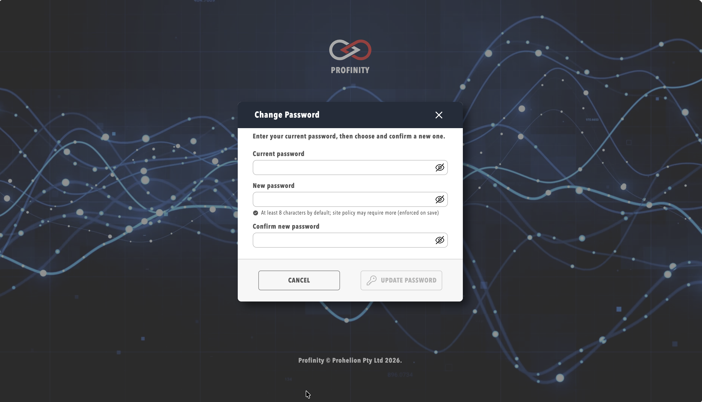

# Password Policy

Profinity 2.3 enforces **password policy** for **local** sign-in (when site **Sign-in method** is **Local**). Policy is configured in **config.yaml** under **Security Policy → Password Policy**.

SSO users authenticate through the identity provider; local password rules do not apply to them.

## Configure password policy

1. Sign in as a user with **SystemAdmin** permission.
2. Select **ADMIN** in the side menu, then **System Configuration**.
3. Open **Security Policy** → **Password Policy**.

| Setting | Description |
|---------|-------------|
| **Minimum length** | Minimum password character count |
| **Require uppercase** | At least one uppercase letter |
| **Require lowercase** | At least one lowercase letter |
| **Require digit** | At least one numeric character |
| **Require special character** | At least one non-alphanumeric character |
| **Maximum age (days)** | Password expiry; leave the field empty to disable expiry |

Saving config.yaml restarts the Profinity engine.

## Forced password change

A user with **SecurityAdmin** permission can require another user to change their password on next login:

1. Select **ADMIN** in the side menu, then **Users & Groups**, and select the user.
2. Enable **Require password change on next login**.

The default `admin` account may be configured to require password change on first login after a fresh install.

When a user with this flag signs in, Profinity shows a **change password** dialog before granting access to the application.

<figure markdown>

<figcaption>Password change required before continuing</figcaption>
</figure>

## Changing password when logged in

Users with local accounts can change their own password when signed in by selecting **ADMIN** in the side menu, then the **Change My Password** pill, which is shown only when the site sign-in method is Local and the session is not a kiosk session.

## Best practices

- Change default `admin` / `password` credentials immediately after install.
- Align **Maximum age** with your organisation's identity policy.
- Use **Require password change on next login** when resetting a compromised account instead of sharing temporary passwords in plain text.

## Related documentation

- [SSO and sign-in method](./SSO_and_Sign_In.md)
- [Two-factor authentication](./Two_Factor_Authentication.md)
- [MFA account management](./MFA_Account_Management.md)
- [Roles and permissions](../Roles_and_Permissions.md)
- [Managing users](../Manage_Users.md)
- [Security guide](../../Installation/Security.md)
