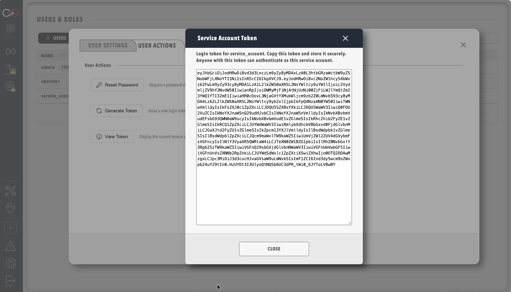

# Service Accounts

Profinity 2.3 supports **service accounts** — dedicated user records with long-lived **API tokens** for automation, integrations, and **MCP** clients. Service accounts are managed in **Users & Groups** by users with **SecurityAdmin** permission.

## Create a service account

1. Select **ADMIN** in the side menu, then **Users & Groups** → **+ Add user** (or edit an existing automation user).
2. Enable the **Service account** toggle.
3. Save the user, then click the user's row to open their settings dialog.
4. Select the **User Actions** tab.
5. Click **Generate Token** (or **View Token** for an existing service account). The token dialog appears, showing the bearer token.

<figure markdown>

<figcaption>Service account token dialog</figcaption>
</figure>

!!! danger "Copy the token once"
    Store the token in a secrets manager. Profinity may not display the full token again after the dialog closes.

## Permissions

Assign **roles** to the service account the same as interactive users. Common patterns:

| Use case | Suggested permissions |
|----------|----------------------|
| Read-only monitoring | A role holding view permissions only, as suggested in [Roles and permissions](../Roles_and_Permissions.md#which-roles-to-create) |
| Tag/query automation | `TagView` plus any required read APIs |
| MCP access | `McpView` (included in the default Administrators role; assign it explicitly to any other role) |

See [Roles and permissions](../Roles_and_Permissions.md).

## Using the token

Pass the token as a bearer token on `/api/v2` requests:

```http
Authorization: Bearer {your-service-token}
```

For MCP setup and testing, see [MCP Server](../../Integrating_to_Profinity/MCP_Server.md).

## Revoke access

- **Disable** the service account user in Users & Groups, or
- Change roles (revokes sessions), or
- Rotate the token by opening the user's settings dialog, selecting the **User Actions** tab, and clicking **Regenerate** in the token dialog to issue a new token.

## Related documentation

- [Managing users](../Manage_Users.md)
- [MCP Server](../../Integrating_to_Profinity/MCP_Server.md)
- [Roles and permissions](../Roles_and_Permissions.md)
- [Component and collection security](./Component_And_Collection_Security.md) — how restricted components and collections apply to service accounts.
