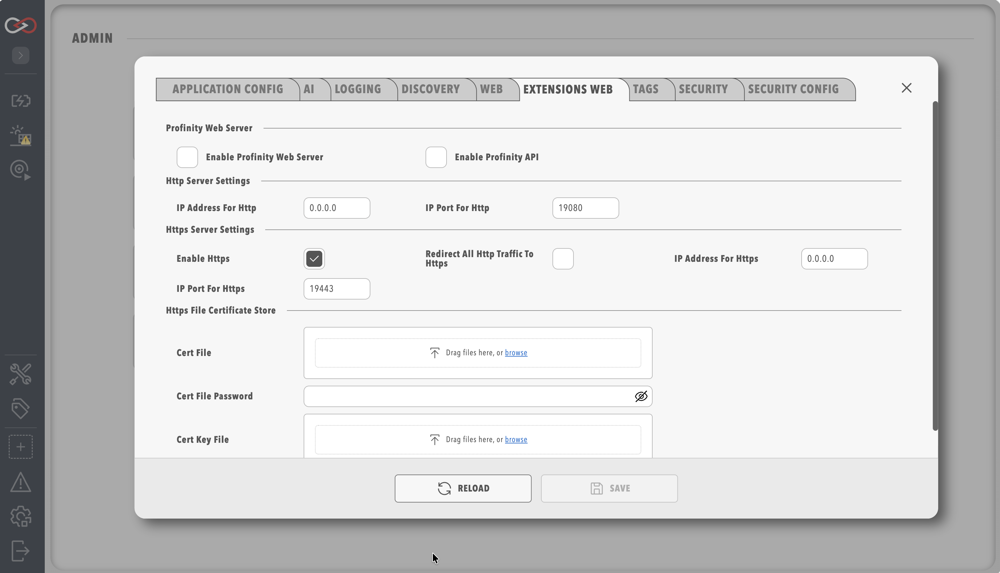

# Extensions Web

!!! warning "Saving Restarts Profinity"
    Saving changes on any System Configuration tab restarts Profinity. See [System Configuration](index.md) for what to expect.

Profinity can run a second, separate web server that serves custom applications and provides access to the same APIs that Profinity itself uses for all functionality. This second server is configured through the Extensions Web tab, is disabled by default, and requires a licence that includes the Profinity Server feature; without it the second web server stays off.

The Extensions Web server hosts custom [kiosk](../Kiosk_Mode.md) applications and custom web applications, such as an in-vehicle display, that call the Profinity API.

<figure markdown>

<figcaption>Extensions Web Menu</figcaption>
</figure>

The HTTP, HTTPS and certificate options are the same as on the [Web tab](Profinity_Web.md) (see [HTTPS certificates](Profinity_Web.md#https-certificates)), except for the default ports (19080 for HTTP and 19443 for HTTPS, so that they do not collide with the main Profinity Web ports) and these additional options:

| Parameter | Default | Description |
|-----------|---------|-------------|
|`Enable Profinity Web Server` | Off | Starts the second web server, so that extensions can be served on their own ports. |
|`Enable Profinity API` | Off | Makes the Profinity API available through the second web server. |
|`Enable Swagger on API` | Off | Shows the [Swagger UI](https://swagger.io/tools/swagger-ui/) API documentation. It can only be enabled when the Profinity API is enabled. |
