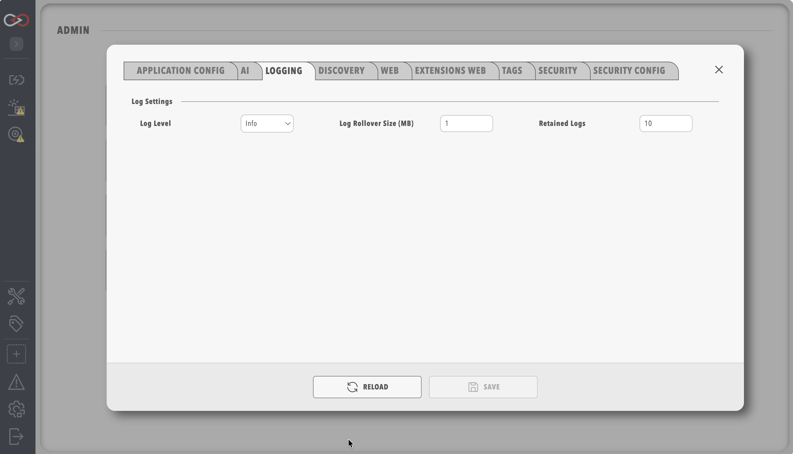

# Logging

!!! warning "Saving restarts Profinity"
    Saving changes on any System Configuration tab restarts Profinity. See [System Configuration](index.md) for what to expect.

The Logging tab of [System Configuration](index.md) has options for modifying the log level, logs rollover size, and number of retained logs.

| Option              | Description                                                                     |
| ------------------- | ------------------------------------------------------------------------------- |
| `Log Level`         | The scope of messages shown in the system logs                                  |
| `Log Rollover Size` | The maximum file size for each log file created, in MB                          |
| `Retained Logs`     | The number of log files that can be created before overwriting the oldest file  |

<figure markdown>

<figcaption>Profinity logs configuration menu</figcaption>
</figure>

Logging levels are a standard industry term and define the types of messages that are displayed to the user in the system logs. Each progressive logging level also encompasses all entries of the previous levels, so `Trace` includes every message from `Debug` through `Fatal`. A brief description of the various log levels is given below.

| Logging Level   | Description                                                                                          |
| ----------------| ---------------------------------------------------------------------------------------------------- |
| `Fatal`         | Used when the application encounters an error that prevents critical functionality from working  |
| `Error`         | Used when the application encounters an error that prevents particular functionality from working, but other parts of the application may remain functional |
| `Warn`          | Indicates something unexpected has happened, but the application continues to function               |
| `Info`          | Standard log level containing informative messages indicating the actions of the application. E.g., when changing states, connecting to the web API, etc.         |
| `Debug`         | Intermediate level of visibility that is helpful for debugging. Details some of the underlying application processes     |
| `Trace`         | Grants full visibility of underlying application execution. Only necessary when performing debugging |

!!! info "Log levels are persistent"
    Once a log level is set, it remains in effect across restarts of Profinity.

To read the logs, see [Logs](../Logs_Config.md).
