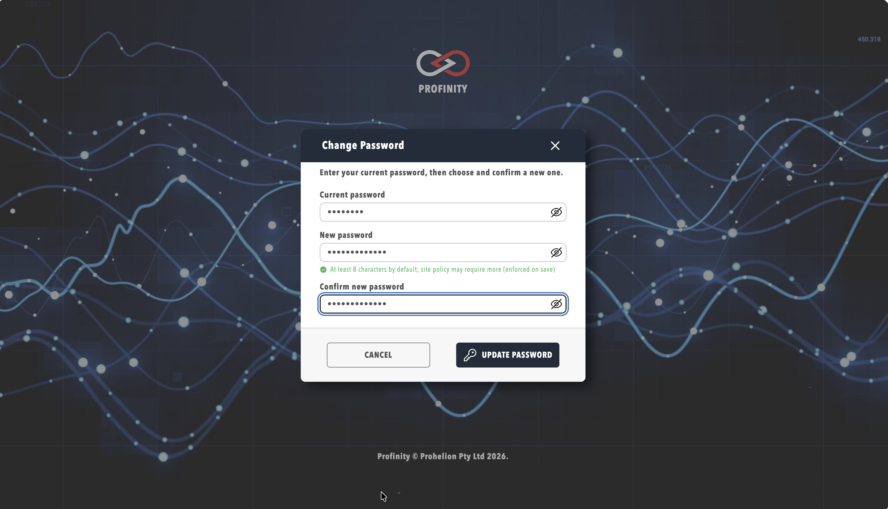

# Password Policy

The password policy applies to **local** sign-in, which is when the site **Sign-in method** is **Local**, and it sets the length, complexity and age rules for every local user's password. Users who sign in through single sign-on (SSO) authenticate with the identity provider, so these rules do not apply to them, as described in [SSO and Sign-In Method](./SSO_and_Sign_In.md).

## Configuring the Password Policy

To set the policy, sign in as a user with the **System administration** permission, select **ADMIN** in the side menu, then **System Configuration**, and open the **Password Policy** group on the **Security** tab. Saving the tab restarts Profinity and interrupts active sessions.

| Setting | Default | Range | Description |
|---------|---------|-------|-------------|
| **Minimum password length** | 8 | 1 to 256 | The minimum number of characters in a local user's password. |
| **Require uppercase letter** | Off | On or off | The password must contain at least one uppercase letter. |
| **Require lowercase letter** | Off | On or off | The password must contain at least one lowercase letter. |
| **Require digit** | Off | On or off | The password must contain at least one digit. |
| **Require special character** | Off | On or off | The password must contain at least one special character. |
| **Maximum password age (days)** | Empty (no expiry) | 1 to 3650 | When set, local users must change their password after this many days. |

The shipped policy accepts any password of eight characters or more, with no complexity rules and no expiry, so a site that handles safety-critical equipment raises the minimum length and switches on the complexity rules, and sets **Maximum password age (days)** to match its organisation's identity policy. The dialog for changing a password shows the minimum length as the user types.

## Forced Password Change

A user with the **Security administration** permission can require another user to change their password at the next sign-in, either by enabling **Require password change on next login** in the user's settings in **Users & Groups**, or by selecting **Reset Password** on the user's **User Actions** tab. **Reset Password** sets the same requirement and signs out the user's active sessions, and it is the preferred way to recover a compromised account because no temporary password has to be shared. **Reset Password** is not shown on an administrator's own account.

A user with this requirement sees a **change password** dialog after signing in and cannot use Profinity until a new password that meets the policy is saved. A new installation creates the `admin` account with this requirement already set, so the first sign-in as `admin` always forces a password change. The default `admin` credentials are listed in the [Security guide](../../../Installation/Security.md).

<figure markdown>

<figcaption>Password Change Required Before Continuing</figcaption>
</figure>

## Changing Your Own Password

A local user changes their own password by selecting **ADMIN** in the side menu, then the **Change My Password** pill, which is shown only when the site sign-in method is **Local** and the session is not a kiosk session. The user enters the current password, chooses and confirms a new one, and selects **Update Password**, and the site policy is enforced when the new password is saved.

<figure markdown>

<figcaption>Changing Your Own Password</figcaption>
</figure>

## Related Documentation

- [SSO and Sign-In Method](./SSO_and_Sign_In.md)
- [Two-Factor Authentication](./Two_Factor_Authentication.md)
- [MFA Account Management](../../Users_and_Access/MFA_Account_Management.md)
- [Roles and Permissions](../../Users_and_Access/Roles_and_Permissions.md)
- [Managing Users](../../Users_and_Access/Manage_Users.md)
- [Security Guide](../../../Installation/Security.md)
