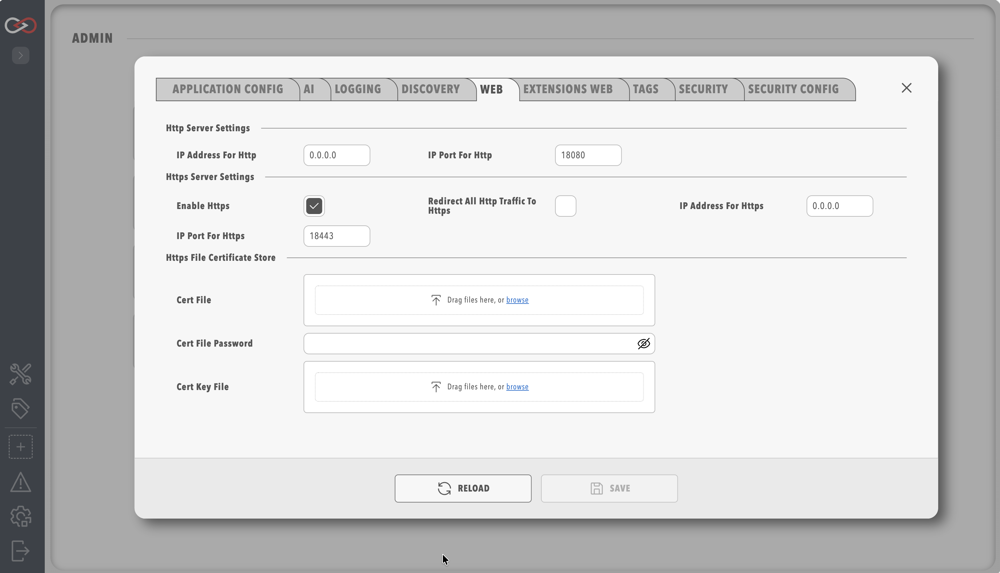

# System Configuration

The **System Configuration** pill is located on the **ADMIN** page, which is opened by selecting **ADMIN** in the side menu, and contains the configuration options for the core Profinity instance. The settings are grouped into tabs, and this page is the map of all of them: tabs that have no other home are described here in full, and tabs with their own page link to it.

!!! warning "Changes to the system config"
    Saving changes in the `System Configuration` menu triggers a reboot of Profinity, whereas enabling or disabling components on the **Components & Plugins** page applies immediately without a restart. After the save, Profinity shows a "Restarting, please wait..." message and checks the engine every two seconds, then refreshes the settings automatically once the engine is running again, so the page does not need to be reloaded manually. If the engine has not returned to the running state within 60 seconds, Profinity reports that the restart is taking longer than expected, and the System Information page shows the current engine state.

## Tabs at a glance

| Tab                | What it controls | Documented |
|--------------------|------------------|------------|
| Application Config | Packet retention, updates, tag history window and scripting | [Application Config](#application-config) |
| AI                 | The Profinity AI assistant and the MCP server | [AI](#ai) |
| Logging            | Log level, rollover size and retained logs | [Logs](../Logs_Config.md#system-logs-configuration) |
| Discovery          | The LAN heartbeat that lets Profinity Mobile find this server | [Discovery](#discovery) |
| Web                | The main HTTP and HTTPS web server and its certificates | [Profinity Web](#profinity-web) |
| Extensions Web     | A second web server for custom applications and the API | [Extensions Web](#extensions-web) |
| Tags               | Limits for the in-memory tag history buffer | [Tags](#tags) |
| Security           | Sign-in, passwords, sessions, two-factor, SSO, SCIM and SIEM | [Security](#security) |

## Application Config

| Parameter                          | Description |
|------------------------------------|--|
|`Maximum number of retained Packets`| Profinity retains CAN Packets for use in the CAN Utilities, and this parameter sets the number of packets retained. The default is 1000 and the maximum is 10000. |
|`Custom Update Server`              | Profinity supports the use of Custom Update Servers for release management. If you are running the standard version of Profinity, leave this field blank. |
|`Update Check Interval (hours)`     | How often Profinity checks for updates, from 1 to 168 hours (one week). The default is 24, and 0 disables scheduled checks. |
|`Recent tag history - local window (minutes)` | Dashboard bindings that query a time range starting within this window are served entirely from the in-memory [tag buffer](#tags). Ranges that start earlier use the designated InfluxDB reader for the whole window, when one is configured. The default is 60 and the range is 1 to 10080 minutes. |
|`Enable Scripting`                  | This field must be selected for the Profinity instance to support scripting. Scripting requires security considerations and as such is not activated by default, and it can only be enabled when the Profinity licence includes the Scripting feature. |

<figure markdown>

<figcaption>Profinity System Configuration</figcaption>
</figure>

## AI

The AI tab configures the instance-wide Profinity AI assistant (provider, model, API key and web search) and the MCP server that it uses. It is described in [Profinity AI settings](AI_Settings.md). Enabling Profinity AI also enables the [MCP Server](../../Integrating_to_Profinity/MCP_Server.md), which can also be enabled on its own for external MCP clients.

## Logging

The Logging tab sets the log level, the log rollover size and the number of retained logs. It is described in [Logs](../Logs_Config.md#system-logs-configuration).

## Discovery

Profinity can broadcast a small UDP heartbeat on the local network so that [Profinity Mobile](../../Mobile/index.md) can find this server without the address being typed in.

| Parameter                          | Description |
|------------------------------------|--|
|`Send Profinity Heartbeat`          | Enable or disable the heartbeat broadcast, which is enabled by default. |
|`Profinity Server Name`             | The name shown to Profinity Mobile. When left empty it defaults to the machine's hostname, and it can be changed to something more recognisable. |
|`Heartbeat UDP port`                | The UDP port used for the broadcast, from 1 to 65535 (default 49025). Only available when the heartbeat is enabled. |
|`Heartbeat interval (seconds)`      | The time between broadcasts, from 1 to 60 seconds (default 3). Only available when the heartbeat is enabled. |

## Profinity Web

The Web tab allows you to configure all the parameters that control how Profinity offers its web server connections to users. Profinity supports both HTTP and HTTPS connections as well as custom HTTPS certificates.

<figure markdown>

<figcaption>Profinity web menu</figcaption>
</figure>

| Parameter                          | Description |
|------------------------------------|--|
|`IP Address for Http`               | The IP address Profinity runs on for HTTP. The default is all IP addresses (0.0.0.0), however localhost (127.0.0.1) or a specific IP address can be set if required. |
|`IP Port for Http`                  | The port used for HTTP (default is 18080). Setting this below 1024 requires admin permissions. |
|`Enable Https`                      | Enable or disable the HTTPS server, which is enabled by default. |
|`IP Address for Https`              | Same as the HTTP address but for HTTPS (127.0.0.1 or 0.0.0.0). |
|`IP Port for Https`                 | Same as the HTTP port but for HTTPS (default is 18443). |
|`Redirect all Http traffic to Https`| Forces the system to use HTTPS for all traffic. It can only be enabled when HTTPS is enabled. |

The certificate options are shared with the Extensions Web tab and are described in [HTTPS certificates](#https-certificates).

## Extensions Web

Profinity can run a second, separate web server that serves custom applications and provides access to the same APIs that Profinity itself uses for all functionality. This second server is configured through the Extensions Web tab, is disabled by default, and requires a licence that includes the Profinity Server feature.

By using the Extensions Web, Profinity can be configured to run custom Kiosk applications and custom web applications for vehicles, among others.

<figure markdown>

<figcaption>Extensions web menu</figcaption>
</figure>

The HTTP, HTTPS and certificate options are the same as on the Web tab, except for the default ports (19080 for HTTP and 19443 for HTTPS, so that they do not collide with the main Profinity Web ports) and these additional options:

| Parameter                          | Description |
|------------------------------------|--|
|`Enable Profinity Web Server`       | Enable or disable the Profinity web server for extensions |
|`Enable Profinity API`              | Enable or disable the Profinity API in that instance of the Web Server for extensions |
|`Enable Swagger on API`             | Enable or disable [Swagger UI](https://swagger.io/tools/swagger-ui/) for API documentation. It can only be enabled when the Profinity API is enabled. |

## HTTPS certificates

These options apply to both the Web and Extensions Web tabs, and each server has its own copy of them.

| Parameter                          | Description |
|------------------------------------|--|
|`Windows Cert Store`                | When using HTTPS on Windows, you can specify a certificate from the Windows Certificate Store. This is typically used when you have a certificate installed in your system's certificate store. |
|`Windows Cert Store Location`       | The location of the certificate store. Common values are: `CurrentUser` (for user-specific certificates) or `LocalMachine` (for system-wide certificates). |
|`Windows Cert Store Subject`        | The subject name of the certificate as it appears in the Windows Certificate Store. This should match exactly with the certificate's subject name. |
|`Cert File`                         | Alternative to using the Windows Certificate Store, you can specify a certificate file (typically .pfx or .p12 format) for HTTPS. |
|`Cert File Password`                | If using a certificate file, provide the password used to protect the certificate file. |
|`Cert Key File`                     | The private key file (`.pem` or `.key`) when the certificate is in PEM format, which is optional because, when it is not specified, Profinity looks for a file named `privkey.pem` in the same folder as the certificate. |

!!! tip "Finding Certificate Information on Windows"
    To find the correct certificate store location and subject name:

    1. Open Windows Certificate Manager (`certmgr.msc`)
    2. Navigate to the appropriate store (Personal, Trusted Root, etc.)
    3. Find your certificate and double-click it
    4. The subject name is listed in the "Subject" field
    5. The store location is shown in the certificate manager's navigation tree

## Tags

Profinity keeps a rolling in-memory history of recent tag values, which is used for dashboard charts and for the recent-history queries described under [Application Config](#application-config). The Tags tab sets the limits on that buffer, so that it cannot grow without bound on a busy instance.

| Parameter                          | Description |
|------------------------------------|--|
|`Max Points Per Tag`                | The most samples kept for a single tag (default 1500). When it is exceeded the oldest samples for that tag are removed. |
|`Max Total Points (All Tags)`       | The most samples kept across all tags (default 100000). |
|`Share eviction budget across tags` | When enabled (the default), the total limit is enforced by dropping the oldest samples across all tags, rather than per tag. |
|`Point TTL (Minutes)`               | Samples older than this are pruned (default 60). |
|`Max Dynamically Tracked Tags`      | The most tags tracked on demand, such as by a dashboard that has just opened (default 200). When it is exceeded the least recently used are dropped. |
|`Dynamic Track Inactivity TTL (Minutes)` | A dynamically tracked tag that nobody has used for this long is removed (default 45). |

## Security

The Security tab holds the instance-wide authentication and access policy. Each group of settings has its own page:

| Settings                  | Page |
|---------------------------|------|
| Sign-in mode, local login and SSO | [Single Sign-On and Sign In](Security/SSO_and_Sign_In.md) |
| Password policy           | [Password Policy](Security/Password_Policy.md) |
| Two-factor authentication | [Two-Factor Authentication](Security/Two_Factor_Authentication.md) |
| SCIM provisioning and SIEM export | [SCIM and SIEM](Security/SCIM_and_SIEM.md) |
