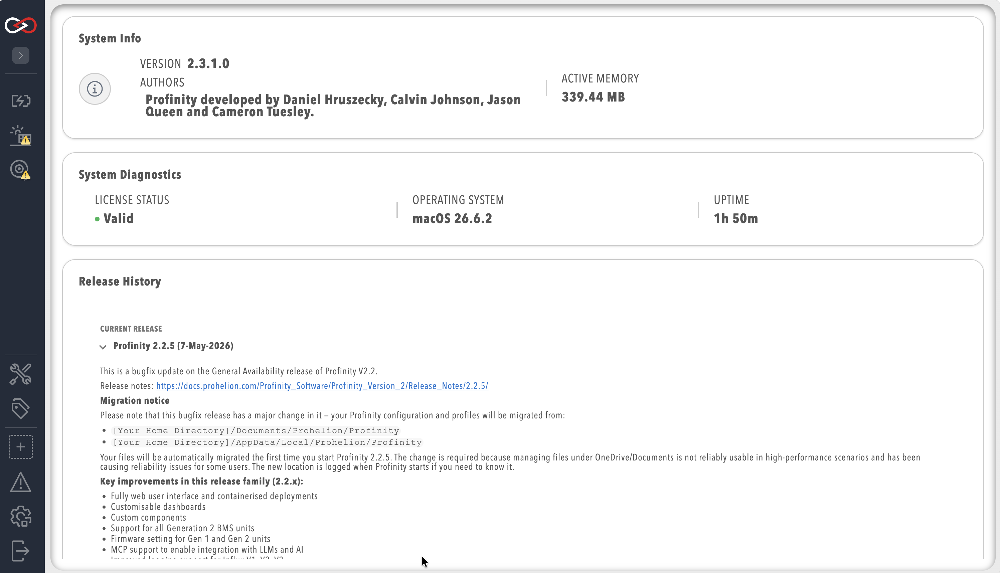

# System Information

To see which version of Profinity you are running, select the `System Information` option in the `ADMIN` tab.

<figure markdown>

<figcaption>System information page</figcaption>
</figure>

The page also shows the active memory in use, a **New Release Available** entry when a newer Profinity release has been detected, and a System Diagnostics row listing the **License Status** (see [Licensing](Licensing.md)), the operating system, and the system uptime, along with notes about the latest Profinity releases and the software credits.
