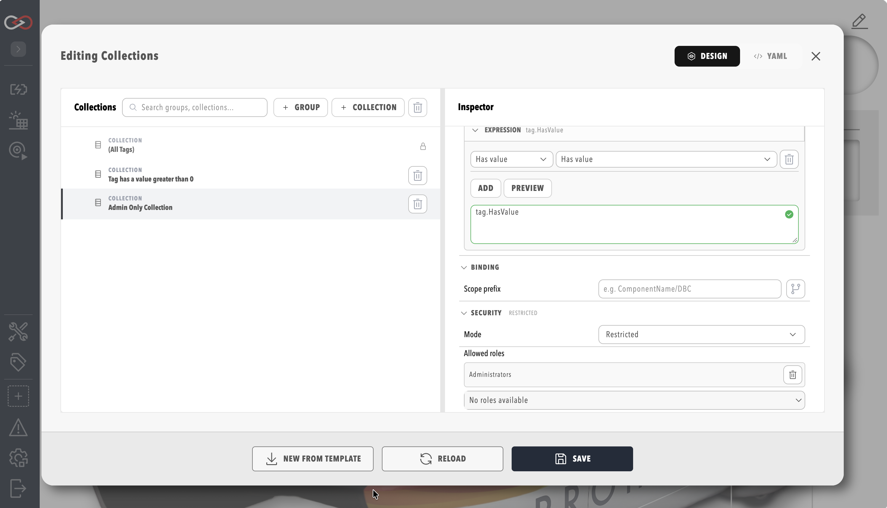

# Component and Collection Security

Component and collection security controls which users can **see** a profile component or a tag collection, independent of who can **modify** it. A user without `ComponentModify` or `TagCollectionsModify` already cannot change a component or a collection; this feature goes further and can remove the resource from that user's view entirely — from the tag tree, the actions list, DBC, firmware, alerts, MCP results, and the tag collections picker.

A restricted component keeps running. Rules, scripts, loggers, CAN, and relay traffic for a hidden component are unaffected — this is a visibility control for users and APIs, not component isolation.

Only a user with the **SecurityAdmin** permission can see or change these settings. `ComponentModify` and `TagCollectionsModify` continue to control editing of the resource itself, but neither permission grants access to its Security tab or panel.

## Open the Security tab on a component

1. Open the component's settings dialog from the profile menu or component list.
2. Select the **Security** tab, alongside **Settings** and **Firmware** (when present).
3. Set **Mode** to **All** or **Restricted**.
4. When **Restricted**, add one or more roles to **Allowed roles**.
5. Save the tab.

The Security tab is visible only to a user with **SecurityAdmin**. Any other user, including one with `ComponentModify`, does not see the tab at all.

<figure markdown>

<figcaption>Security tab on a component settings dialog</figcaption>
</figure>

## Open the Security panel on a collection

1. Open the **Collections** editor.
2. Select a collection in the tree.
3. Open the **Security** panel in the inspector.
4. Set **Mode** to **All** or **Restricted**.
5. When **Restricted**, add one or more roles to **Allowed roles**.

The same panel appears for the built-in **(All Tags)** collection and for every custom collection. Changes save with the rest of the collection's settings.

<figure markdown>

<figcaption>Security panel on a collection in the Collections editor</figcaption>
</figure>

## Mode and allowed roles

Each component and each collection carries its own security policy, made up of two fields:

| Field | Description |
|-------|-------------|
| Mode | **All** (default) — visible to every user with the underlying view permission. **Restricted** — visible only to a user assigned one of the roles in Allowed roles. |
| Allowed roles (`allowedRoles`) | The roles permitted to see the resource when Mode is Restricted. A user needs only one of the listed roles, not all of them. Ignored when Mode is All. |

A component or collection with no security policy set behaves as Mode **All**. Clearing a policy back to All removes it from storage rather than leaving an explicit "All" record behind.

## Who bypasses a restriction

Two groups always see a restricted component or collection, regardless of role assignment:

- A user with **SecurityAdmin**.
- A user with **ProfileModify**, so that engineers configuring a profile's layout are never locked out of their own work.

A service account is treated the same as an interactive user: it must be assigned one of the allowed roles to see a restricted resource, and the same visibility filter applies whether it calls the web UI's APIs or an MCP tool.

## The built-in (All Tags) collection

**(All Tags)** is a reserved, engine-owned collection with the fixed id `All`. It is not stored as a tree node alongside custom collections, cannot be deleted, and its definition cannot be edited — but it carries the same Security panel as any custom collection, and a SecurityAdmin can restrict it the same way.

A custom collection cannot be created with the id `All`; Profinity rejects the save with `400 Bad Request` because that id is reserved.

When **(All Tags)** has no security policy set, it is visible to every user with `TagView` — this is its default state. When restricted, only users with one of the allowed roles (plus SecurityAdmin and ProfileModify) see it in the tag collections picker.

Component security still applies underneath collection security: **(All Tags)** returns every tag a user's component security already permits, not every tag on the profile. A collection that is itself visible to a user can still resolve to an empty member list if every tag it would otherwise return belongs to a component that user cannot see — this returns an empty result, not a 404, because the collection itself is visible.

## Fail-closed behaviour

!!! warning "A misconfigured restriction denies access, it does not grant it"
    Setting Mode to **Restricted** with an empty **Allowed roles** list, or with only role names that no longer exist on this site, hides the resource from every user except SecurityAdmin and ProfileModify. It does not fall back to Mode **All**.

    This applies in two situations in particular:

    - Restricting a component or collection and saving before adding any role to the allow list.
    - Importing a profile pack whose grants reference a role name that does not exist on the destination site (see below). Those names are treated as unresolved and never match a user, even though the resource is still marked Restricted.

    If a user unexpectedly cannot see a component, action, tag branch, or collection they should have access to, check the Security tab or panel for an empty or fully unresolved allow list before assuming a permissions problem elsewhere.

## Unresolved roles after a profile import

Role and user definitions are site-specific; security grants travel with the profile pack. Importing a profile pack built on a different site can reference a role name that does not exist locally.

Profinity does not drop these names silently. A SecurityAdmin sees them as unresolved, read-only entries in the Security tab or panel, with helper text identifying the missing role name. Uploading a profile pack with unresolved grants also surfaces a summary warning so a SecurityAdmin knows to review it. An unresolved role name never grants access while it remains unresolved; the SecurityAdmin must remove it or replace it with a role that exists on the site.

## What stays unaffected

- A hidden component keeps running: rules, scripts, loggers, CAN, and relay behaviour are unchanged.
- Internal engine processing — rule evaluation, collection member resolution used by rules, and relay's outbound tree — ignores component and collection security. Security applies to user-facing APIs and the UI only.
- Direct API access to a hidden component, collection, or tag path returns `404 Not Found`, not `403 Forbidden`, so a caller cannot tell the difference between "does not exist" and "exists but is hidden from you".

## Permissions

Only **SecurityAdmin** can view or change component and collection security. See [Roles and permissions](Roles_and_Permissions.md) for how permissions and roles are assigned generally.

## REST API

| Method | Route | Auth | Purpose |
|--------|-------|------|---------|
| GET/PUT | `/api/v2/ActiveProfile/components/{componentName}/security` | `SecurityAdmin` | Reads or writes the security policy for a component on the active profile. `{componentName}` is the component's display name. |
| GET/PUT | `/api/v2/ActiveProfile/collections/{collectionId}/security` | `SecurityAdmin` | Reads or writes the security policy for a collection on the active profile, including the reserved `All` collection. |

Both endpoints operate on the active profile only; there is no route to edit security for a profile that is not currently loaded. A GET response includes an `unresolvedRoles` list alongside `mode` and `allowedRoles`; PUT accepts only `mode` and `allowedRoles`.

## Related documentation

- [Roles and permissions](Roles_and_Permissions.md) — how permissions, roles, and role assignment work generally.
- [Tag layer](../../Tags/index.md) — the tag tree that component security prunes.
- [Collections](../../Tags/Collections.md) — creating and editing tag collections, including the built-in (All Tags) collection that collection security also covers.
