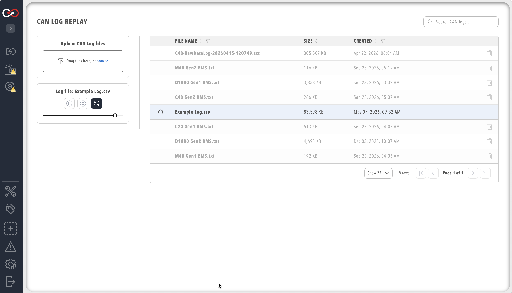

# Log / Replay CAN bus Messages

Profinity provides the ability to both log and replay messages from your CAN bus network, as well as the ability to log CAN bus data to timeseries databases such as InfluxDB and Prometheus.

To log a set of CAN bus messages, first add an adapter to your [Profile](../Getting_Started/Profiles.md) and then connect to the adapter.

Before logging, check that Profinity is actually receiving CAN bus messages by using the [Receive CAN bus](Send_Receive_CAN_Bus_Messages.md#receive-can-packets) window. Once CAN bus messages are coming in to Profinity, you are ready to log.

## Logging CAN bus

There are two distinct types of loggers available in Profinity: loggers to [log to file](../Components/Loggers/File_Loggers.md), and loggers that log to timeseries databases such as [InfluxDB and Prometheus](../Components/Loggers/InfluxDB_Prometheus_Logger.md). The file loggers include the CAN File Logger and the CAN SFTP Logger, which record native CAN bus messages, and the TAG File Logger and the TAG SFTP Logger, which record the values of the tags in selected tag collections. Publishing CAN-derived tag data to an MQTT broker or a webhook is handled separately by the [MQTT Publisher](../Components/Publishers_and_Subscribers/MQTT_Publisher.md) and [Webhook Publisher](../Components/Publishers_and_Subscribers/Webhook_Publisher.md) — a publisher pushes to a subscriber that is actively listening right now, rather than writing to a queryable store the way a logger does, which is why the two sit in their own **Publishers & Subscribers** category rather than under **Loggers**.

All loggers are configured in the same manner, by adding a logger as a component to the Profile. Publishers are added and configured the same way, from the **Publishers & Subscribers** category instead.

!!! info "Replaying Logs Requires a File Logger"
    The CAN Data Log Replayer below cannot replay InfluxDB or Prometheus data. Only a file log of CAN messages recorded by a File or SFTP logger can be replayed.

## CAN Data Log Replayer

The Profinity data log replayer allows you to replay log files that have previously been recorded in Profinity.

To use this tool, select the log file and click the play button to start the replay. A number of options are available that change the way the log file is replayed: sliding the slider back and forth moves to new locations in the CAN bus replay file, pausing suspends the replay so that it can be restarted later if required, and pressing the trashcan icon deletes the log. Log files that you have recorded earlier or on other Profinity instances can be uploaded to this Profinity instance via the **Upload CAN Log files** control.

<figure markdown>

<figcaption>Data Log Replayer</figcaption>
</figure>