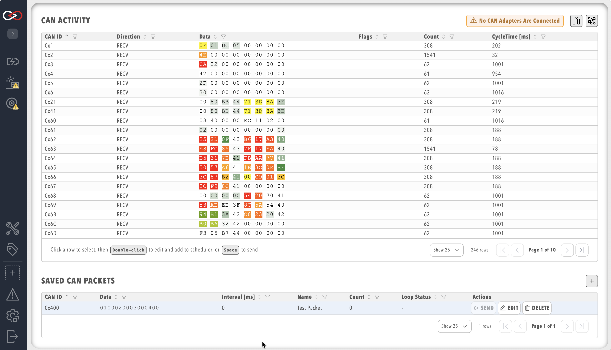
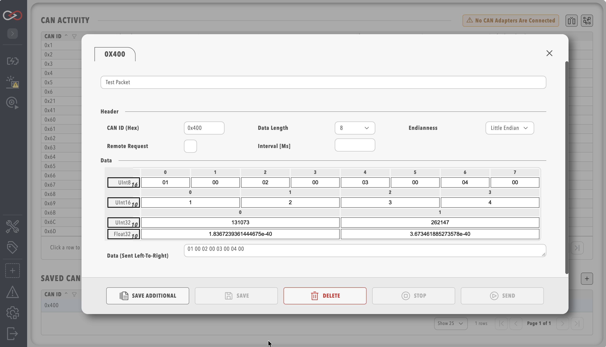

# Send / Receive CAN bus Messages

Profinity can monitor CAN bus traffic on your network and also allows you to transmit messages back on the CAN network from within the Profinity toolset.

Messages can be transmitted either via the `SEND & RECEIVED CAN` window, which is documented below, or via the [CAN Data Log Replayer](Logging_Replaying_CAN_Bus_Messages.md#can-data-log-replayer).

!!! info "Check user privileges"
    Before trying to send or receive any CAN packets, ensure that the current user holds the associated permission: `CANView` to receive and `CANSend` to send (`CANSend` includes `CANView`). The replayer requires `CANReplay`. See [Roles and permissions](../Administration/Users_and_Access/Roles_and_Permissions.md).

## Receive CAN Packets

Select **CAN UTILITIES** in the side menu, then the `SEND & RECEIVED CAN` menu item to see a view of all the CAN bus messages currently travelling across your network.

<figure markdown>

<figcaption>Receive CAN Packets</figcaption>
</figure>

Clicking on the `CAN Activity` table headers allows you to filter and/or sort the messages by CAN ID, direction, flags, and so on. Depending on the [adapter](../Components/CAN_Bus_Protocols/CAN_Bus_Adapters.md), you may also be able to change settings such as endian representation or local traffic filtering.

There are two additional controls available at the top of the window, named `Spaced data` and `Heatmap`. Toggling on the `Spaced data` option breaks the CAN traffic data into individual hex bytes to make it easier to read. With the `Heatmap` option toggled, bytes that change value frequently are highlighted with warmer colours and bytes that remain relatively constant are highlighted with cooler colours.

Both these options are selected by default but can be switched off if required.

## Scheduled CAN Packets

The scheduled CAN Packets are listed at the bottom of the screen. Additional scheduled CAN Packets can be added by clicking on the `+` icon in the bottom panel, or by double clicking or selecting a packet in the top CAN Activity panel and pressing the `+` icon at the top of the page.

Packets can be sent only once, or can be saved so that Profinity adds the packet to a list of scheduled Packets and continues to send it in the background.

!!! info "Logging Off Does Not Stop Packets Sending"
    If you set up a CAN Packet in Profinity to send regularly and then log off from Profinity, the packet continues to send. To stop a packet sending, delete it in the Scheduled CAN Packet list.

!!! info "Scheduled Packets Are Saved In Your Profile"
    If you change [Profile](../Getting_Started/Profiles.md) or restart Profinity your saved packets are not lost, they are restored. However, packets do not automatically start sending again on a schedule, and you need to restart them manually.

### Adding a Scheduled Packet

Click on the `+` symbol to schedule a new CAN Packet to be sent.

!!! info "Default is little endian"
    The default byte order used is little endian to align with Windows / Intel systems. Little endian is used by most of the Prohelion technologies, including the WaveSculptor, whose data fields are sent least significant byte first (see the [WaveSculptor22 CAN protocol appendix](../../../Motor_Controllers/WaveSculptor22/User_Manual/Appendix_C.md)).

<figure markdown>

<figcaption>Send CAN Packet</figcaption>
</figure>

The Scheduled CAN Packet window allows you to transmit messages back on to the CAN bus network from Profinity. From this tool you can set the CAN ID and endian, as well as the values for either Bytes, Int16, Int32, Floats or the raw packet data.

When you change one of these values the raw data updates to reflect that. Likewise, when you change the raw data the values update to reflect that change.

Setting an interval causes Profinity to send your CAN packet at your chosen loop rate, so setting the Interval (ms) to 100 sends the packet every 100 ms.

### Sending a Packet on Demand

If your packet is not set up on a schedule, you can send it manually at any time by clicking on the send arrow in the Scheduled CAN Packets window, or by selecting the line of the CAN Packet and pressing the space bar.

## Related documentation

- [How to Send and Receive CAN Bus Messages](../How_To_Guides/Send_Receive_CAN_Bus.md)
- [How to Connect to CAN Bus](../How_To_Guides/Connect_to_CAN_Bus.md)
- [Log / Replay CAN bus Messages](Logging_Replaying_CAN_Bus_Messages.md)
