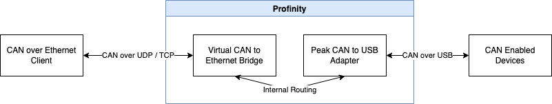
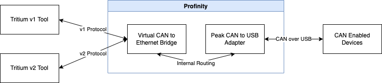
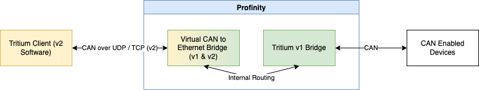
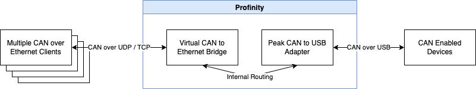

# Prohelion Virtual CAN bus Adapter

The Prohelion Virtual CAN bus Adapter is a special type of adapter in Profinity in that it is designed to relay information to one or more other CAN adapters, while presenting itself to other clients as a Tritium / Prohelion [CAN to Ethernet bridge](../../../../Solar_Car_Racing/CAN_Ethernet_Bridge/index.md) that can be connected to. The adapter is added to a Profile as the `Prohelion Virtual CAN to Ethernet Bridge` component.

In the diagram below, a client on the left connects to the Virtual Adapter which is being used in conjunction with a Peak USB adapter to provide connectivity to the actual CAN Network.  Traffic is routed bi-directionally.

<figure markdown>

<figcaption>Virtual Adapter</figcaption>
</figure>

The Virtual Adapter allows tools that were developed for the Tritium and Prohelion CAN to Ethernet bridges to be used in the absence of a physical bridge. A different CAN connection technology, such as SocketCAN or the Peak USB adapter, connects to the CAN network, and the Virtual Adapter provides connectivity for the legacy tools.

To add a Virtual Adapter to your configuration, add one to your Profile and select the `Network Protocol` (TCP by default, with UDP always available as well), the `Bridge Protocol Version` (`V1`, `V2` or `All`, which defaults to `All`), the `Network Adapter` (the network interface on which the Virtual Bridge runs), and the `Bus Number` for your configuration, which Profinity limits to 0 to 13 for `V1` or `All`, as the version 1 protocol allows only a 4-bit bus number.

!!! info "Setting the Virtual Bridge IP Address"
    As the Virtual CAN Bridge runs inside Profinity, the IP address of the Virtual Bridge Adapter is set at an OS level on that machine. It cannot be changed remotely via the CAN Bridge Config tools or Profinity, which can only select the network interface.

!!! warning "Two Bridges With the Same Bus Number Relay Data Between Each Other"
    Having two bridges with the same bus number on a single network causes them to start relaying data from one bridge to the other. This is designed behaviour that allows two separate CAN bus networks to be spanned over Ethernet as one virtual bus, and it must be taken into account when using the Virtual Adapter, because two bridges on the same CAN bus that are also connected to the same Ethernet network create a cyclic network in which every message is resent indefinitely until the CAN bus is overloaded. See [Network Topologies](../../../../Solar_Car_Racing/CAN_Ethernet_Bridge/User_Manual/Network_Topologies.md) and the [CAN to Ethernet documentation](../../../../Solar_Car_Racing/CAN_Ethernet_Bridge/User_Manual/index.md) for more information.

The configuration options for the Virtual Bridge are generally similar to those of the Tritium bridge, but the virtual bridge behaves differently from the physical bridge in several areas, which are noted below.

## Multi-Protocol Support

Tritium and Prohelion CAN to Ethernet Bridges have two major releases of firmware, V1 and V2, that speak different protocols, which differ in the width of the bus identifier (4 bits for V1 and 16 bits for V2, as set out in [CAN-UDP Bridging](../../../../Solar_Car_Racing/CAN_Ethernet_Bridge/Ethernet_Interface/CAN_UDP_Bridging.md)). A V1 bridge can be updated to V2 by refreshing its firmware, but many bridges remain on V1 firmware in use by existing customers.

Tritium software tools were generally shipped in either a V1 or a V2 variant to talk the correct protocol version, which means that a V1 tool could not talk to a V2 bridge, whereas a V2 tool should be able to manage both versions of bridge, although the [Fundamentals](../../../../Solar_Car_Racing/CAN_Ethernet_Bridge/Fundamentals.md) page recommends using the tools that match the bridge version.

The Virtual Bridge resolves this by speaking both the V1 and V2 protocols at the same time (the `All` option), representing itself as two bridges, one V1 and the other V2. The older tools generally discover the version of the bridge that they can speak to.

<figure markdown>

<figcaption>Multi-Protocol Support</figcaption>
</figure>

A useful scenario for the Virtual Bridge is to use it in conjunction with a physical V1 bridge to talk to tools that were designed for the V2 protocol.

In the scenario below, a Tritium V1 Bridge is front ended by the Virtual Adapter / router, allowing it to communicate with tools that support the V2 protocol.

<figure markdown>

<figcaption>v1 and v2 Protocol Support</figcaption>
</figure>

## Multi-Client TCP Support

The physical bridge can only handle a single TCP connection at a time (a second TCP connection fails, and UDP is the alternative for several clients), whereas the virtual bridge can handle multiple clients simultaneously. This allows the virtual bridge to act as a form of TCP based CAN Bridge server, where many clients connect at once over TCP and sustain the connection to get CAN data from the interface, which is useful for establishing real-time CAN monitoring in remote locations.

<figure markdown>

<figcaption>Multi-Client Support</figcaption>
</figure>
