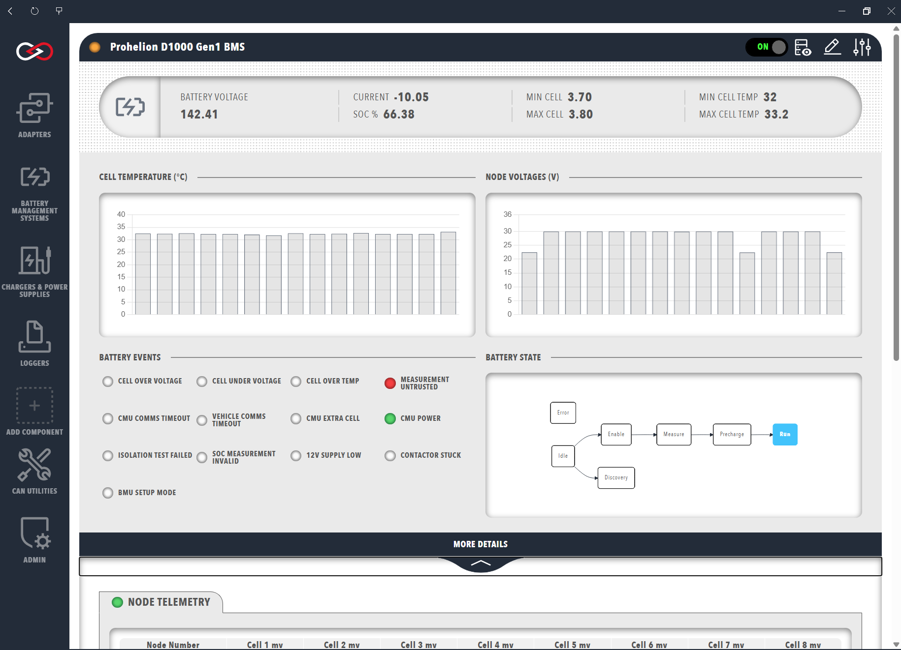
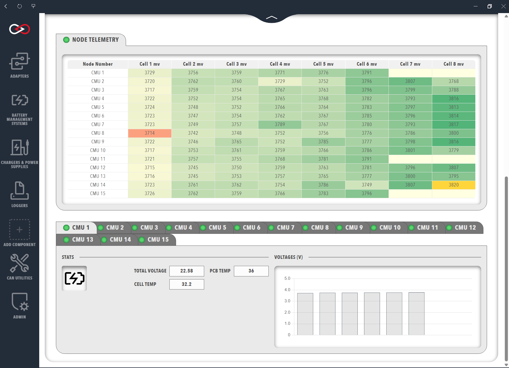
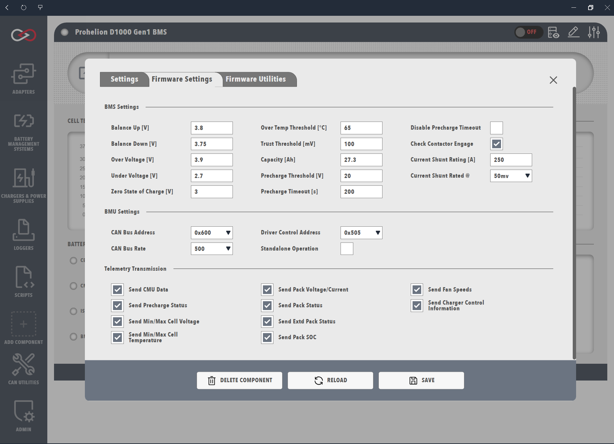

# Prohelion Battery Management Systems

Profinity supports the management and monitoring of all Prohelion Battery Management Systems (BMS) through the BMU dashboard, which is shown as a tab in the sidebar once a Battery Management Unit (BMU) has been added to your [Profile](../../Getting_Started/Profiles.md). The following models are supported, and the appropriate model and generation must be selected when the BMS is added.

- **D1000 Gen1**: [Prohelion BMS D1000 Gen1](../../../../Battery_Management_Systems/Prohelion_BMS_D1000_Gen1/index.md), a 1000 V BMS with a BMU and Cell Management Units (CMUs) on a dedicated CMU CAN bus.
- **D1000 Gen2**: [Prohelion BMS D1000 Gen2](../../../../Battery_Management_Systems/Prohelion_BMS_D1000_Gen2/index.md), a 1000 V BMS with a BMU, a Battery Junction Unit (BJU) and CMUs, available with Firmware V1.1 or V1.2.
- **M48 Gen1**: [Prohelion BMS M48 Gen1](../../../../Battery_Management_Systems/Prohelion_BMS_M48_Gen1/index.md), a 48 V BMS.
- **M48 Gen2**, **C48 Gen2** and **C20 Gen1**: the 48 V Generation 2, 48 V 100 A 16S and 20 V Generation 1 BMS respectively.

!!! info "CMUs and Nodes are managed by the BMU"
    The BMU organises its CMUs (also referred to as Nodes) in every model, so only the BMU is added to your Profile, and doing so provides control of and data from the entire BMS. A typical battery has one BMU, but larger and split packs, such as those used in racing, can have two or more, in which case one BMU is added for each unit with a different base CAN address. The hardware is described in the [Prohelion BMS documentation](../../../../Battery_Management_Systems/index.md).

## BMU Management

When a Prohelion BMU is added to your Profile, Profinity prompts for the following information about the device, and these details can be changed later with the `Change Settings` button at the top-right of the BMU dashboard.

| Parameter            | Description                                                                                         |
|----------------------|-----------------------------------------------------------------------------------------------------|
| `Name`               | The name of the component. Must be unique.                                                          |
| `Control Pack`       | Enables software control of the BMS from Profinity, for the BMS units that support it.              |
| `Milliseconds Valid` | The timeout of the device. If no traffic is received from the device within this time, the connection is assumed to have been lost. |
| `Base Address`       | The CAN address of the BMU, which is `0x600` by default for the D1000 Gen1, D1000 Gen2 and M48 Gen1, as described in the [D1000 Gen1 Communications Protocol](../../../../Battery_Management_Systems/Prohelion_BMS_D1000_Gen1/Communications_Protocol/index.md), [D1000 Gen2 Messages and Signals](../../../../Battery_Management_Systems/Prohelion_BMS_D1000_Gen2/Firmware/V1.2/Messages_and_Signals.md) and [M48 Gen1 CAN Communication](../../../../Battery_Management_Systems/Prohelion_BMS_M48_Gen1/CAN_Communication.md). |

<figure markdown>

<figcaption>Prohelion BMU</figcaption>
</figure>

The top section of the dashboard shows data from the BMU, and clicking the `MORE DETAILS` banner expands it to display telemetry from the CMUs. The controls at the top-right include access to the CAN signals and messages from the BMS in the [DBC viewer](../../CAN_Utilities/CAN_Bus_DBC.md).

### BMU Data

The top row summarises the battery voltage, the current (negative when flowing into the battery), the state of charge as a percentage of the user-set pack capacity (`SOC %`), and the maximum and minimum cell voltage and cell temperature in the pack. Below the summary are graphs of the cell temperatures and node voltages observed by the CMUs, which show the data in greater resolution when hovered over.

The lower left of the window shows status indicators for battery events, which depend on the BMS in use and include cell over and under voltage, cell over temperature, untrusted measurements, CMU and vehicle timeouts and an invalid SoC estimation. The D1000 Gen2 dashboard instead shows the reasons reported by the BMS, including a separate `PRECHARGE FAIL REASON` group for a failed precharge, where `HVIL` indicates that the High-Voltage Interlock loop is measuring a high impedance, which points to a connector failure, and `BJU` indicates that the BJU has not responded to requests for measurements. The full list of status flags is in the [D1000 Gen1 Transmitted CAN Packets](../../../../Battery_Management_Systems/Prohelion_BMS_D1000_Gen1/Communications_Protocol/Transmitted_CAN_Packets.md) and the BMS Info message of the [D1000 Gen2 Messages and Signals](../../../../Battery_Management_Systems/Prohelion_BMS_D1000_Gen2/Firmware/V1.2/Messages_and_Signals.md).

The right-hand side shows the progression of the BMU state machine as a flowchart, with the current state in the grey box. The states depend on the model and firmware, and are described in the state machine documentation for the [D1000 Gen1](../../../../Battery_Management_Systems/Prohelion_BMS_D1000_Gen1/Operation/BMS_State_Machine.md) (which the dashboard extends with a Discovery state), the D1000 Gen2 [Firmware V1.2](../../../../Battery_Management_Systems/Prohelion_BMS_D1000_Gen2/Firmware/V1.2/State_Machine.md) and [Firmware V1.1](../../../../Battery_Management_Systems/Prohelion_BMS_D1000_Gen2/Firmware/V1.1/State_Machine.md), and the [M48 Gen1](../../../../Battery_Management_Systems/Prohelion_BMS_M48_Gen1/Software_Specifications.md).

### CMU or Node Data

The `Node Telemetry` table displays the currently connected CMUs and the voltage of each cell they monitor. The columns depend on the BMS model, and for a D1000 Gen1 they are the CMU serial number (`Node Number`), the CMU board and external cell temperatures (`PCB C` and `Cell C`) and the voltage of each cell in millivolts (`Cell 1 - 8 mV`). A negative voltage is a trust error, where the two redundant measurement channels disagree, and `-32768` indicates a cell position that the BMU has not configured as present, as described in [Transmitted CAN Packets](../../../../Battery_Management_Systems/Prohelion_BMS_D1000_Gen1/Communications_Protocol/Transmitted_CAN_Packets.md).

<figure markdown>

<figcaption>Prohelion CMU</figcaption>
</figure>

The colour of each voltage reading highlights additional information: a blue background indicates a cell that is balancing, green and orange mark the highest and lowest voltage cells, yellow indicates a trust error, and a pale-yellow background with no text indicates a cell that is not present.

## Updating the BMU Configuration

!!! danger "Wrong BMU Configuration Values Are Dangerous"
    Changing the configuration of your BMU can lead to dangerous situations if the wrong values are set for your pack. Only make these changes if you understand the purpose of each value.

To update the configuration, open the `Change Settings` menu at the top-right of the BMU dashboard and select the `Firmware Settings` tab, which is only present if the BMU is physically connected to the network, and the settings are saved to the device once they have been changed. Each D1000 Gen2 parameter has a User or Admin permission level, listed in the [Firmware V1.2](../../../../Battery_Management_Systems/Prohelion_BMS_D1000_Gen2/Firmware/V1.2/Configuration_Parameters.md) and [Firmware V1.1](../../../../Battery_Management_Systems/Prohelion_BMS_D1000_Gen2/Firmware/V1.1/Configuration_Parameters.md) Configuration Parameters, and the M48 Gen1 parameters are listed in the [M48 Gen1 Software Specifications](../../../../Battery_Management_Systems/Prohelion_BMS_M48_Gen1/Software_Specifications.md).

!!! info "Firmware Settings or Firmware Utilities tab not visible"
    Profinity only allows the firmware on a device to be set if the device is in a suitable state, so if these tabs are not visible, Profinity is unable to see the device or the device cannot currently have its firmware changed.

<figure markdown>

<figcaption>Updating the BMU Firmware Config</figcaption>
</figure>
 

## Flashing the BMU Firmware

To flash the BMU firmware, open the `Change Settings` menu at the top-right of the BMU dashboard, select the `Firmware Utilities` tab and run the `Update Firmware` action. Gen1 BMU units require a [CAN to Ethernet bridge](../../../../Solar_Car_Racing/CAN_Ethernet_Bridge/index.md) or a [Virtual CAN Adapter](../Adapters/Virtual_CAN_Adapter.md) for this operation, whereas Gen2 units can be flashed with any supported CAN adapter.

!!! warning "M48 Gen1 requires exactly two terminating resistors"
    The M48 Gen1 procedure uses a Virtual CAN Adapter and Hub together with a PEAK CAN adapter, and requires exactly two 120 Ohm terminating resistors on the CAN bus because any other number can corrupt the firmware. The procedure is described step by step in the [M48 Gen1 Firmware Update Procedure](../../../../Battery_Management_Systems/Prohelion_BMS_M48_Gen1/Firmware_update_procedure.md).
