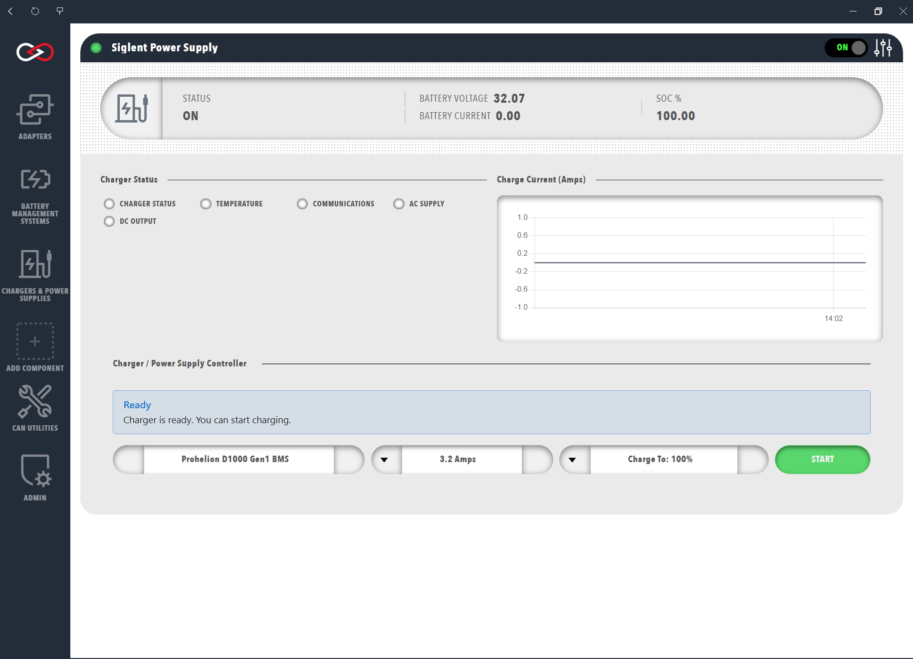

# Profinity Battery Charging

### Table of Contents

- [Profinity Battery Charging](#profinity-battery-charging)
- [Introduction](#introduction)
- [Supported Chargers](#supported-chargers)
- [Charging Steps](#charging-steps)
- [Troubleshooting Charging](#troubleshooting-charging)

## Introduction

Profinity can manage charging of your pack by controlling your Prohelion D1000 Gen1 BMU and a charger to put charge in the pack, which requires a charger that can be controlled remotely because a BMS that can only switch a charger on and off results in slow or poor balancing of the cells (see the [D1000 Gen1 Charger Control](../../../../Battery_Management_Systems/Prohelion_BMS_D1000_Gen1/Operation/Charging.md) documentation). 

The D1000 Gen1 BMU raises the charge current setpoint until the highest cell voltage reaches the Balance Threshold and then reduces it to hold that voltage, and it transmits the charging cell voltage error, cell temperature margin and total pack capacity for an external charger in the Charger Control Information packet. 

Charging with the D1000 Gen2 is generally handled by the hardware, see the D1000 Gen2 documentation for more details.

Profinity Charging supports three charging products (listed below) as well as balancing capabilities to keep the pack cells balanced and in good condition.

<figure markdown>

<figcaption>Siglent Charger</figcaption>
</figure>

## Supported Chargers

**TDK Power Supplies**

Profinity supports [TDK](https://www.tdk.com) Programmable Power Supplies such as the Genesys family, using their SCPI command interface over TCP. TDK Power Supplies that only have a serial interface for programming require a [TCP to Serial Converter](https://www.jaycar.com.au/serial-to-ethernet-converter/p/XC4134) in the solution so that Profinity can communicate via TCP.

**Elcon Chargers**

Elcon Chargers are widely used in the EV industry, and Profinity controls an Elcon Charger via its CAN bus interface. To operate an Elcon Charger via CAN bus, the charger must be connected to a CAN bus interface that is configured in Profinity.

**Siglent Power Supplies**

Profinity can control Siglent Power Supplies that support SCPI commands over a programmable TCP interface. Units such as the [Siglent SPD3303X-E](https://siglentna.com/power-supplies/spd3303x-spd3303x-e-series-programmable-dc-power-supply/) are widely used by Prohelion customers for desktop testing scenarios.

## Charging Steps

### Step 1 - Add a Charger to your Profile

A charger is configured as a device in Profinity, so the first step to charging your pack is to add a charger to your Profile. Your Profile must also include a [Prohelion BMS](../Battery_Management_Systems/index.md) so that Profinity can control the battery.

<figure markdown>

<figcaption>Add a Charger</figcaption>
</figure>

 
### Step 2 - Connect to your Charger

By default, chargers in Profinity do not auto connect, although this can be changed in the charger Profile settings. Once your charger is connected and the light is green, click the charge button.

<figure markdown>

<figcaption>Connect the Charger</figcaption>
</figure>

 
### Step 3 - Engage Contactors, Start Charging

Once everything is configured, charging the pack is a three step process:

__1.__ Set the maximum charge current to apply to the pack

__2.__ Engage the contactors using the "Engage Contactors" button

__3.__ Press the "Start Charge" button

Charge then flows from the charger to the pack.

<figure markdown>

<figcaption>Start the Charge</figcaption>
</figure>

## Troubleshooting Charging

Charging can be complex to set up, as it requires both the charger and the [Prohelion BMS](../Battery_Management_Systems/index.md) to be managed so that they operate as expected. When troubleshooting a charging setup, consider the following.

**Confirm that each device works independently**

All devices in the configuration must show the green circle in the Profile window. If a device is grey or red, fix it so that it works fully before you start charging.

**Confirm that the pack engages**

A common charging issue is current flowing from the battery into the charger during pre-charge, which can cause the pre-charge sequence to fail so that the pack does not engage, because any load that draws current during precharge slows or prevents the rise of the output voltage so that precharge does not complete in the expected time (see [Precharge](../../../../Battery_Management_Systems/Prohelion_BMS_D1000_Gen1/Operation/Precharge.md)). On a D1000 Gen2 the failure is reported by the `PRECHARGE FAIL REASON` lamps, such as `PRECHARGE TIMEOUT` and `PRECHARGE STABLE CURRENT`, which correspond to the `BMSPrechargeFailTIMEOUT` and `BMSPrechargeFailSTABLECURRENT` signals of the [Firmware V1.2 Messages and Signals](../../../../Battery_Management_Systems/Prohelion_BMS_D1000_Gen2/Firmware/V1.2/Messages_and_Signals.md).

This issue can be tested outside of charging by trying to engage the pack with the "Engage Contactors" button while connected to the charger. If the contactors do not engage while the charger is connected, the issue exists.

The problem is typically solved by placing a suitably sized diode in the charger circuit, so that current can only flow from the charger to the pack and not the other way.

**Respect maximum currents and voltages**

The Profile configuration for your charger sets the maximum voltages and currents that the charger and wall circuit can supply. Take these values into account when configuring your charger, because drawing more power from the charger than the circuit is rated for can overload the wall circuit.

The maximum current that your battery can take during a charge must also be respected. Profinity is not aware of your battery configuration beyond the information provided by the BMU, so keep the maximum current at or below the recommended current for your cells to ensure that the batteries are not damaged during charging.
