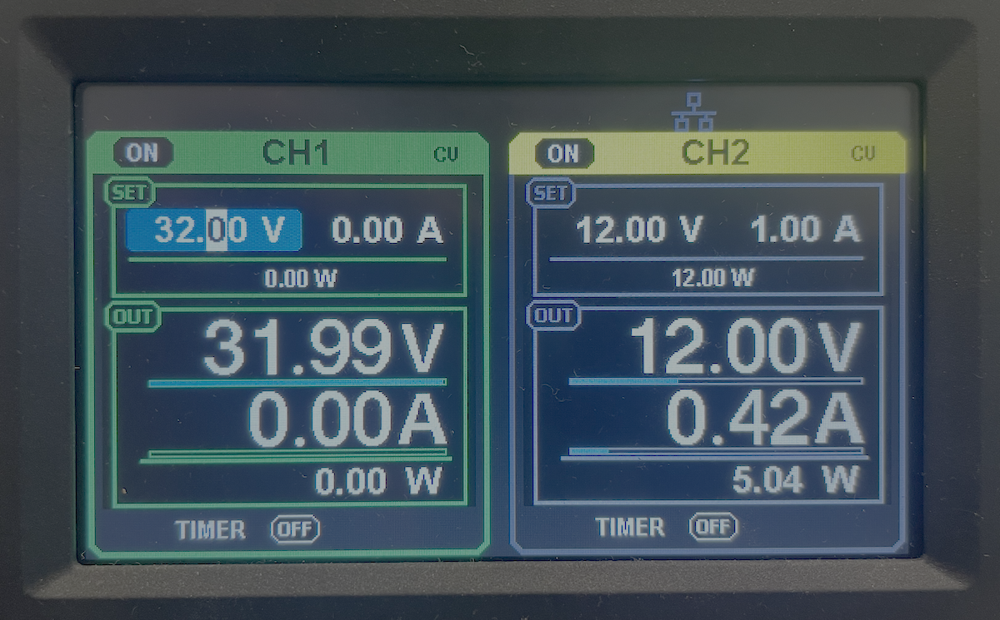
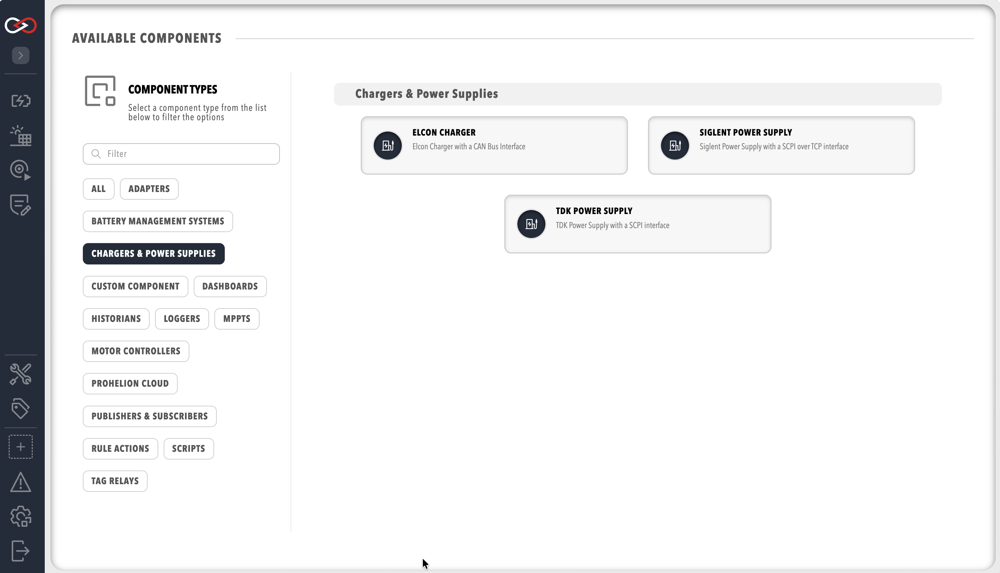
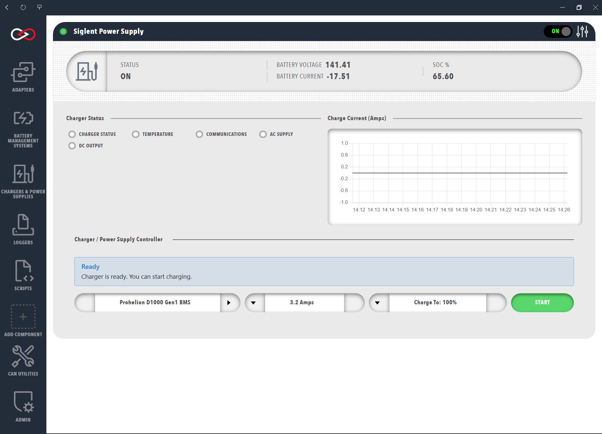

# Chargers and Power Supplies

Profinity charges a pack by controlling a charger and a Prohelion Battery Management Unit (BMU) together. A charger that can be controlled remotely is needed because a BMS that can only switch a charger on and off gives slow or poor balancing of the cells, which is described in the [D1000 Gen1 Charger Control](../../../../Battery_Management_Systems/Prohelion_BMS_D1000_Gen1/Operation/Charging.md) documentation. The D1000 Gen1 BMU raises the charge current setpoint until the highest cell voltage reaches the Balance Threshold and then reduces it to hold that voltage. On a D1000 Gen2 the BMS hardware handles charging, so see the [D1000 Gen2 documentation](../../../../Battery_Management_Systems/Prohelion_BMS_D1000_Gen2/index.md) for how charging is managed there.

Profinity supports three charger types, a [Prohelion BMS](../Battery_Management_Systems/index.md) in the same Profile supplies the pack data, and a user needs the **Control charging** permission to see the charging controls (see [Roles and Permissions](../../Administration/Users_and_Access/Roles_and_Permissions.md)).

<figure markdown>

<figcaption>Siglent Charger</figcaption>
</figure>

## Supported Chargers

**TDK Power Supply** controls TDK programmable power supplies such as the Genesys family using Standard Commands for Programmable Instruments (SCPI) over TCP. A TDK supply that only has a serial interface needs a TCP to serial converter between it and the network so that Profinity can reach it over TCP.

**Elcon Charger** controls an Elcon charger over CAN, so the charger must be connected to a CAN adapter that is already configured in the Profile.

**Siglent Power Supply** controls Siglent programmable power supplies that accept SCPI commands over TCP, such as the SPD3303X-E, which suits desktop testing.

## Add a Charger to the Profile

A charger is a component, so it is added from **ADD COMPONENT** in the same way as any other device (see [Add a Component to a Profile](../../How_To_Guides/Add_Component_to_Profile.md)). The Profile must also contain a Prohelion BMS, and that BMS must have **Control Pack** switched on, because **Control Pack** is off by default and Profinity can only engage and disengage the pack, which a charge needs, when it is on. Once the charger is added it appears under **Chargers & Power Supplies** in the main menu with its own dashboard.

<figure markdown>

<figcaption>Add a Charger</figcaption>
</figure>

### Charger Settings

Every charger asks for its own limits and the limits of the supply that feeds it. Each charger type starts with its own default limits, and **Supply Voltage Limit** and **Supply Current Limit** start at 240 V and 10 A, so set all five to match the actual charger and the wall circuit before charging.

| Setting | TDK | Siglent | Elcon | Notes |
|---|---|---|---|---|
| **Charger Voltage Limit** | 300 V | 32 V | 198 V | Maximum voltage the charger can output, between 1 and 1000. |
| **Charger Current Limit** | 10 A | 3.2 A | 46 A | Maximum current the charger can output, between 1 and 1000. |
| **Charger Power Limit** | 3000 W | 102 W | 6600 W | Maximum power the charger can output, between 1 and 1000000. If unsure, use maximum voltage multiplied by maximum current, or less. |
| **Supply Voltage Limit** | 240 V | 240 V | 240 V | Maximum voltage the wall socket supplies, between 1 and 1000. |
| **Supply Current Limit** | 10 A | 10 A | 10 A | Maximum current the wall socket supplies, between 1 and 1000. |

The TDK and Siglent supplies are reached over the network and share these communication settings.

| Setting | Default | Notes |
|---|---|---|
| **Charger IP Address** | `127.0.0.1` | Address of the supply on the network. |
| **Charger Port** | 5025 | TCP port the supply listens on, between 1 and 65535. |
| **Comms Timeout** | 5000 | Time in milliseconds Profinity waits for the supply to answer. |
| **Auto Connect** | Off | Connects to the supply when the Profile loads. With it off, the supply is not connected until the user connects it. |
| **Auto Reconnect** | On | Reconnects in the background if the supply disconnects. |
| **Reconnect Interval** | 5000 | Time in milliseconds between reconnection attempts, between 500 and 600000. Shown only when **Auto Reconnect** is on. |
| **Charger ID** | 0 | TDK only. The ID the TDK supply is set to. |
| **Channel ID** | 1 | Siglent only. The channel in use on a multi-channel supply. |

The Elcon charger has no connection step, because it communicates over CAN, and asks for the following instead.

| Setting | Default | Notes |
|---|---|---|
| **Elcon Command CAN Bus Id** | `0x1806E5F4` | CAN address Profinity sends commands to. |
| **Elcon Status CAN Bus Id** | `0x18FF50E5` | CAN address Profinity receives status messages from. |
| **Milliseconds Valid** | 5000 | Time in milliseconds the CAN traffic from the charger stays valid before Profinity treats the connection as lost, between 0 and 60000. |

## Start a Charge

Open the charger from **Chargers & Power Supplies**. The dashboard shows the **Charger Status** lamps (**CHARGER STATUS**, **TEMPERATURE**, **COMMUNICATIONS**, **AC SUPPLY** and **DC OUTPUT**), the **Charge Current (Amps)** chart and, for a user with the **Control charging** permission, the **Charger / Power Supply Controller** panel. With **Auto Connect** off on a TDK or Siglent supply, the charger must be connected first, and the status message above the controls changes to show that the charger is ready once it is.

The controls run left to right. The battery selector chooses which Prohelion BMS to charge when the Profile has more than one. The current control sets the charge current in amps, in steps of 0.5 A, up to the maximum the screen allows. **Charge To** sets the state of charge, in percent, at which charging stops. **START** begins the charge and becomes **STOP** while charging is running.

<figure markdown>

<figcaption>Start the Charge</figcaption>
</figure>

Pressing **START** engages the pack itself, so there is no separate step to close the contactors. Profinity sets the charger to the estimated pack voltage, checks that the charger is ready for precharge, engages the pack through the BMS and then starts the charge. If any of those stages fails, Profinity stops the charge and disengages the pack. Pressing **STOP** stops the charger and disengages the pack.

The following steps start a charge.

1. Select the battery to charge.
2. Set the maximum charge current, at or below the cell manufacturer's charge limit.
3. Set **Charge To** to the state of charge at which charging should stop.
4. Press **START**.

## Troubleshooting Charging

Charging needs both the charger and the BMS to work as expected, so first confirm that every device in the Profile shows the green circle in the Profile window. A grey or red device needs fixing before a charge will run. The controller panel then reports most problems in a message above the controls.

| Message | Cause | Fix |
|---|---|---|
| **No Battery**: No battery can be found in this profile | The Profile has no Prohelion BMS. | Add a Prohelion BMS to the Profile. |
| **Battery Control Limited**: You cannot software control this battery | **Control Pack** is off on the BMS, so the current, **Charge To** and **START** controls are disabled. | Switch **Control Pack** on in the BMS settings, or use the screen to monitor the charger only. |
| **Charger Not Available**: The charger is not connected or not available | The charger is not connected or does not exist in the Profile. | Connect the charger, and check its IP address and port (TDK and Siglent) or the CAN adapter (Elcon). |
| **Charger Issue**: There is an issue with your selected charger | The charger, its hardware or its communications report an error. | Check the **COMMUNICATIONS** and **CHARGER STATUS** lamps and the Profinity logs, and resolve the error before charging. |
| **SOC Warning**: You have already reached that charge level | **Charge To** is lower than the current state of charge. | Raise **Charge To** above the current state of charge. |

If **START** does nothing and no message is shown, check that the battery and charger lamps are not grey or red, because the button is disabled while either is unavailable.

### The Pack Does Not Engage

A common problem is current flowing from the battery into the charger during precharge. Any load that draws current while the pack precharges slows or stops the rise of the output voltage, so precharge does not finish in the expected time and the pack does not engage (see [Precharge](../../../../Battery_Management_Systems/Prohelion_BMS_D1000_Gen1/Operation/Precharge.md)). On a D1000 Gen2 the **PRECHARGE FAIL REASON** lamps report the failure, for example **PRECHARGE TIMEOUT** or **PRECHARGE STABLE CURRENT**, and the [Firmware V1.2 Messages and Signals](../../../../Battery_Management_Systems/Prohelion_BMS_D1000_Gen2/Firmware/V1.2/Messages_and_Signals.md) page lists them.

To test this outside a charge, try to engage the pack from the BMU dashboard while the charger is connected. If the contactors do not engage while the charger is connected, the problem exists. The fix is a diode of suitable rating in the charger circuit, so that current can only flow from the charger to the pack.

### Current and Voltage Limits

!!! warning "Set the Supply and Charge Limits Before Charging"
    The charger and supply limits in the Profile are the maximums Profinity works to, so a **Supply Current Limit** above what the wall circuit is rated for can overload that circuit. Profinity does not know the cell specification beyond what the BMU reports, so keep the charge current at or below the cell manufacturer's recommended charge current to avoid damaging the battery.
