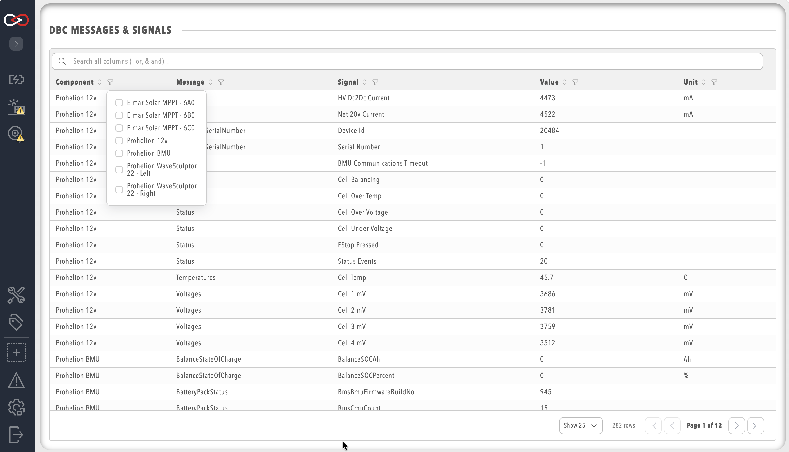

# Custom Components

A Custom Component is the built-in profile component for a device that Profinity does not already ship a type for. As of Profinity 2.3 it can carry an optional DBC file, a dashboard, a rules file, a long-running script, operator actions, and settings and firmware maps, and once it is in a profile it is monitored, graphed, and logged the same way as a Prohelion device.

Built-in components such as the [Elmar Solar MPPT](../MPPT/index.md) and the [WaveSculptor](../Motor_Controller/index.md) already include their own DBC support, so Messages and Signals is available on those components without a separate file. A Custom Component is the same idea for a third-party CAN device, or for a device whose live values a script publishes as tags.

The steps to add one are in [How to Create a Custom Component](../../How_To_Guides/Create_Custom_Component.md). The files that make one up, and how to pack it for another installation, are in [Custom Components](../../Developing_with_Profinity/Custom_Components/index.md) under Extending Profinity.

## What appears in the profile

After the component is saved it is listed in the side menu and opens onto its dashboard. With no dashboard uploaded, Profinity writes a starter dashboard named after the component, which the dashboard editor then replaces. Loggers, rules, and scripts bind to it the same way they bind to any other component.

Component settings are arranged as **Settings**, **Pack files**, **Scripts**, and **Security**, with Security last. **Pack files** is where the DBC, dashboard, rules file, actions file, settings map, firmware map, and firmware file are uploaded. **Scripts** is where the main script and **Auto Start Main Script** are set. A component installed from a content pack hides **Pack files** and **Scripts**, because those files belong to the pack, and shows **Name**, **Tag tree path**, menu placement, and the fields declared in the pack's settings map.

## CAN bus DBC

[DBC](http://socialledge.com/sjsu/index.php/DBC_Format) is a file format that describes the format and nature of CAN bus data. With a DBC file, CAN data can be understood more clearly and broken down into Signals and Messages, the fundamental building blocks of a DBC file.

For the moment, Profinity provides a DBC Viewer that takes a DBC file and shows the CAN bus traffic travelling through the Profinity system as Messages and Signals.

<figure markdown>

<figcaption>CAN DBC Viewer</figcaption>
</figure>

The DBC file is optional. Upload it under **Pack files**, in **Upload DBC File**, when the component needs the Messages and Signals viewer or when the dashboard binds CAN signals from that file. Once the file loads, the component menu includes **Messages and Signals** and **Edit DBC File**. A file that fails to parse leaves the component in the profile and omits **Messages and Signals** until the file is corrected, and Profinity watches the file so a saved edit is picked up without recreating the component. The viewer itself, including its filters, is described in [CAN bus DBC](../../CAN_Utilities/CAN_Bus_DBC.md).

When the device's CAN identifiers sit at a different base address than the DBC was written for, enable **Rebase DBC** and set **Rebase Address**. Profinity shifts the message identifiers in the loaded database to that base.

The DBC file of the WaveSculptor22 is published in the [hardware documentation](../../../../Motor_Controllers/WaveSculptor22/User_Manual/DBC.md), and the [EV Driver Controls DBC file](../../../../Solar_Car_Racing/EV_Driver_Controller/Communications_Protocol/DBC.md) can be used in the same way for a device that has no built-in support. Recorded traffic can be played back against the component with [CAN log replay](../../How_To_Guides/Replay_CAN_Logs.md).

A DBC file describes CAN messages. Live values that a script publishes are tags, and the dashboard binds those tags whether or not a DBC file is present. Both paths can be used on the same component.

## Dashboards

The dashboard is the component's page in the profile. Profinity provides a YAML dashboard editor that validates the file as it is edited, and the dashboards Prohelion ships are written with the same format and can be used as templates. Upload a finished file under **Pack files** as **Upload Dashboard**, or open the dashboard editor on the component and start from the starter dashboard Profinity writes.

Bindings, layout, and the visual editor are covered in the [Dashboard Development Guide](../../Customising_Profinity/Dashboards/index.md). A first dashboard for a Custom Component is in [How to Create a Custom Dashboard](../../How_To_Guides/Create_Custom_Dashboard.md).

## Related documentation

- [How to Create a Custom Component](../../How_To_Guides/Create_Custom_Component.md) — add one to a profile
- [Custom Components](../../Developing_with_Profinity/Custom_Components/index.md) — files, scripts, maps, and packs
- [Component types](../../Developing_with_Profinity/Custom_Components/Component_Types.md) — Custom Component, Dashboard Component, and DLL plugins
- [CAN bus DBC](../../CAN_Utilities/CAN_Bus_DBC.md) — the Messages and Signals viewer
