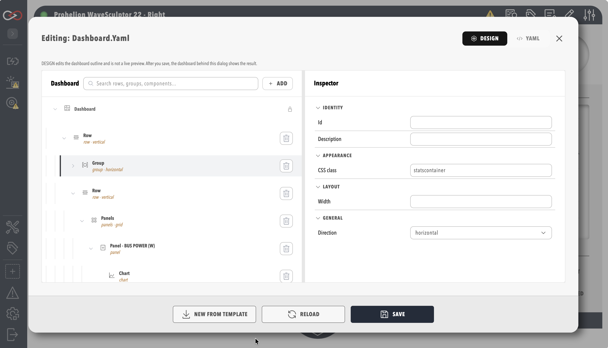

# Dashboard Component

A Dashboard Component is a built-in profile component that renders a dashboard defined entirely in YAML and does not use a DBC (CAN database) file. Use it for human-machine interface (HMI) style screens that bind only to [tags](../../Tags/index.md) that already exist, without defining CAN messages. It is included in every edition, and it differs from a [Custom Component](../Custom_Components/index.md) in that it has no DBC, script or pack files, so there is nothing to upload except the dashboard itself.

## Add a Dashboard Component

Add the component from **ADD COMPONENT** (see [Add a Component to a Profile](../../How_To_Guides/Add_Component_to_Profile.md)), where it is listed under **Dashboards**. Its only setting besides the name is **Upload Dashboard (Optional)**, which takes a `.yaml` dashboard file. When no file is uploaded, Profinity creates a template dashboard named after the component, and the dashboard editor on the component opens that file so it can be edited into the finished dashboard. A component name that matches an existing dashboard file in the profile is rejected with the message "There is already a component in this profile with that name".

## Building the Dashboard

Dashboards are written in YAML and can be edited in the [Visual Editor](../../Customising_Profinity/Dashboards/Visual_Editor.md), with the same layout, data and interactive components available as on any other dashboard.

<figure markdown>

<figcaption>Dashboard visual editor</figcaption>
</figure>

Read [Data Binding](../../Customising_Profinity/Dashboards/Data_Binding.md) to connect the dashboard to tags and the [Component Reference](../../Customising_Profinity/Dashboards/Component_Reference/index.md) for each element. Worked guides are [How to Create a Custom Dashboard](../../How_To_Guides/Create_Custom_Dashboard.md) and [How to Create a Profile Dashboard](../../How_To_Guides/Create_Profile_Dashboard.md).
