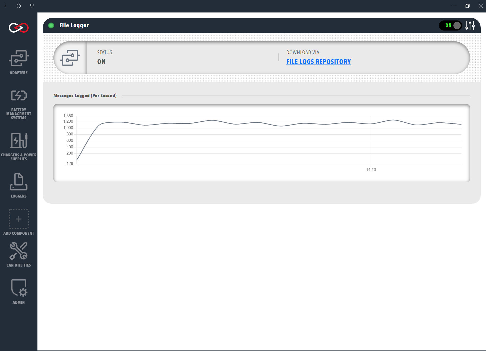

# File and Tag Loggers

File loggers in Profinity write either native CAN bus messages or the values of the [tags](../../Tags/index.md) in selected [tag collections](../../Tags/Collections.md) to a file, which can then be stored locally or transmitted remotely to an SFTP server.

## Logger Variants

File based loggers are available in four variants, each added to a [Profile](../../Getting_Started/Profiles.md) as its own component under **Loggers** and each included in every edition:

| Logger | Details |
|---|---|
| CAN File Logger | Writes native CAN bus messages to the local file system of the machine running Profinity. |
| CAN SFTP Logger | Transmits native CAN bus messages to a remote Secure File Transfer Protocol (SFTP) server. |
| TAG File Logger | Writes the values of the tags in the selected tag collections to the local file system, as comma-separated values (CSV) or JSON Lines. |
| TAG SFTP Logger | Transmits those tag values to a remote SFTP server, as CSV or JSON Lines. |

All four loggers have **Auto Start**, which is on by default, so a logger begins logging when the Profile loads and needs no further action.

### Where Files Are Written

The CAN File Logger and the TAG File Logger have no destination setting. The CAN File Logger creates its files under the Profinity CAN bus log directory (`can_bus_logs/`), and the TAG File Logger creates its files under the Profinity tag log directory (`tag_logs/`), in each case in a folder named after the Profile and the component. See the [artefacts directory](../../Installation/Artifacts_Directory.md) for where those directories sit on each platform.

### SFTP Settings

The CAN SFTP Logger and the TAG SFTP Logger send each completed log file to the remote server and need the following settings.

| Setting | Default | Purpose |
|---|---|---|
| **Remote Host** | None | The name or address of the SFTP server. Required. |
| **Remote Port** | 22 | The port of the SFTP server, from 1 to 65535. |
| **Remote server username** | None | The account used to sign in. Required. |
| **Remote server password** | None | The password for that account. Required, and stored encrypted. |
| **Remote Directory** | None | The directory the files are uploaded to, relative to the home directory of the user on the server, so it must not start with `/`. For example, enter `home/sftp/upload` and not `/home/sftp/upload`. Required. |

If a transfer fails, Profinity writes "Failed to transfer archived TAG log via SFTP" to the Profinity logs for the TAG SFTP Logger, so check the host, port, credentials and remote directory there.

## CAN Loggers

The CAN File Logger and the CAN SFTP Logger record the bus, so they do not use tag collections. Their **File Format** setting chooses the layout of the text file, which always uses a `.txt` extension. **Prohelion**, the default, writes a line for every packet with a Sent or Received column, and **Tritium** writes the same fields without that column.

## Tag Loggers

The TAG File Logger and the TAG SFTP Logger log the values of the tags in the collections selected in **Collections**, and only samples of Good quality are written. A logger with no collection selected does not start, and its status stays off, so a collection has to exist and be selected before the logger can be started.

| Setting | Purpose |
|---|---|
| **Collections** | The tag collections whose member values are logged. At least one collection must be configured before the logger starts. |
| **Update Interval (Seconds)** | The interval, in seconds, between writes. The default is 10, and the value must be between 10 and 86400. With **Snapshot** this is how often the current value of each member is written, and with **On Change** or **Everything** it is how often pending changes or samples are flushed. |
| **Logging mode** | **On Change** writes value changes, **Snapshot** writes the current value of every collection member on the interval, and **Everything** writes every sample, including unchanged values. The default is **Snapshot**. |
| **DBC Notification Mode** | Shown only when **Logging mode** is **On Change**. **Value Change Only** writes a signal from a DBC (CAN database) file when its decoded value changes, and **Every Decoded Physical Sample** writes a line for every decoded sample of that signal, including repeats. **Everything** always uses **Every Decoded Physical Sample**. Tags that are not DBC signal leaves always follow value-change behaviour. |
| **File Format** | **CSV** writes one row per sample, with the header `Recv time,TagId,ValueType,Value,UtcTimestamp,Quality,Reason,Message`, and the file uses a `.txt` extension. **JSON Lines** writes one JSON object per line, and the file uses a `.jsonl` extension. The default is **CSV**. In the CSV header, `Recv time` is the local time the line was written and `UtcTimestamp` is the timestamp carried by the tag sample, so the two can differ. |

## Archive, Compression and Rotation

Rotation closes the current log file and starts a new one, and the **Rotate By** setting selects **No Rotation**, **Time** or **File Size**. **Rotate By** defaults to **No Rotation**, so a logger writes one growing file until rotation is switched on.

| Setting | Purpose |
|---|---|
| **Rotate By** | **No Rotation** (the default), **Time** or **File Size**. |
| **Rotation Interval (Sec)** | Shown when **Rotate By** is **Time**. The seconds between rotations. When it is not set, it follows **Update Interval (Seconds)**, or is 600 seconds when neither is set. |
| **Rotate MB** | Shown when **Rotate By** is **File Size**. The size in megabytes at which the file rotates, 0 or greater. |
| **Archive the Logs** | Moves rotated log files into an `archive` folder beneath the log folder, so no archive directory needs to be provided. |
| **Compress Logs** | Shown when **Archive the Logs** is on. Compresses archived log files into `.zip` files. |
| **Limit Number of Archive Files** | Shown when **Archive the Logs** is on. Enables a limit on the number of log files retained in the archive. |
| **Archive File Limit** | Shown when **Limit Number of Archive Files** is on, and must be greater than 0. Sets the maximum number of log files retained in the archive, and applies to the remote files for the SFTP loggers. |

The CAN SFTP Logger and the TAG SFTP Logger always archive, because files are archived before they are uploaded, and they therefore do not show **Archive the Logs**.

## Downloading the Logged Files

Once a log file has been created, it can be downloaded from Profinity by clicking the link on the Logger Dashboard. A CAN File Logger shows this link as **FILE LOGS REPOSITORY**, and a TAG File Logger shows it as **TAG LOGS REPOSITORY**.

<figure markdown>

<figcaption>Download Log File</figcaption>
</figure>

For where to take the same data next, see [How to Log Data to the Cloud (InfluxDB)](../../How_To_Guides/Log_Data_to_Cloud_Influx.md) and [How to Configure Data Logging](../../How_To_Guides/Configure_Data_Logging.md).
