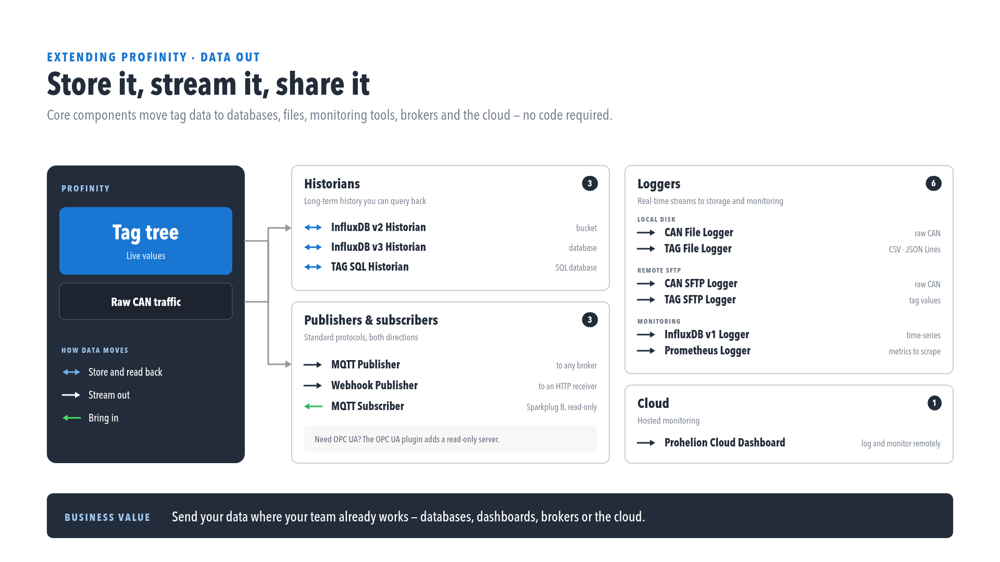
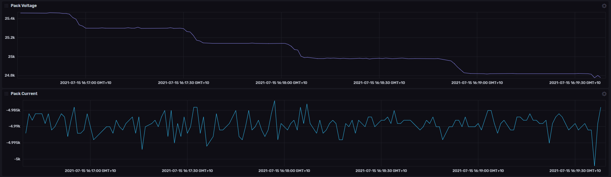

# InfluxDB and Prometheus Logging

Profinity can [log and replay messages](../../CAN_Utilities/Logging_Replaying_CAN_Bus_Messages.md) from a CAN bus network, and the loggers on this page send the values of the [tags](../../Tags/index.md) in selected [tag collections](../../Tags/Collections.md) to time-series databases. This page documents the **InfluxDB v1 Logger**, which is the logger for InfluxDB v1 servers, and the **Prometheus Logger**.

<figure markdown>

<figcaption>Data out of Profinity. Historians (InfluxDB v2, InfluxDB v3, TAG SQL) store and read data back, publishers and subscribers (MQTT, Webhook) stream it in both directions, loggers (file, SFTP, InfluxDB v1, Prometheus) stream it out, and a Prohelion Cloud dashboard gives hosted monitoring.</figcaption>
</figure>

<figure markdown>

<figcaption>InfluxDB dashboard showing pack voltage and pack current logged by Profinity</figcaption>
</figure>

[InfluxDB](https://www.influxdata.com) both stores and visualises data, whereas [Prometheus](https://prometheus.io) stores data only and is usually coupled with [Grafana](https://grafana.com) for visualisation.

## Logging Modes

The **Logging mode** setting determines what Profinity sends to the database on each interval, and it applies to the InfluxDB v1 Logger, the [InfluxDB v2 Historian](../Historians/InfluxDB_v2_Historian.md), the [InfluxDB v3 Historian](../Historians/InfluxDB_v3_Historian.md) and the other collection-based loggers. Nothing is logged until at least one tag collection is selected in **Collections**.

- **Snapshot**, the default, sends the current value of every member of the selected collections on each interval.
- **On Change** sends every change recorded for those members during the interval.
- **Everything** sends every sample that arrives, including unchanged values.

**Everything** gives the most detailed recording and the largest volume of data, so choose the mode by the resolution of measurement required.

## InfluxDB

!!! warning "Match the Component to Your InfluxDB Version"
    InfluxDB v1, v2 and v3 are separate products with different APIs, authentication methods and configuration requirements. Using the wrong component type results in connection failures.

Profinity provides a separate component for each InfluxDB version, so the version of InfluxDB in use must be known before a component is added to a [profile](../../Getting_Started/Profiles.md). The InfluxDB v1 component is the **InfluxDB v1 Logger**, documented below. The v2 and v3 components are registered as the **InfluxDB v2 Historian** and the **InfluxDB v3 Historian**, which write data in the same way and additionally allow it to be read back through the APIs, and they are documented in the Historians section.

### InfluxDB v1 Logger

InfluxDB v1 uses username and password authentication and the concept of databases and retention policies. To log data to InfluxDB v1, first install InfluxDB v1 and confirm that it is running, then add an **InfluxDB v1 Logger** to the profile and configure the following settings.

| Setting | Default | Purpose |
|---|---|---|
| **InfluxDB Database** | None | The InfluxDB database that the data is stored in. Required. |
| **InfluxDB Username** | Blank | The username for InfluxDB authentication. Leave blank for unsecured connections. |
| **InfluxDB Password** | Blank | The password for InfluxDB authentication. Leave blank for unsecured connections. |
| **InfluxDB Retention Policy** | `autogen` | The InfluxDB retention policy used when writing data. |
| **Influx Server URL** | `http://localhost:8086/` | The endpoint URL that InfluxDB is running on. |
| **Dashboard URL** | Blank | The URL of the InfluxDB dashboard. Optional, and leaving it blank shows no dashboard link. |
| **InfluxDB Health Check** | On | Performs a health check on the connection at regular intervals. |
| **Collections** | None | The tag collections whose tags are logged. At least one collection must be configured before the component starts. |
| **Logging Interval (Sec)** | 10 | The interval, in seconds, at which log data is sent, with a minimum of 1. |
| **Logging mode** | **Snapshot** | Sets what is sent on each interval: **Snapshot**, **On Change** or **Everything**. See [Logging Modes](#logging-modes). |
| **Auto Connect** | On | Starts the logger when the profile is loaded. |

When these settings are correct, data flows into InfluxDB v1. If it does not, check the [Logs](../../Getting_Started/Profinity_Log.md) for more details.

!!! warning "Switch Off the Health Check for InfluxDB Cloud"
    InfluxDB Cloud does not support the InfluxDB Health Check API, and **InfluxDB Health Check** is on by default, so it must be set to off when InfluxDB Cloud is used to store the data.

## Prometheus

[Prometheus](https://prometheus.io) logging works differently from InfluxDB logging. InfluxDB expects its data to be pushed to it, whereas Prometheus treats Profinity as a source of data and calls it to request the latest values. Prometheus also has no graphing capability out of the box, so it is usually coupled with a tool such as Grafana.

Adding a **Prometheus Logger** to Profinity is all that is required on the Profinity side to set up Prometheus logging, and the following connection values can be set, in addition to the **Collections** setting, which selects the tag collections that are served and which must contain at least one collection before the component starts.

| Setting | Default | Purpose |
|---|---|---|
| **Data endpoint URL** | `metrics/` | The URL path, within the hostname and port, that the Prometheus data is served on. |
| **Server Hostname** | `localhost` | The hostname or IP address that the Prometheus scraper connects to on the local machine. |
| **Server Port** | 7065 | The port that the endpoint runs on, from 1 to 65535. |
| **Dashboard URL** | Blank | The full URL of the Prometheus dashboard. Optional, and leaving it blank shows no dashboard link. |
| **Update Interval (Seconds)** | 10 | The interval, in seconds, between samples, from 10 to 86400. |
| **Auto Connect** | On | Starts the logger automatically when the profile is loaded. |

Once the Prometheus Logger is active, Prometheus can call Profinity on this URL to receive data. With all settings left at their defaults, for example, the data is served at:

```text
http://localhost:7065/metrics
```

If the logger cannot reach InfluxDB or open its Prometheus endpoint (for example the port is in use), it shows **Error**, writes the reason to the [Logs](../../Getting_Started/Profinity_Log.md) once, and retries every 5 seconds until the problem clears. If Prometheus shows no data, check that the logger is running, that the scraper is configured with the same hostname, port and endpoint path, and that at least one collection with tags is selected. Configuring Prometheus to receive and display this data is covered in the Prometheus documentation.
