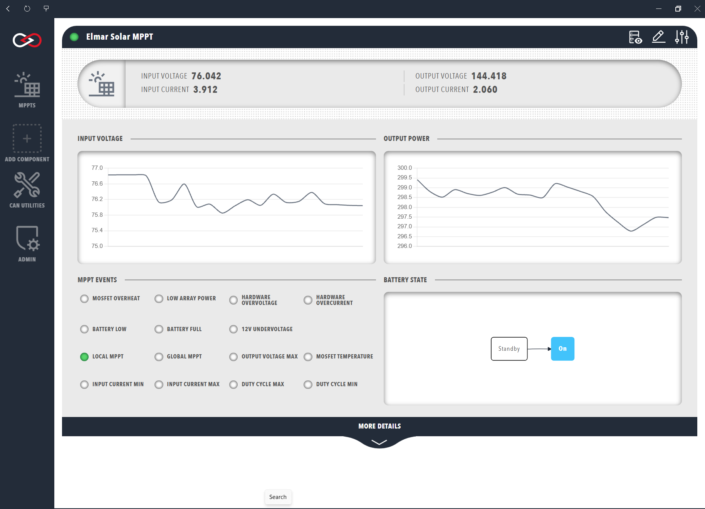

# Elmar Solar MPPT

Elmar Solar makes Maximum Power Point Trackers (MPPTs) that optimise the output of solar arrays. The Elmar range distributed by Prohelion consists of the Elmar 3A MPPT, the Elmar Race MPPT and the Elmar Best MPPT, described in the [Solar Charge Controllers by Elmar](../../../../Solar_Charge_Controllers/index.md) documentation. Profinity supports the Elmar Solar MPPT Series A and B, which use the CAN database (DBC) file described in the [Elmar MPPT DBC](../../../../Solar_Charge_Controllers/DBC.md) documentation.

To monitor an Elmar Solar MPPT, add an Elmar Solar MPPT tracker to the [Profile](../../Getting_Started/Profiles.md). Profinity prompts for the following information about the device, and the **Change Settings** button on the MPPT dashboard changes these details later.

| Parameter            | Description                                                                           | Default |
|----------------------|---------------------------------------------------------------------------------------|---------|
| `Name`               | The name of the component. Must be unique.                                            | The component name |
| `Milliseconds Valid` | The timeout of the device, from 0 to 60000. If the network receives no traffic from this device within this many milliseconds, Profinity treats the connection as lost. | 5000 |
| `Base Address`       | The CAN address of the MPPT, as described in the Elmar MPPT DBC. | `0x300` |

Once the MPPT is added to the Profile, the Elmar Solar MPPT dashboard is available in the sidebar. The dashboard displays input and output voltage graphs, error status indicators and, under the **MORE DETAILS** banner, temperature readings.

<figure markdown>

<figcaption>Elmar Solar MPPT</figcaption>
</figure>

The raw CAN data from an Elmar Solar MPPT can also be viewed in the [DBC view](../../CAN_Utilities/CAN_Bus_DBC.md), which opens from the **Messages and Signals** button in the top right corner of the dashboard.

## MPPT Data

The top row of the MPPT dashboard presents a summary of the following information, from left to right.

| Cell              | Meaning                                                      |
|-------------------|--------------------------------------------------------------|
| **INPUT VOLTAGE**   | The voltage produced by the connected solar array, in volts. |
| **INPUT CURRENT**   | The current delivered by the connected solar array, in amps. |
| **OUTPUT VOLTAGE**  | The output voltage of the MPPT, in volts.                    |
| **OUTPUT CURRENT**  | The output current of the MPPT, in amps.                     |

Below the summary are two time-series graphs depicting the input voltage and output power of the MPPT. Hovering the cursor over a graph shows the data in greater resolution.

The **MPPT EVENTS** panel at the lower left of the window shows status indicators for MPPT events, and the colour of each indicator matches its type.

| Type | Colour | Indicators |
|------|--------|------------|
| Error | Red | Low array power, hardware overvoltage, hardware overcurrent, metal-oxide-semiconductor field-effect transistor (MOSFET) overheat, 12 V undervoltage, battery low and battery full |
| Limit | Amber | Input current minimum and maximum, output voltage maximum, duty cycle minimum and maximum, and MOSFET temperature |
| Limit | Green | The local and global MPPT limits |

The events correspond to the `Status` message of the [Elmar MPPT DBC](../../../../Solar_Charge_Controllers/DBC.md), which carries the error and limit flags, the mode, and the CAN receive and transmit error counters. The datasheets of each product are linked from the Solar Charge Controllers by Elmar documentation.

The right-hand side depicts a simplified flowchart of the MPPT state, which is either Standby or On according to the `Mode` signal of the `Status` message, and the grey box marks the current state. Expanding the **MORE DETAILS** banner shows the input, output and power readings, the MOSFET, controller and power connector temperatures, and the auxiliary 12 V and 3 V supply and battery-side output voltages. The state of a connected battery is described in the [BMU section](../Battery_Management_Systems/index.md).
