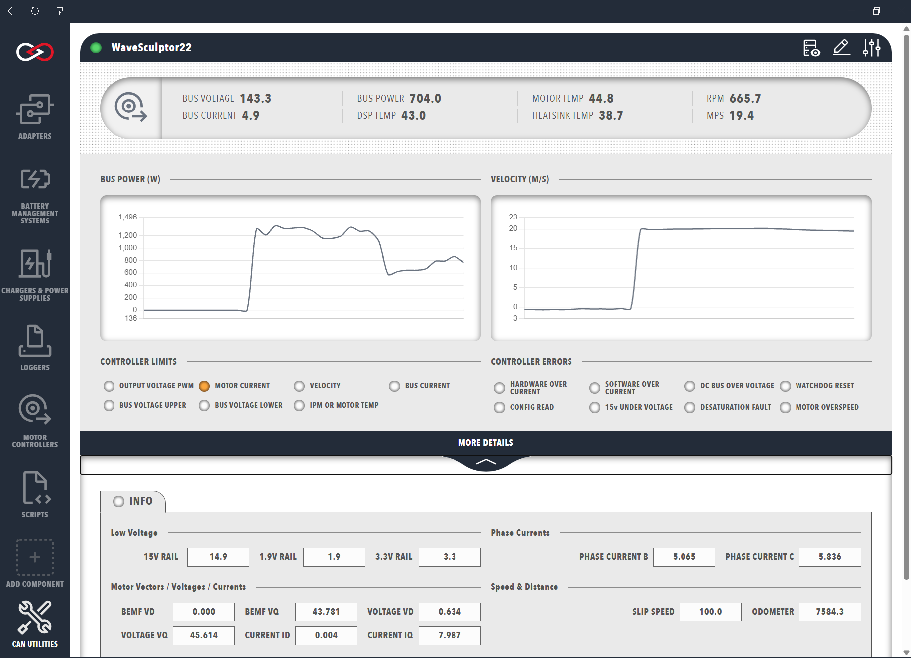
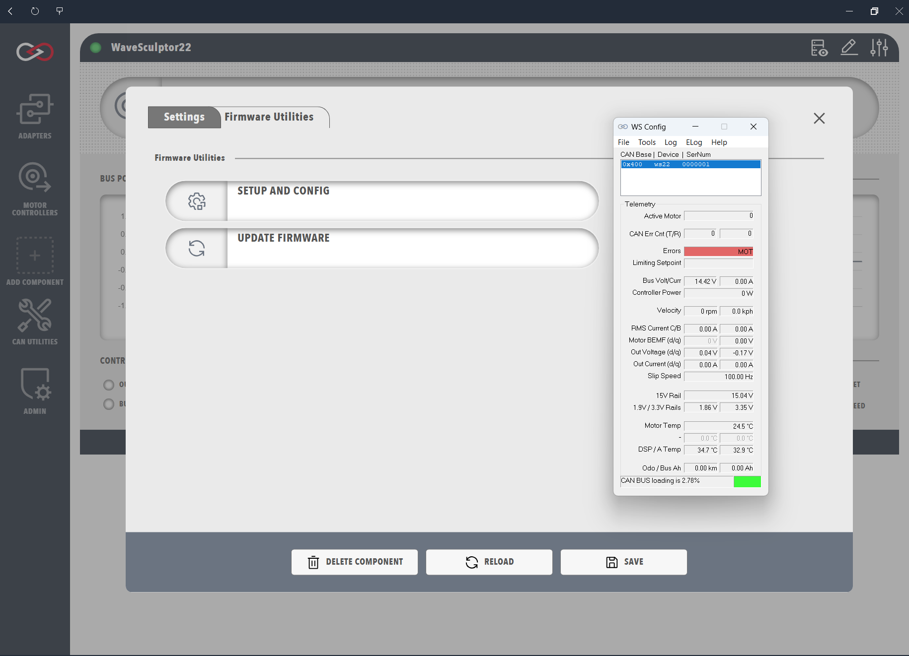

# WaveSculptor Motor Controller Support

Profinity provides a WaveSculptor dashboard for the Prohelion WaveSculptor22 motor controller, which is shown as a tab in the sidebar once a WaveSculptor22 has been added to your [Profile](../../Getting_Started/Profiles.md), and which decodes the controller using the message and signal names of the [WaveSculptor22 DBC file](../../../../Motor_Controllers/WaveSculptor22/User_Manual/DBC.md). The WaveSculptor communicates only over CAN and takes its low-voltage supply from the CAN cable, so a [CAN adapter](../CAN_Bus_Protocols/CAN_Bus_Adapters.md) connected to a powered CAN bus is required before the dashboard shows any data. The settings below are requested when the WaveSculptor is added and can be changed later with the `Change Settings` button at the top-right of the dashboard.

| Parameter            | Description                                                                                  |
|----------------------|----------------------------------------------------------------------------------------------|
| `Name`               | The name of the component. Must be unique.                                                   |
| `Milliseconds Valid` | The timeout of the device, which defaults to 5000. If no traffic is received from the device within this time, the connection is assumed to have been lost. |
| `Base Address`       | The CAN base address of the WaveSculptor, which defaults to `0x400` and must match the address programmed into the controller. Every WaveSculptor on the same CAN bus requires a different base address, as described in [CAN Bus and Low Voltage](../../../../Motor_Controllers/WaveSculptor22/User_Manual/CAN_Bus_And_Low_Voltage.md). |

<figure markdown>

<figcaption>Prohelion WaveSculptor</figcaption>
</figure>

!!! info "WaveSculptor22 and WaveSculptor200"
    The component supplied with Profinity is the WaveSculptor22. The WaveSculptor200 uses a different Status message layout, so the signal names must be checked against its [DBC file](../../../../Motor_Controllers/WaveSculptor200/User_Manual/Appendix_C.md) before a dashboard is reused.

## WaveSculptor Data

The top row of the dashboard summarises the bus voltage, bus current, bus power, DSP, motor and heatsink temperatures, motor speed in `RPM` and vehicle speed in `MPS`. A negative bus current or bus power indicates power flowing out of the WaveSculptor, for example during regenerative braking, and `BUS POWER` is calculated by Profinity as the product of bus voltage and bus current. `MOTOR TEMP` is only meaningful when a motor temperature sensor is connected and configured, and `MPS` depends on the tyre diameter entered in the WaveSculptor configuration.

Below the summary are time-series graphs of bus power and velocity, followed by a `CONTROLLER LIMITS` panel (amber) and a `CONTROLLER ERRORS` panel (red) whose indicators light when the matching bit of the Status message is set. Only one control loop limits the motor torque at any one time, so a single limit indicator is normally lit, and `MOTOR CURRENT` or `VELOCITY` lighting simply means the setpoint has been reached during normal operation.

| Limit indicator       | Meaning                                                                          |
|-----------------------|----------------------------------------------------------------------------------|
| `OUTPUT VOLTAGE PWM`  | There is not enough bus voltage to produce more current and hence more torque.    |
| `MOTOR CURRENT`       | The motor current setpoint is being regulated.                                    |
| `VELOCITY`            | The velocity setpoint has been reached.                                           |
| `BUS CURRENT`         | The bus current setpoint is limiting any further increase in motor torque.        |
| `BUS VOLTAGE UPPER`   | Regenerative torque is limited by the maximum bus voltage setpoint.               |
| `BUS VOLTAGE LOWER`   | Drive torque is limited by the minimum bus voltage setpoint.                      |
| `IPM OR MOTOR TEMP`   | A temperature limit is reducing the motor torque.                                 |

| Error indicator         | Meaning                                                                         |
|-------------------------|---------------------------------------------------------------------------------|
| `HARDWARE OVER CURRENT` | The hardware over current comparator tripped, even if only for an instant.       |
| `SOFTWARE OVER CURRENT` | The measured current exceeded the limit in the calibration configuration.        |
| `DC BUS OVER VOLTAGE`   | The bus voltage exceeded the over voltage limit in the calibration configuration. |
| `WATCHDOG RESET`        | The watchdog reset the controller, which is a warning rather than a fault and stays set until the next power cycle. |
| `CONFIG READ`           | The stored configuration could not be read at start-up, so default values are in use. |
| `15v UNDER VOLTAGE`     | The internal 15 V rail has dropped too low.                                      |
| `DESATURATION FAULT`    | On the WaveSculptor22 this indicates an under voltage of the MOSFET driver.      |
| `MOTOR OVERSPEED`       | The motor speed exceeded the configured maximum by 15%.                          |

Each limit and error is described in more detail on the [Observation](../../../../Motor_Controllers/Config_Software/Observation.md) page of the configuration software manual. The `MORE DETAILS` banner reveals the internal controller state, including the low-voltage rails, phase currents, D-Q reference frame vectors, slip speed, odometer, serial number and CAN error counts, which is not needed for general use but is useful for debugging. Signals that the default dashboard does not display, such as the motor hall sequence error, can be bound to a lamp in a [custom dashboard](../../Customising_Profinity/Dashboards/Full_Example.md).

## Updating the WaveSculptor Configuration

!!! warning "Desktop instance required"
    Only the desktop release of Profinity includes the WaveSculptor configuration tools, so the WaveSculptor must be connected to a desktop instance for the duration of the update.

Configuration is performed by the Tritium wsConfig program, which Profinity launches from the `Setup and Config` button on the Firmware Utilities tab in the settings. This runs a three-step sequence that checks a suitable network is available, sets the WaveSculptor as the active device over a TCP connection, and launches wsConfig, which also sets the CAN bus data rate and base address of the WaveSculptor. The factory default rate for all Prohelion devices is 500 kbit/s, and the CAN adapter in your Profile must be set to the same rate as the WaveSculptor. The PhasorSense, ParamExtract and ImExtract tools and the procedure for [setting up a motor](../../../../Motor_Controllers/Config_Software/Set_Up_a_Motor.md) are covered in the [configuration software documentation](../../../../Motor_Controllers/Config_Software/index.md).

!!! info "Tritium / Prohelion Adapter"
    The configuration tools require a Prohelion or Tritium [CAN to Ethernet Bridge](../../../../Solar_Car_Racing/CAN_Ethernet_Bridge/index.md) on the same CAN bus as the WaveSculptor and the same local network as the PC. Where no bridge is available, a virtual one can be created by pairing the [Virtual CAN Adapter](../CAN_Bus_Protocols/Virtual_CAN_Adapter.md) with another CAN adapter. A physical bridge accepts only one TCP connection at a time, as covered under [Multiple TCP clients on one bridge](../../../../Solar_Car_Racing/CAN_Ethernet_Bridge/Common_Problems_And_Solutions.md).

<figure markdown>

<figcaption>Configure a WaveSculptor</figcaption>
</figure>
 

## Flashing the WaveSculptor Firmware

Once the configuration has been updated, the firmware is flashed with the `Update Firmware` button on the Firmware Utilities tab in the settings, which has the same requirement for a CAN to Ethernet bridge or Virtual CAN Adapter as the configuration tool.
