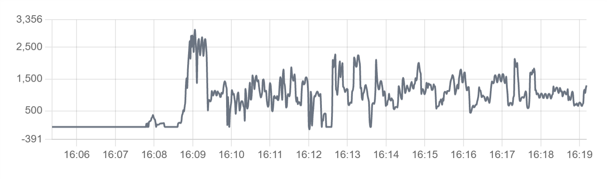

# Charts

A chart is a graphical representation of bound or static data that shows patterns and changes over time. Profinity supports eight [chart types](#chart-types), and the line and bar charts are shown below.

<figure markdown>

<figcaption>Line chart component displaying data trends over time with connected data points</figcaption>
</figure>

<figure markdown>

<figcaption>Bar chart component displaying data comparison using rectangular bars</figcaption>
</figure>

## When to Use

Use a chart for data trends, historical analysis, performance monitoring and time series data. Use [Readouts](Readouts.md) when only the latest value matters, and a [Table](Tables.md) when the exact values matter more than the shape of the data.

## Parameters

| Parameter | Type | Required | Default | Description |
|-----------|------|----------|---------|-------------|
| `id` | string | No | None | Optional identifier of the chart. The value is not displayed |
| `class` | string | No | None | Not used by the web interface |
| `type` | string | Yes | None | Chart type, one of `bar`, `line`, `radar`, `doughnut`, `pie`, `polarArea`, `bubble` or `scatter`. See [Chart Types](#chart-types) for details |
| `value` | object or array | No | None | Static chart data, given as `labels` and `datasets` for most chart types or as the datasets of a `bubble`, `scatter` or `radar` chart, or a starting shape for a chart whose live series come from `bind` |
| `legend` | boolean | No | Depends on chart type | Whether to show the legend. The default is `true` for `pie`, `doughnut` and `polarArea` charts, and a line chart with more than one series also shows its legend |
| `refreshInterval` | number | No | None | Automatic refresh interval in milliseconds. The web interface honours values of `1000` and above, and a chart with a refresh interval polls for its data instead of using the live data feed |
| `showControls` | boolean | No | None | Not used by the web interface |
| `min` | number | No | None | Fixed lower bound of the value axis. The bound is calculated from the data when omitted |
| `max` | number | No | None | Fixed upper bound of the value axis. The bound is calculated from the data when omitted |
| `label` | string | No | None | Title displayed above the chart |
| `enabled` | boolean | No | `true` | Not used by the web interface |
| `visible` | boolean | No | `true` | Not used by the web interface |
| `bind` | array | No | None | Tag and time-series bindings that supply the chart data. Use the `value` target |

### Chart Binding Options

A chart binding accepts the following properties in addition to the common binding properties that the [Data Binding](../../Data_Binding.md) page describes:

| Property | Type | Default | Description |
|----------|------|---------|-------------|
| `seriesMode` | string | `instant` | How the bound samples are presented: `instant` for the live value, `timeSeries` for an absolute series of recent samples, or `timeSeriesDelta` for the differences between successive samples |
| `seriesType` | string | Chart type | Overrides the chart `type` for one series with `line`, `bar` or `scatter` |
| `stackScale` | boolean | `false` | When `true`, the series gets its own value axis in a stack of axes |
| `store` | string | `local` | `local` for recent samples held in memory or `logged` for samples read from the logged history |
| `timeRangeStart` | string | `-10m` | Start of the time range for the series, as a relative time before now such as `-5m`. Set `timeRangeStart` and `timeRangeStop` together on a `timeSeries` binding that needs a particular history. The Visual Editor sets `-10m` and `0m` when a series mode is chosen |
| `timeRangeStop` | string | None | End of the time range for the series, where `0m` is now |

A chart bound with `store: logged` also takes the `aggregationWindow` and `aggregationFunction` properties, which the [Data Binding](../../Data_Binding.md) page describes with the other binding properties.

## Chart Types

| Chart type | Use |
|------------|-----|
| `line` | Data points connected by lines, which suits trends over time |
| `bar` | Rectangular bars, which suit comparing discrete values or categories |
| `radar` | Multivariate data in a two-dimensional form |
| `doughnut` | A circular chart with a hole in the centre |
| `pie` | Proportional slices of a circle |
| `polarArea` | Sectors of a circle |
| `bubble` | Three dimensions of data: x, y and size |
| `scatter` | Data points across two axes |

## Example

### Data Binding Example

``` yaml
dashboard:
  items:
    - row:
        items:
          - chart:
              type: bar
              legend: false
              bind:
                - target: value
                  source: /Prohelion BMU/Properties/PackData/CellTempsSummaryGraph
```

### Static Chart Example

``` yaml
dashboard:
  items:
    - row:
        items:
          - chart:
              type: line
              legend: true
              value:
                labels: ["Jan", "Feb", "Mar", "Apr"]
                datasets:
                  - label: "Sales"
                    data: [65, 59, 80, 81]
                  - label: "Revenue"
                    data: [28, 48, 40, 19]
```

### Time Series Example

``` yaml
dashboard:
  items:
    - row:
        items:
          - chart:
              type: line
              label: Bus Current
              legend: false
              bind:
                - target: value
                  source: "DBC/BusMeasurement/BusCurrent"
                  seriesMode: timeSeries
                  timeRangeStart: "-5m"
                  timeRangeStop: "0m"
```

### Refresh Interval Example

``` yaml
dashboard:
  items:
    - row:
        items:
          - chart:
              type: line
              refreshInterval: 5000
              bind:
                - target: value
                  source: "DBC/BusMeasurement/BusCurrent"
                  seriesMode: timeSeries
                  timeRangeStart: "-5m"
                  timeRangeStop: "0m"
```
