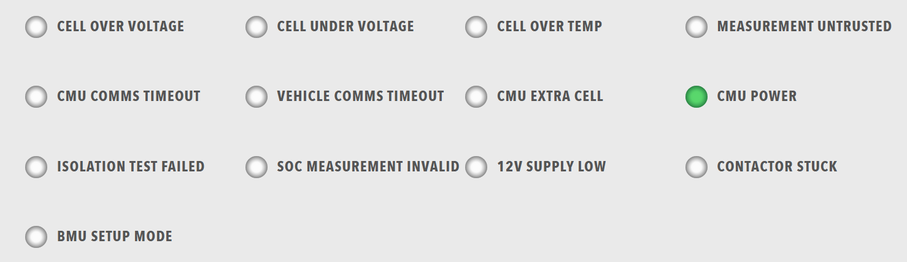

# Lamps

Grid of status indicators. Lamps use colour and on/off state to communicate system status at a glance.

<figure markdown>

<figcaption>Lamps component displaying a grid of status indicators with colour-coded states</figcaption>
</figure>

**Best for:** Status indicators, error/warning displays, system state visualisation, quick status overview

**Parameters:**

| Parameter | Type | Required | Default | Description |
|-----------|------|----------|---------|-------------|
| `id` | string | No | None | Not used by the web interface |
| `class` | string | No | None | CSS class added to the `lamp-grid` element |
| `items` | array | Yes | None | Array of lamp groups. Each group is displayed as one column |

**Lamp Group Parameters:**

Each item in `items` must contain a `lampgroup` object with:

| Parameter | Type | Required | Default | Description |
|-----------|------|----------|---------|-------------|
| `id` | string | No | None | Not used by the web interface |
| `class` | string | No | None | Not used by the web interface |
| `items` | array | Yes | None | Array of lamps. The column width scales automatically with the number of lamps |

Each item in the lamp group's `items` must contain a `lamp` object. The [Lamp](Lamp.md) page describes the lamp parameters, the colour names and the way that a lamp decides what to display.

**Example:**

``` yaml
dashboard:
  items:
    - row:
        items:
          - lamps:
              items:
                - lampgroup:
                    items:
                      - lamp:
                          color: "green"
                          label: "Online"
                          value: 1
                          enabled: true
                          bind:
                            - target: enabled
                              source: 'DBC/Status/Online'
                              toType: boolean
                      - lamp:
                          color: "red"
                          label: "Error"
                          value: 1
                          enabled: false
                          bind:
                            - target: enabled
                              source: 'DBC/Status/Error'
                              toType: boolean
                      - lamp:
                          color: "amber"
                          label: "Warning"
                          value: 1
                          enabled: false
                          bind:
                            - target: enabled
                              source: 'DBC/Status/Warning'
                              toType: boolean
```
