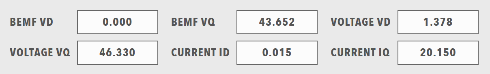

# Readouts

Readouts display numerical or text values with units and precision, and they are the primary way to show sensor data, measurements and other numerical information from the system.

<figure markdown>

<figcaption>Readouts component showing numerical and text value displays</figcaption>
</figure>

## When to Use

Use readouts for sensor readings, measurements, text information and other real-time values. Use a [Chart](Charts.md) when the trend matters more than the latest value, and a [Table](Tables.md) for a large set of related values.

## Parameters

| Parameter | Type | Required | Default | Description |
|-----------|------|----------|---------|-------------|
| `id` | string | No | None | Not used by the web interface |
| `class` | string | No | None | CSS class added to the `readouts` element |
| `items` | array | Yes | None | Array of readout items. Each item is displayed as one readout |

### Readout Parameters

Each item in `items` must contain a `readout` object with:

| Parameter | Type | Required | Default | Description |
|-----------|------|----------|---------|-------------|
| `id` | string | No | None | Not used by the web interface |
| `class` | string | No | None | Not used by the web interface |
| `label` | string | Yes | None | Caption of the readout. The caption can be bound with the `label` target, and it is underlined when `action` is set |
| `value` | number or string | No | None | Static value. The value is formatted with `unit` and `precision`. When no data is available, the readout shows `--` and is displayed as stale |
| `unit` | string | No | None | Unit appended after a numeric value. When `unit` is omitted and the bound tag defines a unit in its metadata, the web interface fills in that unit. The unit can be bound with the `unit` target |
| `precision` | number | No | None | Number of decimal places for numeric values |
| `width` | integer | No | `1` | Number of columns that the readout spans, from `1` to `4`. A value greater than `1` displays the readout as a wide readout |
| `enabled` | boolean | No | `true` | When `false`, the readout is displayed in the disabled style and remains visible. The state can be bound with the `enabled` target |
| `visible` | boolean | No | `true` | When `false`, the readout is hidden. The state can be bound with the `visible` target |
| `bind` | array | No | None | [Data binding](../../Data_Binding.md). The `value`, `label`, `unit`, `enabled` and `visible` targets are handled |
| `action` | string | No | None | Underlines the caption. Clicking the readout does not run an action |
| `param` | string | No | None | Not used by the web interface |

## Example

``` yaml
dashboard:
  items:
    - row:
        items:
          - readouts:
              items:
                - readout:
                    label: "Temperature"
                    value: 25.5
                    unit: "°C"
                    precision: 1
                    enabled: true
                    bind:
                      - target: value
                        source: 'DBC/TemperatureMeasurement/Value'
                - readout:
                    label: "Pressure"
                    value: 1013.25
                    unit: "hPa"
                    precision: 2
                    width: 2
                    enabled: true
                    bind:
                      - target: value
                        source: 'DBC/PressureMeasurement/Value'
```
