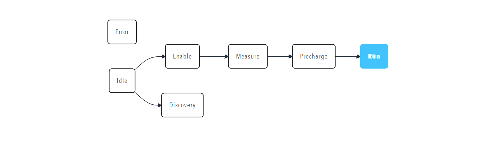

# State

A state component displays the current state of a system as a [Mermaid flowchart](https://mermaid.js.org/syntax/flowchart.html), which shows the states, the transitions between them and the active state.

<figure markdown>

<figcaption>State component showing state machine visualisation with Mermaid flowchart</figcaption>
</figure>

## When to Use

Use a state component to show a state machine, a process flow or the status of a complex system as a diagram. Use a [Caption](Caption.md) or a [Lamp](Lamp.md) when only the name or the health of the current state needs to be shown.

## Parameters

| Parameter | Type | Required | Default | Description |
|-----------|------|----------|---------|-------------|
| `id` | string | No | None | Not used by the web interface |
| `class` | string | No | None | Not used by the web interface |
| `label` | string | No | None | Not used by the web interface |
| `model` | string | Yes | None | Mermaid flowchart definition that lists the states and the transitions between them. Without a model, the component shows that no model is available |
| `value` | string | No | None | Identifier of the active state, which the diagram highlights. The identifier must match a node identifier in `model`, for example `IDLE` for the node `IDLE(Idle)` |
| `enabled` | boolean | No | `true` | Not used by the web interface |
| `visible` | boolean | No | `true` | Not used by the web interface |
| `bind` | array | No | None | [Data binding](../../Data_Binding.md). Bind a tag to the `value` target to drive the highlighted state. Only the `value` target is handled |

## Example

The bound tag supplies the name of the current state, which must match one of the node identifiers in `model`, such as `IDLE`:

``` yaml
dashboard:
  items:
    - row:
        items:
          - state:
              model: |
                flowchart LR
                  ERROR(Error)
                  IDLE(Idle)
                  ENABLE(Enable)
                  DISCOVERY(Discovery)
                  MEASURE(Measure)
                  PRECHARGE(Precharge)
                  RUN(Run)
                  IDLE --> ENABLE
                  IDLE --> DISCOVERY
                  ENABLE --> MEASURE
                  MEASURE --> PRECHARGE
                  PRECHARGE --> RUN
              bind:
                - target: value
                  source: /Prohelion BMU/Properties/State/Controller/CurrentState/Name
                  toType: string
```
