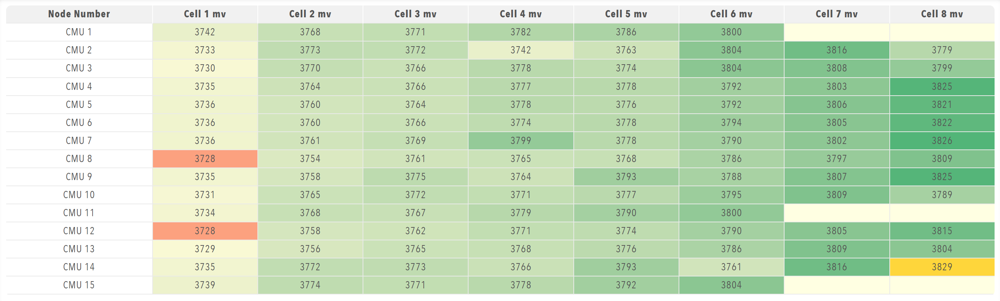

# Tables

Data table display. Tables present structured data in rows and columns, with heatmaps, highlighting and threshold alerts to help analyse the data.

<figure markdown>

<figcaption>Tables component displaying structured data in rows and columns with heatmap visualisation</figcaption>
</figure>

**Best for:** Structured data display, multi-dimensional data, data analysis, large datasets, comparative data

**Parameters:**

| Parameter | Type | Required | Default | Description |
|-----------|------|----------|---------|-------------|
| `id` | string | No | None | Not used by the web interface |
| `class` | string | No | None | Not used by the web interface |
| `label` | string | No | None | Not used by the web interface |
| `tableHeaders` | array | Yes | None | Column definitions for tables whose data is an array of row objects. The headers are not used when the bound data is a time series |
| `value` | array | No | None | Not used for display. The value only marks the table as stale until data arrives, and the rows come from `bind` at run time |
| `selectColumns` | boolean | No | `false` | Lets the operator show and hide individual columns |
| `minValueToDisplay` | number | No | None | Numeric cells below this value are displayed empty |
| `maxValueToDisplay` | number | No | None | Numeric cells above this value are displayed empty |
| `heatmap` | boolean | No | `false` | Colours cells on a scale from pale yellow to green between the lowest and highest values in the table |
| `highlightMin` | boolean | No | `false` | Highlights the lowest value or values in the table |
| `highlightMax` | boolean | No | `false` | Highlights the highest value or values in the table |
| `highlightAtOrBelow` | number | No | None | Highlights cells at or below this value |
| `highlightAtOrAbove` | number | No | None | Highlights cells at or above this value |
| `highlightIfEqualTo` | number | No | None | Highlights cells that equal this value exactly. An exact match takes priority over the range settings |
| `alertAtOrBelow` | number | No | None | Colours cells at or below this value as an alert |
| `alertAtOrAbove` | number | No | None | Colours cells at or above this value as an alert |
| `alertIfEqualTo` | number | No | None | Colours cells that equal this value as an alert. An exact match takes priority over the range settings |
| `displayPositive` | boolean | No | `false` | Shows the absolute value of negative numbers |
| `conversionFactor` | number | No | None | Factor that multiplies each displayed number, for example for a unit conversion |
| `precision` | number | No | None | Number of decimal places for numeric cells |
| `rowNames` | array of string | No | None | Custom name for each row when the bound data is a time series. A row without a name uses the label of its series |
| `columnNames` | array of string | No | None | Custom heading for each value column when the bound data is a time series. A column without a name is numbered from `1` |
| `enabled` | boolean | No | `true` | Not used by the web interface |
| `visible` | boolean | No | `true` | Not used by the web interface |
| `bind` | array | No | None | Data binding that supplies the table data from tags, either as an array of row objects or as a series. Use the `value` target |

The web interface applies the settings to each numeric cell in this order: the display range (`minValueToDisplay` and `maxValueToDisplay`) is tested against the original value, then `conversionFactor`, `displayPositive` and `precision` are applied to the displayed text. The highlight, alert and heatmap colours are chosen from the original value.

**Table Header Parameters:**

Each item in `tableHeaders` must contain a `header` object with:

| Parameter | Type | Required | Default | Description |
|-----------|------|----------|---------|-------------|
| `accessorKey` | string | Yes | None | Field path in each row object that supplies the cells of the column |
| `value` | string | Yes | None | Text of the column header |

**Example:**

The example follows the cell voltage table of the Prohelion BMU dashboard, in which each cell value is in millivolts and the value `-32768` marks a cell position that is not present:

``` yaml
dashboard:
  items:
    - row:
        items:
          - table:
              tableHeaders:
                - header:
                    accessorKey: name
                    value: Node Number
                - header:
                    accessorKey: cell1mV
                    value: Cell 1 mV
                - header:
                    accessorKey: cell2mV
                    value: Cell 2 mV
              minValueToDisplay: 0
              heatmap: true
              highlightMin: true
              highlightMax: true
              highlightIfEqualTo: -32768
              displayPositive: true
              bind:
                - target: value
                  source: /Prohelion BMU/Properties/PackData/Nodes/Values
```
