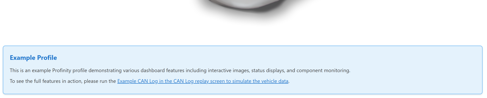

# HTML

HTML content component for displaying HTML. The component embeds custom HTML, including images from `/Profile/Images`, and it can instead show an OpenStreetMap view that follows a GPS position. The component sanitises the HTML before it is displayed, so scripts and form controls are removed.

<figure markdown>

<figcaption>HTML component displaying custom HTML content with rich text formatting</figcaption>
</figure>

**Best for:** Custom content display, rich text formatting, embedded images, documentation snippets, a live map of a GPS position

**When not to use:** For structured data display (use [Readouts](../Data/Readouts.md), [Tables](../Data/Tables.md) and similar components), for interactive elements (use [Actions](Actions.md) and [Toggles](Toggles.md))

**Parameters:**

| Parameter | Type | Required | Default | Description |
|-----------|------|----------|---------|-------------|
| `id` | string | No | None | Not used by the web interface |
| `class` | string | No | None | CSS class added to the content container |
| `content` | string | Yes | None | HTML snippet to display. See [Allowed HTML](#allowed-html) for the tags and attributes that survive sanitising. The content is not displayed when `map` is set with both position sources |
| `map` | object | No | None | Switches the component to a map view that follows a GPS position. See [Map Parameters](#map-parameters) |

## Allowed HTML

The web interface removes everything that is not on an allowed list before it displays `content`:

- **Tags**: `p`, `div`, `span`, `img`, `a`, `h1` to `h6`, `ul`, `ol`, `li`, `table`, `thead`, `tbody`, `tr`, `th`, `td`, `strong`, `em`, `b`, `i`, `u`, `br`, `hr`, `blockquote`, `pre`, `code` and `iframe`
- **Attributes**: `src`, `alt`, `href`, `class`, `style`, `title`, `width`, `height`, `colspan`, `rowspan`, `align`, `valign`, `target`, `rel`, `name`, `loading`, `referrerpolicy`, `sandbox`, `allow` and `allowfullscreen`
- **Removed**: `script`, `link`, `embed`, `object`, `form`, `input`, `button`, every event handler attribute such as `onclick`, and every `data-` attribute

A link whose address begins with a single `/` navigates inside the web interface, and any other link opens normally.

**Referencing Profile Assets in HTML:**

- **Images**: Use `/Profile/Images/{filename}` in the `src` attribute of `img` elements
- **Styles**: Add rules to the `profile.css` file in the `/Profile/Styles` directory, which the web interface loads when the file is present, and use the `class` attribute in the HTML to apply them. The `profile.css` file can load further stylesheets with CSS `@import`
- **Content**: Reference content files using `/Profile/Content/{filename}`

## Map Parameters

When both `latSource` and `lonSource` are set, the component shows an OpenStreetMap view centred on the position, with a marker, instead of `content`. The map is loaded from `openstreetmap.org`, so the browser that displays the dashboard needs internet access. The map is displayed as stale when a position source has no data.

| Parameter | Type | Required | Default | Description |
|-----------|------|----------|---------|-------------|
| `latSource` | string | Yes | None | Full tag path of the latitude, which starts with the name of the component |
| `lonSource` | string | Yes | None | Full tag path of the longitude, which starts with the name of the component |
| `fixSource` | string | No | None | Full tag path of the GPS fix quality. The map is displayed as stale when the fix value is missing or is not greater than `0` |
| `zoom` | integer | No | `14` | OpenStreetMap zoom level |

**Example:**

``` yaml
dashboard:
  items:
    - row:
        items:
          - html:
              class: "info-box"
              content: |
                <div class="info-box__header">System Information</div>
                <div class="info-box__content">
                  <p>This dashboard monitors system status.</p>
                  
                </div>
```

The three position sources are not relative paths, because Profinity expands relative `DBC/` and `Properties/` paths only for the `source` of a binding, so each position source names the component in full, as in the example below.

**Map Example:**

``` yaml
dashboard:
  items:
    - row:
        items:
          - html:
              content: ""
              map:
                latSource: GPS Receiver/DBC/Position/Latitude
                lonSource: GPS Receiver/DBC/Position/Longitude
                fixSource: GPS Receiver/DBC/Position/FixQuality
                zoom: 15
```
