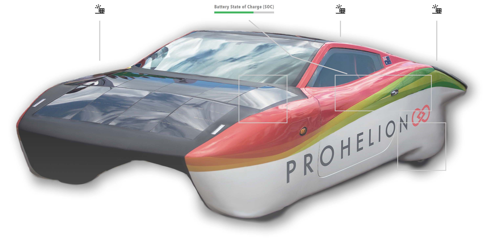

# Image

An interactive image is a base image from the `/Profile/Images` directory with overlay elements positioned on it, such as clickable regions, icons, buttons, live data values, points and annotation lines.

<figure markdown>

<figcaption>Interactive image component showing clickable regions, icons, data values, and annotation lines</figcaption>
</figure>

## When to Use

Use an interactive image for device diagrams, system layouts, interactive schematics and visual data overlays. Use the [HTML](HTML.md) component with an `img` element for a simple static image, the [Charts](../Data/Charts.md) component for charts, and the [Model](Model.md) component for a three-dimensional view.

The base image carries seven kinds of overlay element. Regions are clickable rectangles that navigate to another page or run an action, icons and buttons are positioned graphics and controls that can run an action, data values display live system data, points anchor annotation lines, annotation lines connect elements and may bend at waypoints called elbows, and layers are named groups of overlay elements that the operator shows and hides. Icons can be an emoji, a Scalable Vector Graphics (SVG) path or an image file, and every overlay element is positioned relative to the base image.

## Parameters

| Parameter | Type | Required | Default | Description |
|-----------|------|----------|---------|-------------|
| `id` | string | No | None | Set as the `id` attribute of the image container |
| `class` | string | No | None | CSS class added to the image container |
| `label` | string | No | None | Not used by the web interface |
| `image` | string | Yes | None | Filename of the base image in `/Profile/Images`, given directly with no `value` wrapper |
| `layers` | array | No | None | Named layers for visibility toggles. See [Layers](#layers) |
| `regions` | array | No | None | Clickable regions. See [Regions](#regions) |
| `icons` | array | No | None | Icons on the image. See [Icons](#icons) |
| `buttons` | array | No | None | Buttons on the image. See [Buttons](#buttons) |
| `dataValues` | array | No | None | Data overlays. See [Data Values](#data-values) |
| `points` | array | No | None | Anchor points for annotation lines. See [Points](#points) |
| `annotationLines` | array | No | None | Lines connecting elements. See [Annotation Lines](#annotation-lines) |
| `bind` | array | No | None | [Data binding](../../Data_Binding.md) whose value replaces the overlay data of the image, using the same structure as the parameters above |
| `enabled` | boolean | No | `true` | Not used by the web interface |
| `unit` | string | No | None | Not used by the web interface. Set `unit` on each data value instead |
| `precision` | number | No | None | Not used by the web interface. Set `precision` on each data value instead |

## Base Image

The base image is the foundation of an Interactive Image component. The image file must be stored in the profile's `/Profile/Images` directory (see [Image Storage](#image-storage)) and is referenced by filename only.

```yaml
image:
  image: "device-diagram.png"
```

Regions, icons, buttons, data values, points and elbows are all positioned relative to this base image.

## Action Invocation

The `action` of a region, icon or button is an action invocation, which is the same object that a [Toggle](Toggles.md) uses. The [Actions](Actions.md#invoke-types) page describes the invoke types.

| Parameter | Type | Required | Default | Description |
|-----------|------|----------|---------|-------------|
| `invoke` | string | No | `Component` | How a click is carried out, one of `Component`, `System`, `Endpoint` or `Navigate` |
| `actionId` | string | Conditional | None | Name of the action to run. Required when `invoke` is `Component` or `System` |
| `target` | string | Conditional | None | Location to navigate to. Required when `invoke` is `Navigate` |
| `endpointAction` | object | Conditional | None | Details of the HTTP request. Required when `invoke` is `Endpoint` |
| `value` | string | No | None | Payload posted with a `Component` or `System` request |
| `confirmMessage` | string | No | None | Not used by overlays. Only the `confirmMessage` of an `endpointAction` is honoured |
| `trackProgress` | boolean | No | None | Not used by overlays |
| `restartingOnSuccess` | boolean | No | None | Not used by overlays |

## Regions

Regions are clickable rectangular areas on the image. Regions can navigate to other pages or run actions.

### Region Parameters

| Parameter | Type | Required | Default | Description |
|-----------|------|----------|---------|-------------|
| `id` | string | Yes | None | Unique identifier for the region |
| `x` | number | No | None | Left edge of the region as a percentage of the image width, from `0` to `100` |
| `y` | number | No | None | Top edge of the region as a percentage of the image height, from `0` to `100` |
| `width` | number | No | None | Width of the region as a percentage of the image width |
| `height` | number | No | None | Height of the region as a percentage of the image height |
| `coordinates` | string | No | None | Older form of the rectangle, written as `xywh=x,y,width,height`, that Profinity still reads when `x`, `y`, `width` and `height` are not all set. Use `x`, `y`, `width` and `height` instead. The four values are percentages written as plain numbers, without a `%` or `px` suffix |
| `action` | object | Yes | None | Action invocation run when the region is clicked. See [Action Invocation](#action-invocation) |
| `label` | string | No | None | Tooltip text displayed on hover |
| `visibleBorder` | boolean | No | `true` | Whether to show the border of the region |
| `layer` | string | No | None | Identifier of the layer that controls the visibility of the region |

### Navigation Region Example

```yaml
regions:
  - id: "battery-region"
    x: 20
    y: 15
    width: 30
    height: 20
    action:
      invoke: Navigate
      target: "/component?componentId=Battery%20Pack"
    label: "View Battery Pack"
    visibleBorder: true
```

### Action Region Example

```yaml
regions:
  - id: "reset-region"
    x: 60
    y: 40
    width: 10
    height: 8
    action:
      invoke: Component
      actionId: "reset-system"
    label: "Reset System"
```

## Icons

Icons are positioned elements that can display an emoji, an SVG path or an image file. Icons can run an action when clicked and display a tooltip on hover.

### Icon Parameters

| Parameter | Type | Required | Default | Description |
|-----------|------|----------|---------|-------------|
| `id` | string | Yes | None | Unique identifier for the icon |
| `x` | number | Yes | None | Horizontal position as a percentage of the image width, from `0` to `100` |
| `y` | number | Yes | None | Vertical position as a percentage of the image height, from `0` to `100` |
| `icon` | string | Yes | None | Icon source: an image filename (ending in `.png`, `.jpg`, `.jpeg`, `.gif`, `.svg` or `.webp`) from `/Profile/Images`, an emoji character, SVG path data that starts with `M`, or an `<svg>` element whose first path is used. Any other text is displayed as text |
| `size` | number | No | `24` | Icon size in pixels |
| `color` | string | No | None | Icon colour, applied to SVG paths and text icons |
| `label` | string | No | None | Tooltip text displayed on hover |
| `action` | object | No | None | Action invocation run when the icon is clicked. See [Action Invocation](#action-invocation) |
| `layer` | string | No | None | Identifier of the layer that controls the visibility of the icon |

### Icon Types

#### Emoji Icons

```yaml
icons:
  - id: "status-emoji"
    x: 50
    y: 50
    icon: "🔋"
    size: 48
    label: "Battery Status"
```

#### Image File Icons

```yaml
icons:
  - id: "solar-icon"
    x: 25
    y: 25
    icon: "solar-panel.svg"
    size: 64
    label: "Solar Panel"
    action:
      invoke: Navigate
      target: "/component?componentId=Solar%20Panel"
```

#### SVG Path Icons

```yaml
icons:
  - id: "custom-icon"
    x: 75
    y: 75
    icon: "M 10 10 L 90 90 M 90 10 L 10 90"
    size: 40
    color: "#FF0000"
    label: "Custom Icon"
```

## Buttons

Buttons are dashboard-style buttons positioned on the image, which run an action when clicked.

### Button Parameters

| Parameter | Type | Required | Default | Description |
|-----------|------|----------|---------|-------------|
| `id` | string | Yes | None | Unique identifier for the button |
| `x` | number | Yes | None | Horizontal position as a percentage of the image width, from `0` to `100` |
| `y` | number | Yes | None | Vertical position as a percentage of the image height, from `0` to `100` |
| `label` | string | No | None | Caption of the button |
| `action` | object | No | None | Action invocation run when the button is clicked. See [Action Invocation](#action-invocation) |
| `layer` | string | No | None | Identifier of the layer that controls the visibility of the button |

### Button Example

```yaml
buttons:
  - id: "unlock"
    x: 70
    y: 40
    label: "Unlock"
    action:
      invoke: Component
      actionId: "unlock"
```

## Data Values

Data Values display real-time data from the Profinity system. They support three display types (text, graph as a bar chart, and status as a lamp) and can bind to any tag.

### Data Value Parameters

| Parameter | Type | Required | Default | Description |
|-----------|------|----------|---------|-------------|
| `id` | string | Yes | None | Unique identifier for the data value |
| `x` | number | Yes | None | Horizontal position as a percentage of the image width, from `0` to `100` |
| `y` | number | Yes | None | Vertical position as a percentage of the image height, from `0` to `100` |
| `label` | string | No | The `id` | Label displayed above the value. The label can be bound with the `label` target |
| `bind` | array | Yes | None | Data binding that supplies the live value. See the display types below for the targets |
| `displayType` | string | No | `text` | How the value is displayed, one of `text`, `graph` (bar chart) or `status` (lamp) |
| `maxValue` | number | No | None | Maximum of the bar chart scale. A `graph` data value needs a `maxValue` greater than `0` to draw the bar |
| `lampColor` | string | No | `grey` | Colour of the lamp before a bound colour arrives, when `displayType` is `status`. The values are those of the lamp [colour names](../Data/Lamp.md#colour-names) |
| `value` | number or string | No | None | Static value shown when the data value is not bound |
| `unit` | string | No | None | Unit appended to the formatted value |
| `precision` | number | No | None | Number of decimal places for the displayed value |
| `enabled` | boolean | No | `true` | Whether the status lamp is enabled. The parameter applies only when `displayType` is `status` |
| `layer` | string | No | None | Identifier of the layer that controls the visibility of the data value |

### Display Types

#### Text Display

```yaml
dataValues:
  - id: "temperature"
    x: 30
    y: 40
    label: "Temperature"
    bind:
      - target: value
        source: 'DBC/Temperature/Value'
    displayType: "text"
    unit: "°C"
    precision: 1
```

#### Graph Display (Bar Chart)

```yaml
dataValues:
  - id: "battery-soc"
    x: 70
    y: 40
    label: "SOC"
    bind:
      - target: value
        source: 'DBC/StateOfCharge/SOCPercent'
    displayType: "graph"
    maxValue: 100
    unit: "%"
    precision: 1
```

#### Status Display (Lamp)

A status data value is always lit. The bound value supplies the colour of the lamp as a string such as `green`, `amber` or `red`, so bind the `color` target, as this example does. A binding with the `value` target is also applied as the lamp colour, and `lampColor` is the colour shown until the bound colour arrives:

```yaml
dataValues:
  - id: "system-status"
    x: 50
    y: 60
    label: "Status"
    bind:
      - target: color
        source: 'Properties/StatusColourText'
        toType: string
    displayType: "status"
    lampColor: "grey"
```

## Points

Points are anchor points for annotation lines. They can be displayed as visual markers or used as connection points for annotation lines.

### Point Parameters

| Parameter | Type | Required | Default | Description |
|-----------|------|----------|---------|-------------|
| `id` | string | Yes | None | Unique identifier for the point |
| `x` | number | Yes | None | Horizontal position as a percentage of the image width, from `0` to `100` |
| `y` | number | Yes | None | Vertical position as a percentage of the image height, from `0` to `100` |
| `size` | number | No | `8` | Diameter of the dot in pixels. A value of `0` hides the dot while the point remains available as an anchor |
| `color` | string | No | `grey` | Colour of the dot |
| `layer` | string | No | None | Identifier of the layer that controls the visibility of the point |

### Visible Point Example

```yaml
points:
  - id: "anchor-point"
    x: 50
    y: 50
    size: 8
    color: "#0000FF"
```

### Invisible Anchor Point Example

```yaml
points:
  - id: "connection-point"
    x: 30
    y: 40
    size: 0
```

## Annotation Lines

Annotation Lines connect elements (icons, data values, regions, or points) with optional waypoints (elbows) for routing. Lines are drawn automatically between connected elements.

### Annotation Line Parameters

| Parameter | Type | Required | Default | Description |
|-----------|------|----------|---------|-------------|
| `id` | string | Yes | None | Unique identifier for the annotation line |
| `fromId` | string | Yes | None | Identifier of the element that the line starts from |
| `toId` | string | Yes | None | Identifier of the element that the line ends at |
| `elbows` | array | No | None | Bend points between the two elements. Each elbow has an `x` and a `y`, both required, as percentages of the image from `0` to `100` |
| `layer` | string | No | None | Identifier of the layer that controls the visibility of the line |

### Direct Line Example

```yaml
annotationLines:
  - id: "direct-connection"
    fromId: "status-icon"
    toId: "voltage-display"
```

### Line With Waypoints Example

```yaml
annotationLines:
  - id: "routed-connection"
    fromId: "sensor-icon"
    toId: "sensor-data"
    elbows:
      - x: 50
        y: 30
      - x: 70
        y: 50
```

## Layers

Layers let the operator show and hide groups of overlay elements. The component displays a button for each layer, and an overlay element joins a layer through its `layer` parameter.

### Layer Parameters

| Parameter | Type | Required | Default | Description |
|-----------|------|----------|---------|-------------|
| `id` | string | Yes | None | Layer identifier that the `layer` parameter of an overlay element refers to |
| `label` | string | No | The `id`, with underscores shown as spaces | Caption of the layer button |
| `defaultVisible` | boolean | No | `true` | Whether the layer is visible when the dashboard loads |

### Layer Example

```yaml
layers:
  - id: "Hotspots"
    label: "Hotspots"
    defaultVisible: true
  - id: "Data"
    label: "Data values"
    defaultVisible: false
```

## Example

The following example combines every overlay type on one image:

```yaml
dashboard:
  items:
    - row:
        items:
          - image:
              image: "battery-system.png"
              layers:
                - id: "Hotspots"
                  label: "Hotspots"
              regions:
                - id: "battery-region"
                  x: 20
                  y: 15
                  width: 10
                  height: 8
                  action:
                    invoke: Navigate
                    target: "/component?componentId=Battery%20Pack"
                  label: "Battery Pack"
                  visibleBorder: true
                  layer: "Hotspots"
                - id: "charger-region"
                  x: 20
                  y: 40
                  width: 10
                  height: 8
                  action:
                    invoke: Navigate
                    target: "/component?componentId=Charger"
                  label: "Charger"
              icons:
                - id: "status-icon"
                  x: 50
                  y: 20
                  icon: "Lock.svg"
                  size: 24
                  label: "Battery Status"
                  action:
                    invoke: Navigate
                    target: "/component?componentId=Battery%20Pack"
              buttons:
                - id: "unlock"
                  x: 70
                  y: 40
                  label: "Unlock"
                  action:
                    invoke: Component
                    actionId: "unlock"
              dataValues:
                - id: "voltage"
                  x: 10
                  y: 10
                  label: "Voltage"
                  bind:
                    - target: value
                      source: 'DBC/Voltage/Value'
                  displayType: "text"
                  unit: "V"
                  precision: 2
                - id: "soc"
                  x: 10
                  y: 30
                  label: "SOC"
                  bind:
                    - target: value
                      source: 'DBC/StateOfCharge/SOCPercent'
                  displayType: "graph"
                  maxValue: 100
                  unit: "%"
                  precision: 1
                - id: "status"
                  x: 50
                  y: 30
                  label: "Status"
                  bind:
                    - target: color
                      source: 'Properties/StatusColourText'
                  displayType: "status"
                  lampColor: "grey"
              points:
                - id: "anchor-1"
                  x: 25
                  y: 75
                  size: 8
                  color: "#FF0000"
              annotationLines:
                - id: "status-line"
                  fromId: "status-icon"
                  toId: "status"
                  elbows:
                    - x: 50
                      y: 25
                - id: "data-line"
                  fromId: "anchor-1"
                  toId: "voltage"
```

## Notes

### Coordinates

Every position on an interactive image is a percentage of the displayed image, where `0` is the left edge or top edge and `100` is the right edge or bottom edge. The rule applies to the `x` and `y` of regions, icons, buttons, data values and points, to the `width` and `height` of regions, and to the elbows of annotation lines, so the overlays stay aligned when the image is scaled. The `size` of an icon and of a point is the only measurement in pixels.

Write each position as a plain number such as `50` or `12.5`, without a `%` or `px` suffix. A string such as `"50%"` or `"120px"` is not a number, and a region whose `x`, `y`, `width` and `height` are not all numbers is not drawn from those properties.

A value above `100` places the element outside the image, so keep every position between `0` and `100`.

```yaml
icons:
  - id: "centered-icon"
    x: 50  # 50% of image width
    y: 50  # 50% of image height
    icon: "⚡"
```

### Image Storage

Image files, both base images and icon files, are stored in the profile's `/Profile/Images` directory and referenced by filename only, never by full path.

```text
/Profile/Images/
  ├── device-diagram.png
  ├── battery-system.png
  ├── solar-panel.svg
  └── custom-icon.png
```

Images are served from the `/Profile/Images/{filename}` URL path, and the dashboard YAML refers to them by filename only, as the [Base Image](#base-image) section shows.

### Tooltips and Hover Behaviour

Regions and icons display their `label` as a tooltip on hover, a button displays its `label` as its caption, and a data value displays no tooltip because it shows its data directly.

### Working With Overlays

Give every region, icon, button, data value and point an `id` that is unique within the image, because annotation lines refer to elements by `id`. Give regions and icons a `label` so that the tooltip says what the element does, and give a status data value a `label` as well, because the colour of a lamp alone does not state the status.
