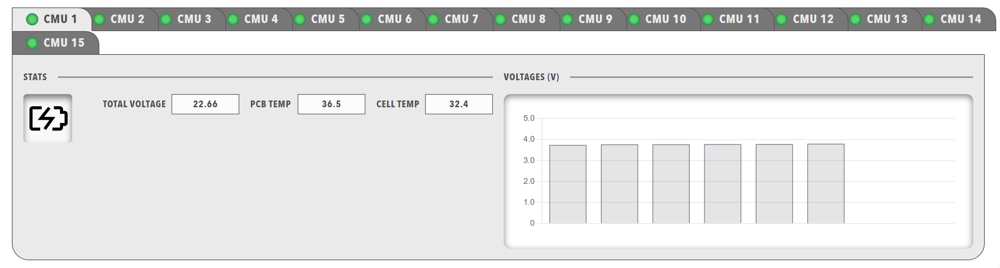

# Tabs

Tabs organise information into separate views that the operator switches between, where the header of each tab carries a status lamp and a caption.

<figure markdown>

<figcaption>Tabs component displaying a tabbed interface with header lamps and body content</figcaption>
</figure>

## When to Use

Use tabs to organise several data views, to separate different types of information and to build a multi-page interface within a single dashboard. Use an [Accordion](../Layout/Accordion.md) when sections should expand and collapse in place on one page.

## Parameters

| Parameter | Type | Required | Default | Description |
|-----------|------|----------|---------|-------------|
| `id` | string | No | None | Not used by the web interface |
| `class` | string | No | None | CSS class added to the `tabs` element |
| `items` | array | Yes | None | Array of objects that each contain a single `tab`, which together form the tab strip. A tabs component with one tab displays the tab as the active tab without a switching control |

### Tab Parameters

Each item in `items` must contain a `tab` object with:

| Parameter | Type | Required | Default | Description |
|-----------|------|----------|---------|-------------|
| `id` | string | No | None | Not used by the web interface |
| `class` | string | No | None | Not used by the web interface |
| `enabled` | boolean | No | `true` | When `false`, the tab header is displayed in the disabled style. The state can be bound with the `enabled` target |
| `visible` | boolean | No | `true` | When `false`, the tab header is hidden. The state can be bound with the `visible` target, and a tab whose bound data is unavailable is hidden |
| `bind` | array | No | None | [Data binding](../../Data_Binding.md) for the tab. The `enabled` and `visible` targets are handled |
| `header` | array | Yes | None | Content of the tab label in the tab strip. Each item must be an object that contains a `lamp`, which is displayed as the status lamp and caption of the tab. See [Lamp](../Data/Lamp.md) |
| `items` | array | Yes | None | Content shown when the tab is active. Each item must be an object that contains a [`panels`](../Layout/Panels.md) grid |

## Example

``` yaml
dashboard:
  items:
    - row:
        items:
          - tabs:
              items:
                - tab:
                    enabled: true
                    visible: true
                    header:
                      - lamp:
                          color: disabled
                          value: 1
                          label: INFO
                    items:
                      - panels:
                          items:
                            - panel:
                                title: Low Voltage
                                items:
                                  - readouts:
                                      items:
                                        - readout:
                                            label: 15v RAIL
                                            precision: 1
                                            bind:
                                              - target: value
                                                source: 'DBC/VoltageRail15VMeasurement/Supply15V'
                                        - readout:
                                            label: 1.9v RAIL
                                            precision: 1
                                            bind:
                                              - target: value
                                                source: 'DBC/VoltageRail3V31V9Measurement/Supply1V9'
                - tab:
                    header:
                      - lamp:
                          color: disabled
                          value: 1
                          label: TEMPERATURES
                    items:
                      - panels:
                          items:
                            - panel:
                                title: Board Temperature
                                items:
                                  - readouts:
                                      items:
                                        - readout:
                                            label: DSP TEMP
                                            unit: °C
                                            precision: 1
                                            bind:
                                              - target: value
                                                source: 'DBC/DspBoardTempMeasurement/DspBoardTemp'
```

Each `tab` in `items` adds one header to the tab strip, so the example above displays the tabs **INFO** and **TEMPERATURES**.
