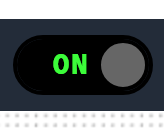

# Toggles

Switch components. Toggles provide on/off controls for component features, and a toggle runs an action each time that it is clicked while a data binding shows whether the feature is currently on or off.

<figure markdown>

<figcaption>Toggles component displaying switch controls for enabling or disabling features</figcaption>
</figure>

**Best for:** Feature switches, enable and disable controls, and any action that alternates between two states

**Parameters:**

| Parameter | Type | Required | Default | Description |
|-----------|------|----------|---------|-------------|
| `id` | string | No | None | Not used by the web interface |
| `class` | string | No | None | CSS classes added to the toggle, alongside `toggle-action` |
| `label` | string | Yes | None | Two captions separated by a vertical bar character, for example the text `ON`, a vertical bar and the text `OFF`, as the example below shows. The text before the vertical bar is shown at the left of the switch and the text after it at the right |
| `action` | object | Yes | None | Action invocation that is submitted when the toggle is clicked. See [Action Invocation Parameters](#action-invocation-parameters) |
| `value` | object | No | None | Payload posted with the action request |
| `enabled` | boolean | No | `true` | Whether the toggle can be clicked. The state can be bound with the `enabled` target |
| `visible` | boolean | No | `true` | Not used by the web interface |
| `bind` | array | No | None | Data binding. The `enabled`, `tooltip` and `classes` targets are handled. Bind the `classes` target to a boolean and map `true` to `on` and `false` to `off` to show the current state of the switch |

## Action Invocation Parameters

The `action` object is an action invocation, which is the same object that the regions, icons and buttons of an [Image](Image.md) or [Model](Model.md) component use for their `action`.

| Parameter | Type | Required | Default | Description |
|-----------|------|----------|---------|-------------|
| `invoke` | string | No | `Component` | How a click is carried out, one of `Component`, `System`, `Endpoint` or `Navigate`. The [Actions](Actions.md#invoke-types) page describes each type |
| `actionId` | string | Conditional | None | Name of the action to run. Required when `invoke` is `Component` or `System` |
| `target` | string | Conditional | None | Location to navigate to. Required when `invoke` is `Navigate` |
| `endpointAction` | object | Conditional | None | Details of the HTTP request. Required when `invoke` is `Endpoint`. The [Actions](Actions.md#endpoint-action-parameters) page describes the parameters |
| `value` | string | No | None | Not used by toggles. Set `value` on the toggle itself to post a payload |
| `confirmMessage` | string | No | None | Message of a confirmation dialog shown before the action runs |
| `trackProgress` | boolean | No | None | Polls the progress of the action after a `Component` or `System` request |
| `restartingOnSuccess` | boolean | No | None | Shows a wait dialog after the action succeeds and polls until the engine is running again |

**Example:**

``` yaml
dashboard:
  items:
    - row:
        items:
          - toggle:
              label: "ON|OFF"
              action:
                invoke: Component
                actionId: "Auto Refresh"
              bind:
                - target: classes
                  source: 'Properties/AutoRefreshActive'
                  toType: boolean
                  mapToText:
                    falseValue: off
                    trueValue: on
```
