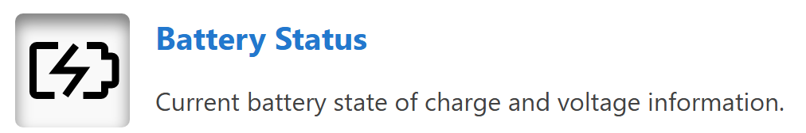
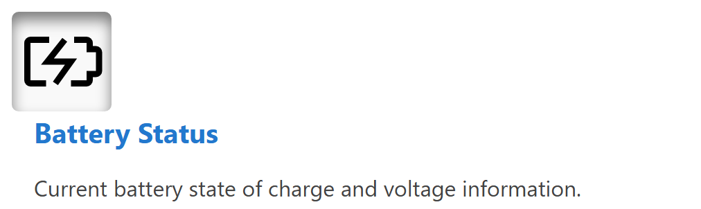

# Group

A group is a container that keeps related components together, side by side or from top to bottom, inside a row or a panel. Groups create visual and logical groupings that keep a dashboard organised and easier to read.

## When to Use

Use a group to keep related data displays together as one section and to give them a shared `width`. A group stacks its items vertically unless `direction` is set to `horizontal`. Use a [Row](Row.md) when the section needs a `height` instead of a width, or when it is a whole band of the dashboard and not a part of one.

## Parameters

| Parameter | Type | Required | Default | Description |
|-----------|------|----------|---------|-------------|
| `id` | string | No | None | Set as the `id` attribute of the group element |
| `class` | string | No | None | CSS class added to the group, alongside the horizontal or vertical layout class |
| `width` | string | No | None | Width in CSS format, for example `100px`, `50%` or `auto` |
| `direction` | string | No | `vertical` | Layout direction, `vertical` or `horizontal`. Items are stacked from top to bottom unless the value is `horizontal` |
| `items` | array | Yes | None | Components displayed in the group |

## Example

### Horizontal Group

A horizontal group arranges its components side by side. This example shows a horizontal group containing an icon and HTML content:

<figure markdown>

<figcaption>Horizontal group component showing components arranged side by side</figcaption>
</figure>

``` yaml
dashboard:
  items:
    - row:
        items:
          - group:
              direction: horizontal
              items:
                - icon:
                    image: nav_battery_active.svg
                    recess: true
                - html:
                    content: |
                      <div style="padding-left: 1rem;">
                        <div class="info-box__header">Battery Status</div>
                        <div class="info-box__content">
                          <p>Current battery state of charge and voltage information.</p>
                        </div>
                      </div>
```

### Vertical Group

A vertical group stacks its components from top to bottom:

<figure markdown>

<figcaption>Vertical group component showing components arranged from top to bottom</figcaption>
</figure>

``` yaml
dashboard:
  items:
    - row:
        items:
          - group:
              class: "sensor-panel"
              direction: "vertical"
              items:
                - readouts:
                    items:
                      - readout:
                          label: "Pressure"
                          value: 1013.25
                          unit: "hPa"
                          precision: 2
                - chart:
                    type: "line"
                    value:
                      labels: ["00:00", "06:00", "12:00", "18:00"]
                      datasets:
                        - label: "Pressure Trend"
                          data: [1010, 1012, 1015, 1013]
```

### Width Example

The `width` of a group controls its horizontal footprint in rows and in panel content:

``` yaml
dashboard:
  items:
    - row:
        items:
          - group:
              width: "40%"
              direction: "vertical"
              items:
                - readouts:
                    items:
                      - readout:
                          label: "Pressure"
                          value: 1013.25
                          unit: "hPa"
                - html:
                    content: "<p>Summary details</p>"
          - group:
              width: "60%"
              direction: "vertical"
              items:
                - chart:
                    type: "line"
                    value:
                      labels: ["00:00", "06:00", "12:00", "18:00"]
                      datasets:
                        - label: "Pressure Trend"
                          data: [1010, 1012, 1015, 1013]
```
