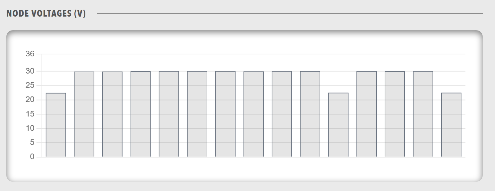

# Panel

Individual panel within a panels grid. Each panel can contain various components and provides a titled container for organising related content.

<figure markdown>

<figcaption>Panel component displaying a titled container with organised content</figcaption>
</figure>

**Best for:** Individual data sections, titled content areas, organised information display

**Parameters:**

| Parameter | Type | Required | Default | Description |
|-----------|------|----------|---------|-------------|
| `id` | string | No | None | Not used by the web interface |
| `class` | string | No | None | Modifier applied to the panel body as `panel__body--{class}`, for example `sunken`, and not applied to the panel container |
| `title` | string | Yes | None | Header label shown above the panel body |
| `menu` | object | No | None | When present, the web interface shows a static menu icon in the panel header. The icon is not interactive and the menu items are not displayed, so a panel menu does not provide navigation, actions or dialogs. See [Menu](Menu.md) |
| `width` | string | No | None | Width in CSS format, for example `100px`, `50%` or `auto`, applied to the panel |
| `height` | string | No | None | Height in CSS format, for example `100px`, `50vh` or `auto`, applied to the body area of the panel |
| `minHeight` | string | No | None | Minimum height of the panel body in CSS format. The body grows to fit its content and never shrinks below this value, and the value never stretches the panel to fill space |
| `items` | array | Yes | None | Components displayed in the body of the panel. The schema allows `chart`, `lamps`, `state`, `group`, `readouts`, `table`, `html`, `redirect` and `caption`, and any other component is placed inside a `group` |

**Basic Example:**

``` yaml
dashboard:
  items:
    - row:
        items:
          - panels:
              items:
                - panel:
                    title: "Temperature Sensors"
                    height: "auto"
                    items:
                      - readouts:
                          items:
                            - readout:
                                label: "Sensor 1"
                                value: 22.5
                                unit: "°C"
                                precision: 1
                            - readout:
                                label: "Sensor 2"
                                value: 24.2
                                unit: "°C"
                                precision: 1
```

**Menu Icon Example:**

The `menu` parameter makes the web interface show a menu icon in the panel header. The icon is static, so the menu items are not displayed:

``` yaml
dashboard:
  items:
    - row:
        items:
          - panels:
              items:
                - panel:
                    title: "System Status"
                    menu:
                      items:
                        - menuitem:
                            label: "Settings"
                            navigate: "/settings"
                    items:
                      - lamps:
                          items:
                            - lampgroup:
                                items:
                                  - lamp:
                                      color: "green"
                                      label: "Online"
                                      value: 1
```

**Height Variations:**

Panels support different height configurations for flexible layouts:

``` yaml
dashboard:
  items:
    - row:
        items:
          - panels:
              items:
                - panel:
                    title: "Fixed Height Panel"
                    height: "200px"
                    items:
                      - chart:
                          type: "line"
                          value:
                            labels: ["Jan", "Feb", "Mar"]
                            datasets:
                              - label: "Data"
                                data: [10, 20, 30]
                - panel:
                    title: "Viewport Height Panel"
                    height: "50vh"
                    items:
                      - table:
                          tableHeaders:
                            - header:
                                accessorKey: name
                                value: Name
                          value: []
                - panel:
                    title: "Auto Height Panel"
                    height: "auto"
                    items:
                      - readouts:
                          items:
                            - readout:
                                label: "Value"
                                value: 42
```

**Width Example:**

Panels also support explicit width values to control horizontal sizing within layouts:

``` yaml
dashboard:
  items:
    - row:
        items:
          - panels:
              items:
                - panel:
                    title: "Half Width Panel"
                    width: "50%"
                    height: "auto"
                    items:
                      - readouts:
                          items:
                            - readout:
                                label: "Value"
                                value: 42
                - panel:
                    title: "Fixed Width Panel"
                    width: "480px"
                    height: "auto"
                    items:
                      - html:
                          content: "<p>Fixed width content area</p>"
```

**Complex Nested Structures:**

Panels can contain complex nested component structures, in which a `group` holds the components that the panel does not accept directly:

``` yaml
dashboard:
  items:
    - row:
        items:
          - panels:
              items:
                - panel:
                    title: "Motor Controller Overview"
                    height: "auto"
                    items:
                      - group:
                          direction: "horizontal"
                          items:
                            - icon:
                                image: nav_motorcontrollers_active.svg
                            - readouts:
                                items:
                                  - readout:
                                      label: "Bus Voltage"
                                      precision: 1
                                      bind:
                                        - target: value
                                          source: 'DBC/BusMeasurement/BusVoltage'
                                  - readout:
                                      label: "Bus Current"
                                      precision: 1
                                      bind:
                                        - target: value
                                          source: 'DBC/BusMeasurement/BusCurrent'
                      - chart:
                          type: "line"
                          legend: false
                          refreshInterval: 1000
                          bind:
                            - target: value
                              source: 'DBC/BusMeasurement/BusVoltage'
                              seriesMode: timeSeries
                      - lamps:
                          items:
                            - lampgroup:
                                items:
                                  - lamp:
                                      color: "green"
                                      label: "Online"
                                      value: 1
                                      bind:
                                        - target: enabled
                                          source: 'DBC/Status/Online'
                                          toType: boolean
                                  - lamp:
                                      color: "red"
                                      label: "Error"
                                      value: 1
                                      bind:
                                        - target: enabled
                                          source: 'DBC/Status/Error'
                                          toType: boolean
```

**Complete Example with All Features:**

``` yaml
dashboard:
  items:
    - row:
        items:
          - panels:
              items:
                - panel:
                    class: "sunken"
                    title: "System Status"
                    height: "60vh"
                    minHeight: "200px"
                    menu:
                      items:
                        - menuitem:
                            label: "Details"
                            navigate: "/component?componentId=Motor%20Controller"
                    items:
                      - group:
                          direction: "vertical"
                          items:
                            - lamps:
                                items:
                                  - lampgroup:
                                      items:
                                        - lamp:
                                            color: "green"
                                            label: "Online"
                                            value: 1
                                            bind:
                                              - target: enabled
                                                source: 'DBC/Status/Online'
                                                toType: boolean
                            - readouts:
                                items:
                                  - readout:
                                      label: "Temperature"
                                      bind:
                                        - target: value
                                          source: 'DBC/Temperature/Value'
                            - chart:
                                type: "line"
                                bind:
                                  - target: value
                                    source: 'DBC/Temperature/Value'
                                    seriesMode: timeSeries
```
