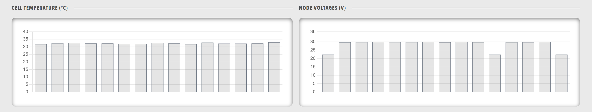

# Panels

A panels component is a grid that lays out several [panel](Panel.md) containers, where each panel holds its own content and data visualisations. The panels sit side by side and wrap onto the next line when the row has no room left.

<figure markdown>

<figcaption>Panels component showing a grid layout of multiple panel containers</figcaption>
</figure>

## When to Use

Use panels to divide a section of a dashboard into several titled areas that each show a different data view. Use a [Row](Row.md) or a [Group](Group.md) when the components need no titles or panel frames.

## Parameters

| Parameter | Type | Required | Default | Description |
|-----------|------|----------|---------|-------------|
| `id` | string | No | None | Not used by the web interface |
| `class` | string | No | None | CSS class added to the panel grid, for use with a profile style sheet |
| `height` | string | No | None | Height in CSS format, applied directly to the grid and overriding any height the grid would otherwise take |
| `minHeight` | string | No | None | Minimum height in CSS format. The grid grows to fit its content and never shrinks below this value, and the value never stretches the grid to fill space |
| `items` | array | Yes | None | Array of objects that each contain a single `panel`. The grid displays the panels in the order listed |

## Example

``` yaml
dashboard:
  items:
    - row:
        items:
          - panels:
              items:
                - panel:
                    title: "System Status"
                    items:
                      - lamps:
                          items:
                            - lampgroup:
                                items:
                                  - lamp:
                                      color: "green"
                                      label: "CPU"
                                      value: 1
                                      enabled: true
                - panel:
                    title: "Performance"
                    items:
                      - chart:
                          type: "bar"
                          value:
                            labels: ["CPU", "Memory", "Disk"]
                            datasets:
                              - label: "Usage %"
                                data: [45, 67, 23]
```
