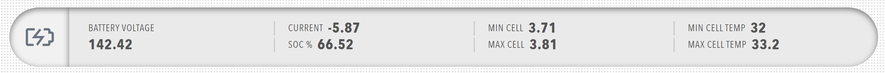

# Pill

A pill is a compact status display that shows several related values, arranged in groups, beside a central icon, which suits component status and key metrics.

<figure markdown>

<figcaption>Pill component showing status display with icon and grouped readouts</figcaption>
</figure>

## When to Use

Use a pill for component status and key metrics, where several related values sit beside one icon. Use [Readouts](../Data/Readouts.md) when the values need no icon or grouping.

## Parameters

| Parameter | Type | Required | Default | Description |
|-----------|------|----------|---------|-------------|
| `id` | string | No | None | Not used by the web interface |
| `class` | string | No | None | CSS class added to the pill element |
| `title` | string | No | None | Heading shown above the icon and groups, inside the same pill |
| `icon` | object | No | None | Icon shown at the left of the pill. When omitted, the icon area is left empty |
| `items` | array | Yes | None | Array of pill groups, laid out horizontally in order |

### Icon Parameters

| Parameter | Type | Required | Default | Description |
|-----------|------|----------|---------|-------------|
| `image` | string | No | None | Icon name such as `BatteryCharging`, an icon filename such as `nav_battery_active.svg`, or an image filename from the `/Profile/Images` directory. See [Icon](../Interactive/Icon.md) for the icon names |
| `recess` | boolean | No | `false` | When `true`, the icon is displayed in a recessed frame at a larger size |
| `value` | number | No | None | State of the icon between `0` and `1`. The value only affects icons that change with state, and has no visible effect on an icon drawn from `image` |
| `bind` | array | No | None | Data binding for the icon. Only the `value` target is handled |

### Pill Group Parameters

Each item in the pill's `items` must contain a `pillgroup` object with:

| Parameter | Type | Required | Default | Description |
|-----------|------|----------|---------|-------------|
| `id` | string | No | None | Not used by the web interface |
| `class` | string | No | None | Not used by the web interface |
| `items` | array | Yes | None | Array of value items |

### Pill Item Parameters

Each item in the pill group's `items` must contain a `value` object, which is a pill item, with:

| Parameter | Type | Required | Default | Description |
|-----------|------|----------|---------|-------------|
| `label` | string | No | None | Caption shown beside the value. The caption can be bound with the `label` target |
| `value` | number or string | No | None | Static value. When no data is available, the pill shows `--` and the item is displayed as stale |
| `unit` | string | No | None | Unit appended after a numeric value. The unit can be bound with the `unit` target |
| `precision` | number | No | None | Number of decimal places for numeric values |
| `dotColor` | string | No | None | Shows a status dot beside the value. Use `success`, `warning` or `error` for the dashboard theme colours, or any CSS colour value. Give the item a `label` as well, because colour alone does not state the status. The dot is not shown when `hyperlink` is set |
| `hyperlink` | string | No | None | When set, the value is displayed as a link. A path that starts with `Profile/` resolves against the Profinity server |
| `openHyperLinkInNewWindow` | boolean | No | `false` | When `true` and `hyperlink` is set, the link opens in a new browser tab. The parameter has no effect without `hyperlink` |
| `enabled` | boolean | No | `true` | Not used by the web interface, because pill items are always displayed normally |
| `visible` | boolean | No | `true` | Not used by the web interface, because pill items are always displayed |
| `bind` | array | No | None | [Data binding](../../Data_Binding.md) for the item. The `value`, `label` and `unit` targets are handled, and `enabled` and `visible` bindings are ignored |

## Example

``` yaml
dashboard:
  items:
    - row:
        items:
          - pill:
              title: MOTOR CONTROLLER
              icon:
                image: nav_motorcontrollers_active.svg
                recess: false
                value: 0
              items:
                - pillgroup:
                    items:
                      - value:
                          label: BUS VOLTAGE
                          unit: V
                          precision: 1
                          bind:
                            - target: value
                              source: 'DBC/BusMeasurement/BusVoltage'
                      - value:
                          label: BUS CURRENT
                          unit: A
                          precision: 1
                          bind:
                            - target: value
                              source: 'DBC/BusMeasurement/BusCurrent'
                - pillgroup:
                    items:
                      - value:
                          label: DSP TEMP
                          unit: °C
                          precision: 1
                          dotColor: warning
                          bind:
                            - target: value
                              source: 'DBC/DspBoardTempMeasurement/DspBoardTemp'
                      - value:
                          label: DOCUMENTATION
                          value: Open
                          hyperlink: https://www.prohelion.com
                          openHyperLinkInNewWindow: true
```
