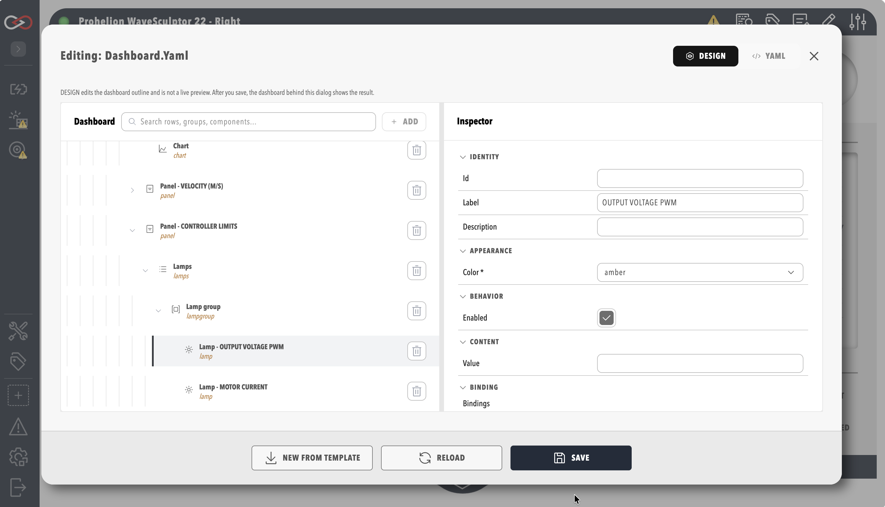

# Dashboard Visual Editor

From Profinity 2.3, the **visual editor** is the primary way to build and change a dashboard. You add widgets from a list, arrange them in a tree, set their properties in an inspector and bind them to tags, all without writing YAML. The **YAML** tab is still there as a fallback for anything the visual editor does not cover, and as the reference format when you share or review a dashboard.

Dashboards created before Profinity 2.3 keep working unchanged. Open one in the editor and it appears in the visual editor, ready to change.

!!! note "Editing Needs the Modify Dashboards Permission"
    Opening the editor and saving changes needs the **Modify dashboards** permission, and without it the **Edit Dashboard** icon is not shown.

## Open the Visual Editor

1. Open a component that uses a custom dashboard, or the profile home page if the profile uses a [profile dashboard](../../Administration/Profile_Dashboard.md).
2. Select the pencil (**Edit Dashboard**) icon in the menu at the right of the dashboard title bar.
3. The editor opens in **DESIGN** mode, which is the visual editor. Select **YAML** to edit the YAML source directly, and **DESIGN** to come back.

<figure markdown>

<figcaption>Dashboard visual editor</figcaption>
</figure>

## The Editor Layout

| Area | What it does |
|------|--------------|
| **Dashboard tree** | Shows every element of the dashboard, nested as it is in the dashboard. Use the **Search dashboard** box to find an element by name or type. |
| **Inspector** | Shows the properties of the selected element. With nothing selected it shows the **Header**, **Actions** and **Footer** switches for the dashboard. |
| **Schema validation issues** | Lists anything that does not match the dashboard schema. |
| **Footer buttons** | **NEW FROM TEMPLATE** replaces the dashboard with the template after a confirmation prompt, **RELOAD** loads the saved dashboard again and discards the changes made since it was saved, and **SAVE** stores the dashboard. |

## Build a Dashboard

### Add an Element

1. Select the container you want to add into, such as a row, group or pill, or leave the dashboard root selected.
2. Select **Add**. The **Add component** window lists the element types that fit the selection, such as Row, Group, Pill, Readout, Lamp, Chart and Action.
3. Choose a type. It is inserted as the first child of the selected container and becomes the selected element. With the dashboard root selected, the new element is inserted at the top of the dashboard.

**Add** is unavailable when the selected element cannot hold other elements. Because a new element always goes first, drag it in the tree to move it to its final position, as described in the next section.

### Arrange Elements

Drag an element in the tree to reorder it within its parent, or drag it onto another container to move it there, and the tree only allows drops that the dashboard schema permits.

### Change an Element

Select the element and edit its properties in the **Inspector**. Each property uses the control that suits it, such as a drop-down for fixed choices, a check box for on/off values, and pickers for icons and action IDs. A property the visual editor cannot edit shows a hint to use the **YAML** tab.

### Delete an Element

Select the element and delete it from the tree. A confirmation lists how many nested elements are removed with it.

## Bind Tags to an Element

An element that can show live data has a **Binding** section in the inspector, and a binding connects one of its properties to a tag.

1. Select the element in the tree, such as a readout, a lamp or a chart.
2. Open the **Binding** section of the inspector and add a binding for each property that the data drives.
3. Choose the tag from the tag tree, which is the same tree as the Tag Explorer.
4. Set the optional transform and default value.

A single-value element such as a readout or lamp binds one tag, and a chart binds one or more tags. See [Data Binding](./Data_Binding.md) for how a binding names a tag and the modes it supports.

<figure markdown>

<figcaption>Binding section of the inspector</figcaption>
</figure>

You can also start from tags: choosing tags to link to a dashboard opens the **Add component for selected tags** window, which offers only the element types that suit the tags you chose. See [Tag Linking](../../Tags/Tag_Linking.md).

Dashboard widgets show live **alert indicators** when bound tags have active rule alerts, as described in [Alerts Log](../../Tags/Alerts.md).

## Validate and Save

The editor checks the dashboard against the dashboard schema as you work and lists problems under **Schema validation issues**. **SAVE** shows a message and does not save while any issues remain, so a saved dashboard always conforms to the schema. The server also rejects an invalid dashboard submitted through the API. Closing the editor with unsaved changes asks for confirmation before the changes are discarded.

## When to Use the YAML Tab

Use the visual editor first, and switch to **YAML** to edit a property that the inspector marks as "use the YAML tab", to copy a dashboard or paste in one from the [Examples](./Examples.md), to review a whole dashboard at once or make the same change in many places, or to repair a dashboard that the visual editor cannot open.

Switching tabs keeps your changes. Switching to **DESIGN** needs valid YAML, and if the YAML cannot be parsed the editor shows an error and stays on the **YAML** tab. See the [Dashboard Development Guide](./index.md) for the YAML structure, and [Troubleshooting](./Troubleshooting.md) for the validation messages.
