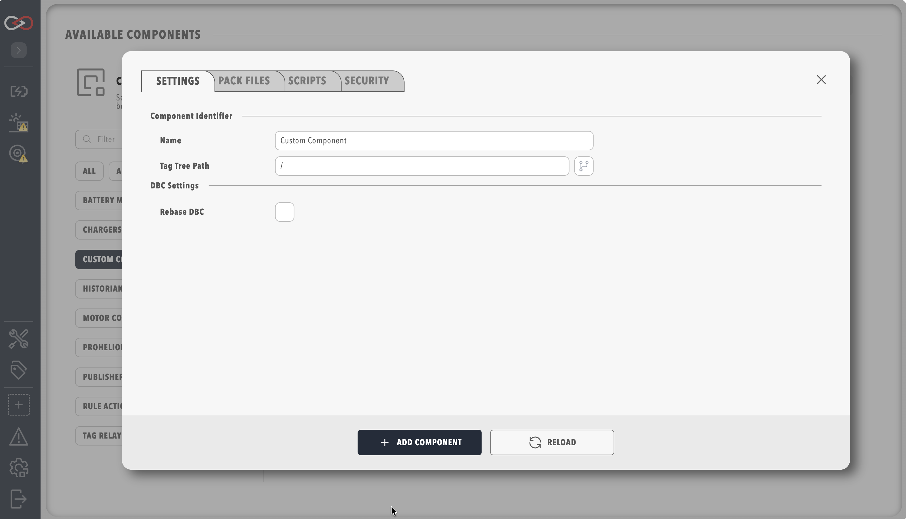

# Custom Components

A Custom Component is one built-in component type, `CustomComponent`, plus the files uploaded for that instance. As of Profinity 2.3 those files can include a DBC, a dashboard, a rules file, a main script, `actions.yaml`, `settings_map.yaml`, `firmware_map.yaml`, and `firmware.yaml`. Adding the component in a profile and filling in those files is enough to run it, and packing is a separate step used only when the same component should be installed somewhere else.

Day-to-day behaviour in a profile, including the Messages and Signals viewer, is covered under [Custom Components](../../Components/Custom_Components/index.md). The click path to add one is [How to Create a Custom Component](../../How_To_Guides/Create_Custom_Component.md). How this type compares with a DLL plugin is [Component types](Component_Types.md).

<figure markdown>

<figcaption>Custom Component settings, with Pack files and Scripts</figcaption>
</figure>

Settings for an authored component are **Settings**, **Pack files**, **Scripts**, and **Security**. **Pack files** is split into **Device** (the DBC), **Presentation** (the dashboard), **Behaviour** (actions and rules), **Maps** (settings and firmware maps), and **Firmware** (`firmware.yaml`). **Scripts** holds **Main Script** and **Auto Start Main Script**. A component created from an installed pack hides **Pack files** and **Scripts**, and the operator edits **Name**, **Tag tree path**, menu placement, and the fields from `settings_map.yaml`.

## Files

| File | Required | Role |
|------|----------|------|
| DBC (`.dbc`) | No | CAN message and signal database for the Messages and Signals viewer and for dashboard bindings that read CAN signals |
| Dashboard (`.yaml`) | Profinity writes one if omitted | The component page. The default file name is the component name with a `.yaml` extension |
| Rules YAML | No | Rules evaluated when this component's tags change |
| `actions.yaml` | No | Menu actions: a button, a service toggle, or the Connect / Disconnect control for the main script |
| Main script (`.cs`, `.py`, or `.lua`) | No | Long-running service that publishes tags. Started by **Auto Start Main Script** or by Connect / Disconnect |
| `settings_map.yaml` | No | Extra settings fields shown on the component |
| `firmware_map.yaml` | No | Firmware settings fields shown on the component |
| `firmware.yaml` | No | Scripts for load, save, and any further firmware actions |
| `component_metadata.yaml` | Only in a pack | Catalogue name, description, and which files the pack binds |

Every Profinity YAML document in that set carries `version: "2.3"`. Script files may mix languages on the one component, because the engine is chosen from the file extension.

## DBC file

Upload **Upload DBC File** when the device's CAN traffic should appear as Messages and Signals, or when the dashboard binds signals from that database. The component runs with the field left empty. **Rebase DBC** and **Rebase Address** shift the loaded message identifiers onto the base address the device actually uses.

**Edit DBC File** opens the DBC editor once a file is set, and a saved change is picked up from the file watcher. The viewer is documented in [CAN bus DBC](../../CAN_Utilities/CAN_Bus_DBC.md).

## Dashboard

The dashboard YAML is the component's page. Profinity writes a starter file, named after the component, when **Upload Dashboard** is left empty, and the dashboard editor replaces that starter. Layout, elements, and the visual editor are the [Dashboard Development Guide](../../Customising_Profinity/Dashboards/index.md).

A binding that reads a CAN signal uses the DBC names. A binding that reads a value the main script published uses a tag path. A relative path, with no leading slash, is resolved against the component's own place in the tag tree, so it follows the component if **Tag tree path** changes. An absolute path begins with `/` and is a literal reference to some other place in the tree. The `{COMPONENT_NAME}` placeholder still loads, and Profinity rewrites it to an explicit path the next time the dashboard is saved. See [Data Binding](../../Customising_Profinity/Dashboards/Data_Binding.md) and [Tag Tree Path](../../Tags/Tag_Tree_Path.md).

## Rules

**Rules YAML file** is an optional rules document for this component, evaluated when its tags change. Alerts raised from those rules appear in [ALL ALERTS](../../Tags/Alerts.md). Menu actions in `actions.yaml` are a separate mechanism from rule actions.

## Main script

**Main Script** is a service script, in C#, Python, or Lua, that keeps running until Disconnect or until the component shuts down. **Auto Start Main Script** starts it when the profile loads. With auto start left off, the operator starts and stops it from a Connect / Disconnect menu item, which is a `mainScriptToggle` entry in `actions.yaml`.

The script owns its telemetry. It creates branches and leaves under the component in the tag tree and publishes with the script tag API (`SetValue`, `ClearValue`, `MarkStale`), and the dashboard binds those paths directly. On Disconnect the current values are cleared and marked stale, and the branches stay in place so dashboard bindings remain valid. Script types and the tag API are in [Scripting](../Scripting/index.md).

## actions.yaml

`actions.yaml` declares the component menu entries that run scripts.

| `kind` | What the operator gets |
|--------|------------------------|
| `button` | Runs `script` once when the menu item is chosen |
| `toggle` | Starts and stops a service `script`, and publishes that running state on the component |
| `mainScriptToggle` | Connect / Disconnect for **Main Script**. The script is the **Main Script** field on the **Scripts** tab |

Each entry needs an `id`, a `name` (or `displayName`), a `kind`, and an `icon` from the Profinity icon set. `button` and `toggle` also need `script`, a path relative to the component folder such as `scripts/calibrate.cs`. An optional `iconPath` points at an image in the component folder instead of a built-in icon.

```yaml
version: "2.3"
menuActions:
  - id: connect
    name: Connect / Disconnect
    icon: Start
    kind: mainScriptToggle
  - id: zero
    name: Zero Calibration
    icon: Start
    kind: button
    script: scripts/calibrate_zero.py
```

## Settings and firmware maps

`settings_map.yaml` adds fields to the component settings, grouped into sections and categories, with a name, a type, and a default. `firmware_map.yaml` does the same for firmware settings. A script reads the saved values through the component settings API, which is how a serial port, a baud rate, or a CAN export flag reaches the main script without a code change. Both files are watched, so an edit to the map shows up on the settings dialog.

A serial device, for example, keeps its COM port and baud rate in `settings_map.yaml`, and keeps a firmware page derived from the device's own configuration sentences in `firmware_map.yaml`. Packing that folder is described below.

## firmware.yaml

`firmware.yaml` names the scripts behind the firmware actions. `loadScript` and `saveScript` are the load and save operations, and `actions` lists any further firmware operations, each with an `id`, a display name, and a `script`. An action can require the operator to upload a file first by setting `uploadFileType` and `uploadFileExtension`. Until this file is set, the **Scripts** tab points back at **Pack files** / **Firmware**.

```yaml
version: "2.3"
loadScript: scripts/load_firmware.py
saveScript: scripts/save_firmware.py
```

The fields the operator edits on the firmware page come from `firmware_map.yaml`. The scripts that apply those values come from `firmware.yaml`.

## Packing

A Custom Component that lives in one profile never needs a pack. `component_metadata.yaml` is what turns the same folder into a bundle another installation can add by name. It carries `version: "2.3"`, `name`, `description`, `author`, `pluginVersion`, `requiredSdkVersion`, `componentType: CustomComponent`, and the file bindings the host should load, such as `mainScript`, `dbcFile`, and `dashboardFile`.

```yaml
version: "2.3"
name: G-STAR IV Python
description: SiRFstar IV G-STAR IV GPS reference component (Python scripts)
author: Profinity
pluginVersion: 1.0.0
requiredSdkVersion: ">=1.0.0"
componentType: CustomComponent
allowMultiple: true
mainScript: scripts/gps_main.py
dbcFile: GStarIV.dbc
dashboardFile: gstar_iv.yaml
```

[`profinity-component-pack`](Component_Pack_CLI.md) validates that folder and writes a `.zip`, or a content `.nupkg` when the output name ends in `.nupkg`. A `.nupkg` requires `pluginVersion` and a non-empty `author`. The bundle is still `CustomComponent` plus these files. A compiled assembly installed through Plugin Manager is a [DLL plugin](../Plugins/index.md), and the two are packed and installed separately.

A content pack can be uploaded under **ADMIN** → **Components & Plugins**, after which Add Component lists the `name` from `component_metadata.yaml`. Adding that entry creates a profile instance with **Pack files** and **Scripts** hidden. The same bundle can be installed on the box with `profinity-component-pack install`, which extracts it into the profile's `components` folder. The tool ships in the [Profinity SDK](../SDK.md) kit.

## Related documentation

- [Custom Components](../../Components/Custom_Components/index.md) — using one in a profile
- [How to Create a Custom Component](../../How_To_Guides/Create_Custom_Component.md)
- [Component types](Component_Types.md)
- [Component Pack CLI](Component_Pack_CLI.md)
- [Dashboard Development Guide](../../Customising_Profinity/Dashboards/index.md)
- [Scripting](../Scripting/index.md)
- [Profinity SDK](../SDK.md)
