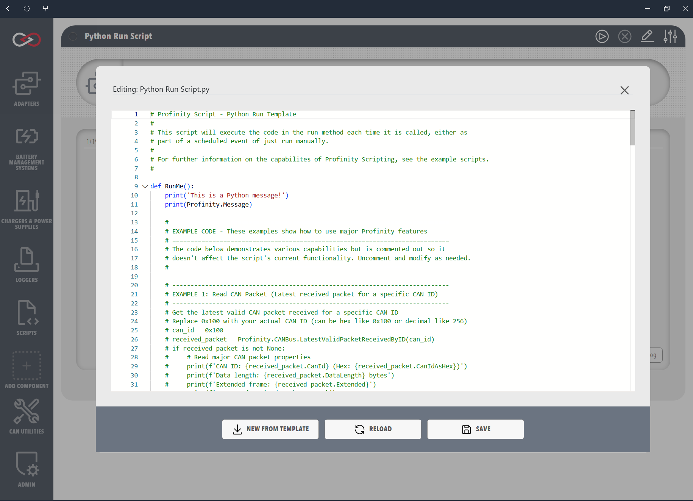

# Run Scripts

Run scripts are the general-purpose script type: they run when an operator starts them or on a schedule, which suits data collection, testing and system configuration. A Run script can use the CAN bus, DBC, State, Console and Tags operations, can write to the console, and can stop early when it checks `Profinity.ScriptCancelled`.

A Run script has three modes, chosen with **Script Mode**. **Run On Demand** runs the script when an operator selects **Run Script** from the script component's menu, and **Cancel Script** stops a run that is still going. **Run On Time Interval** runs the script automatically at a fixed interval set with **Time Interval** and **Time Interval Unit** (Seconds, Minutes, Hours or Days), for example every 5 minutes or every hour. **Run On CRON Schedule** runs the script from a [Quartz cron expression](https://www.quartz-scheduler.org/documentation/quartz-2.3.0/tutorials/crontrigger.html) entered in **Cron Schedule**. A Quartz expression has six or seven fields that start with seconds, which differs from a standard five-field cron expression, so `0 0 6 ? * MON-FRI` runs the script at 06:00 on every weekday. The scheduled modes are started with **Start Scheduled Script** and stopped with **Stop Scheduled Script**, or start by themselves when **Auto Start Script** is on.

<figure markdown>

<figcaption>Run Script Editor and Scheduling Options</figcaption>
</figure>

## Examples

The example shows the basic structure of a Run script in each supported language. It writes two messages to the console, one fixed and one taken from `Profinity.Message`, and reports success. In C# the `Run()` method returns a boolean, where `true` reports success and `false` reports failure. Python and Lua Run scripts have no return value: the script file runs from the top, so the sample defines a function and then calls it, and a script reports failure by raising an error (or, in Python, by calling `sys.exit()` with a non-zero exit code, where `sys.exit(0)` is treated as success). The interfaces used by the C# sample are available to a script by default, so the sample needs no `using` line for them.

=== "C#"

    ```csharp
    using System;

    public class CSharpRunExample : ProfinityScript, IProfinityRunnableScript
    {
        public bool Run()
        {
            Profinity.Console.WriteLine("This is a CSharp Message!");
            Profinity.Console.WriteLine(Profinity.Message);
            return true;
        }
    }
    ```

=== "Python"

    ```python
    def RunMe():
        print('This is a Python message!')
        print(Profinity.Message)

    RunMe()
    ```

=== "Lua"

    ```lua
    function RunMe()
        print('This is a Lua message!')
        print(Profinity.Message)
    end

    RunMe()
    ```

Python scripts run on [IronPython](https://ironpython.net/) with Python 3 syntax, as described on [Supported Languages](../Supported_Languages/index.md).
