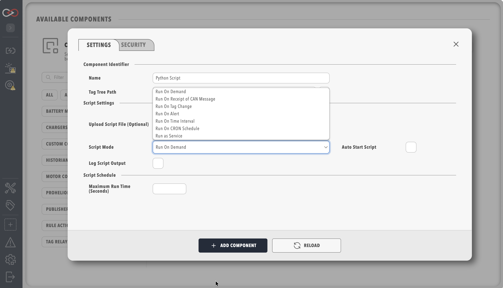

# Script Types in Profinity

Profinity supports seven script execution modes, each with specific use cases and execution contexts: Run On Demand, Run On Receipt of CAN Message, Run On Tag Change, Run On Alert, Run On Time Interval, Run On CRON Schedule and Run as Service. This page explains the differences between the modes and when to use each one.

<figure markdown>

<figcaption>Script type selection and configuration in the Profinity UI</figcaption>
</figure>

| Script Type                                   | Description| Best For                                                                                            | Not Recommended For        |
|-----------------------------------------------|-|-----------------------------------------------------------------------------------------------------|----------------------------|
| [Run](./RunScripts.md)            | A Run Script can be run by the operator, or scheduled to run on a regular basis. Run Scripts are typically used for jobs that are short and do not require a lot of state management | - One-time operations - Manual tasks - Testing - Troubleshooting      | - Continuous monitoring - Real-time responses |
| [Receive](./ReceiveScripts.md)    | Receive Scripts (Run On Receipt of CAN Message mode) run each time a matching CAN packet is received, and are generally used to respond to the receipt of a packet with a reply message | - CAN message processing - Real-time data handling - Protocol implementation                  | - Long-running operations - System configuration - Manual tasks |
| [Service](./ServiceScripts.md)    | Service Scripts implement full lifecycle management and are designed for tasks that need to run for a long time | - Continuous monitoring - Long-running tasks - Critical services - System-level operations |  - Quick responses - One-time operations - Manual tasks |
| TimeInterval | Scripts that run on a time-based interval (for example, every 5 minutes or every hour). Uses the Run script engine but executes automatically at regular intervals | - Periodic tasks - Regular data collection - Scheduled maintenance - Interval-based monitoring | - Real-time responses - Event-driven operations - Complex scheduling requirements |
| CronSchedule | Scripts that run on a cron schedule using Quartz cron expressions. Provides flexible scheduling for complex time-based requirements | - Complex scheduling requirements - Time-of-day operations - Weekly/monthly tasks - Advanced scheduling patterns | - Simple intervals - Manual tasks - Real-time responses |
| Run On Tag Change | Scripts that run each time a specific tag's value changes. Used to compute derived values or react to state changes without polling | - Derived/computed tags - Reacting to another component's output - Chained automation | - One-time operations - Manual tasks |
| Run On Alert | Scripts named as a rule action (`onTrue`/`onFalse`), invoked when the rule transitions. See [Rule scripts](Rule_Scripts.md) | - Rule notifications and side effects - Custom alert handling beyond the built-in actions | - Anything not driven by a rule firing - Long-running work (keep it fast; see Trigger Overlap) |

## Best Practices

!!! info "Scripts Run Inside Profinity"
    Scripts add functionality to the core of Profinity itself. Inefficient code, leaked memory or leaked resources run inside the Profinity engine and affect it directly, so review a script whenever Profinity shows a negative impact while that script is running.

Best practices for Profinity scripting include the following.

**Choose the right type of script execution**

- Use Run On Demand scripts for manual operations
- Use Receive scripts for CAN message processing
- Use Service scripts for critical, long-running operations
- Use TimeInterval scripts for periodic tasks with simple intervals
- Use CronSchedule scripts for complex scheduling requirements
- Use Run On Tag Change scripts to react to another tag's value without polling
- Use Run On Alert scripts for custom logic on a rule firing

**Manage resources efficiently**

- Keep scripts efficient
- Monitor resource usage
- Clean up resources when scripts end
- Consider system load when scheduling tasks
- Implement proper service recovery mechanisms

**Handle errors**

- Implement proper error handling
- Log errors appropriately to the Profinity Logs
- Handle timeouts and resource limits
- Consider retry mechanisms for scheduled tasks
- Implement service health monitoring

**Use state management where required**

- Use appropriate state scope (State vs GlobalState)
- Clean up state when no longer needed
- Handle state conflicts in service scripts
- Consider state persistence for scheduled tasks
- Implement proper service state management