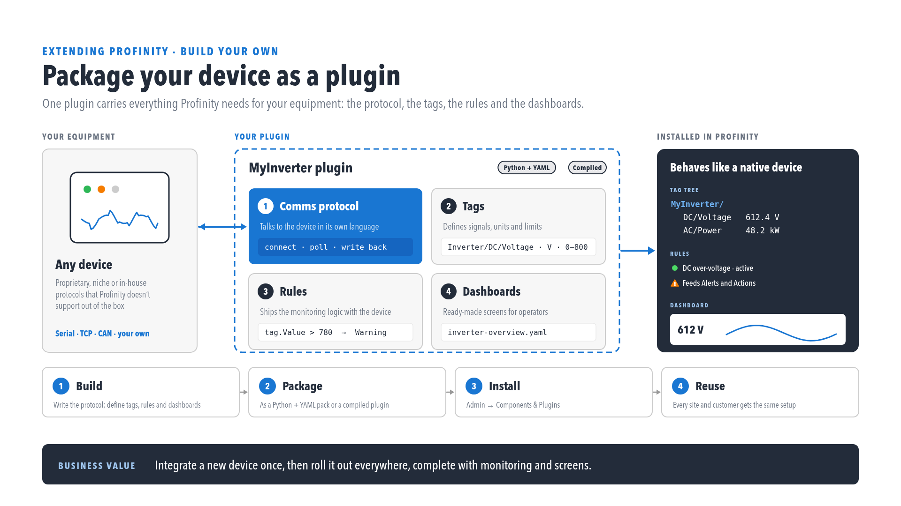

# Custom Component, Dashboard Component, and DLL plugins

Profinity 2.3 distinguishes three extension models, each with its own packaging and install path, so the right model needs to be chosen before building rather than after.

<figure markdown>

<figcaption>Package your device as a plugin</figcaption>
</figure>

## Comparison

| | **Custom Component** | **Dashboard Component** | **DLL plugin** |
|--|----------------------|-------------------------|----------------|
| **Type** | Built-in `CustomComponent` | Built-in `DashboardComponent` | Author-compiled assembly |
| **DBC** | Optional | No | Varies by plugin |
| **Primary files** | DBC, dashboard YAML, `actions.yaml`, scripts, maps | Dashboard YAML only | `.dll` plus an optional `dependencies/` folder, in a nupkg or zip |
| **Packaging** | Optional `profinity-component-pack` zip/nupkg | N/A (profile YAML) | Plugin Manager `.nupkg`/zip |
| **Install path** | Profile component folder | Profile component folder | `{Artifacts}/plugins/{id}/` |
| **Example** | G-STAR IV custom sample | Profile YAML dashboard-only component | Rinstrum Scale Plugin |

## Custom Component (advanced)

Beyond basic DBC + dashboard, Custom Components support:

- **`actions.yaml`** — firmware and operator actions.
- **`MainScriptFilename`** and firmware scripts.
- **`settings_map.yaml`** / **`firmware_map.yaml`** — structured settings binding.
- **`component_metadata.yaml`** — display metadata.

<figure markdown>

<figcaption>Custom Component advanced settings (screenshot placeholder — provide SS-47)</figcaption>
</figure>

Optional packaging: [Component Pack CLI](./Component_Pack_CLI.md).

Authoring reference: [Custom Components](../Custom_Components/index.md) and the [Profinity SDK](../SDK.md).

## Dashboard Component

A **Dashboard Component** is a built-in profile component that renders **YAML-only** dashboards, with **no DBC**. It suits human-machine interface (HMI) style screens that bind to existing tags without defining CAN messages.

A Dashboard Component is distinct from:

- **Profile home dashboard** — `UseCustomProfileDashboard` on the profile replaces the profile home page.
- **Custom Component** — can include a DBC and firmware scripts.

## DLL plugin

A DLL plugin is a C# (or other SDK-supported) assembly packed as a `.nupkg` or zip and installed through Plugin Manager (see [DLL plugins](../Plugins/index.md)). Plugins register new component types at runtime.

## Related documentation

- [Custom Components](../Custom_Components/index.md)
- [Component Pack CLI](./Component_Pack_CLI.md)
- [DLL plugins](../Plugins/index.md)
- [Dashboard visual editor](../Dashboards/Visual_Editor.md)
